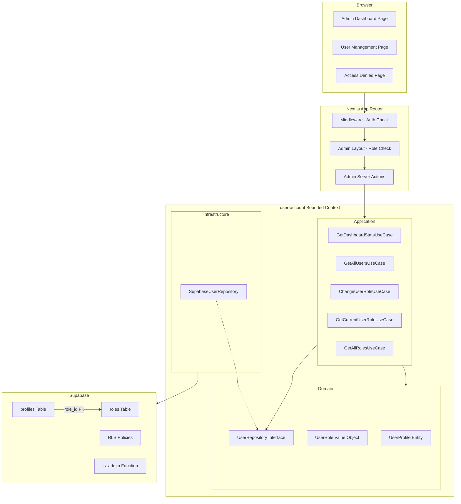
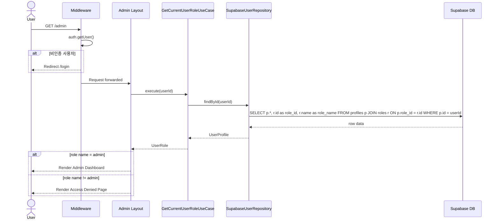
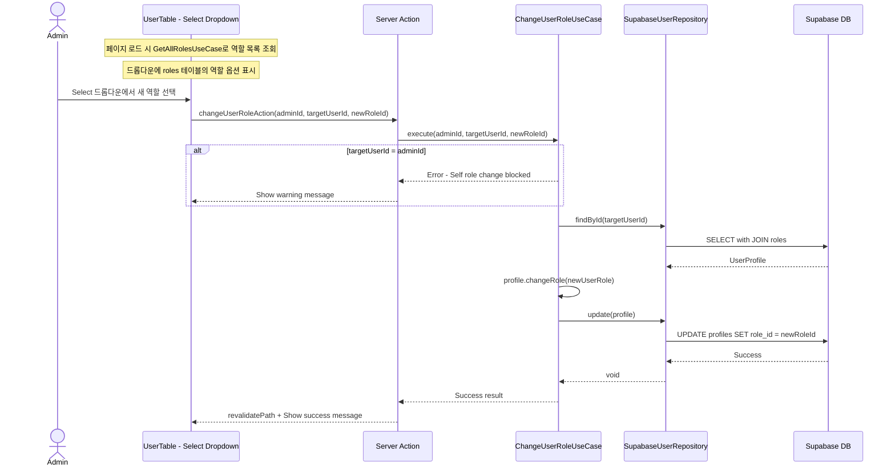
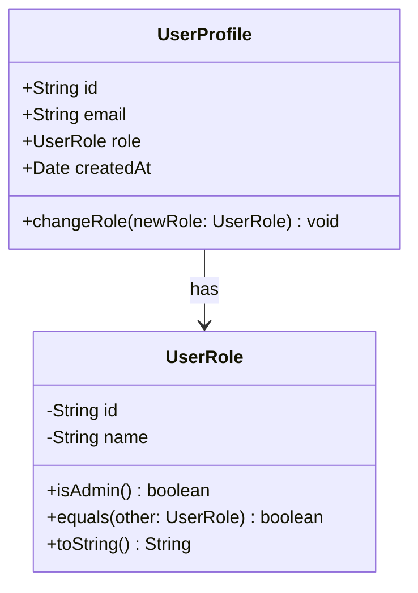
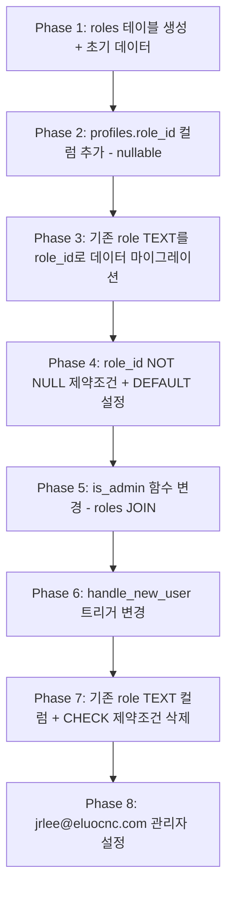

# Technical Design: 어드민 페이지 (v2 - 역할 테이블 분리)

## Overview

**Purpose**: 이 기능은 기존 어드민 페이지의 역할(role) 관리 체계를 리팩토링한다. 현재 `profiles.role` TEXT 컬럼에 저장되는 역할 데이터를 독립적인 `public.roles` 테이블로 분리하고, `profiles.role_id` FK로 참조하도록 변경한다. 이를 통해 역할의 확장성과 데이터 무결성을 강화한다. 동시에 사용자 역할 변경 UI를 버튼 토글 방식에서 드롭다운(`Select`) 방식으로 전환하여, 향후 역할이 추가되어도 코드 변경 없이 동적으로 대응할 수 있도록 한다.

**Users**: 플랫폼 관리자(`role name = 'admin'`)가 어드민 대시보드와 사용자 관리 기능을 사용한다. 일반 사용자(`role name = 'user'`)는 접근이 차단되며 안내 메시지를 확인한다.

**Impact**: 기존 `profiles.role` TEXT 컬럼을 `roles` 테이블 + `profiles.role_id` FK 구조로 변경한다. 기존 마이그레이션(`20260228000000_add_role_to_profiles.sql`)의 스키마를 대체하는 새 마이그레이션이 필요하다. 도메인 모델(`UserRole`, `UserProfile`), 인프라 계층(`SupabaseUserRepository`), UI 계층(`UserTable`) 모두 변경 대상이다.

### Goals
- `public.roles` 테이블을 도입하여 역할 데이터를 정규화하고, `profiles.role_id` FK로 연결하여 참조 무결성을 보장한다.
- 역할 변경 UI를 드롭다운(`Select`)으로 전환하여 `roles` 테이블의 역할 목록을 동적으로 반영한다.
- 기존 어드민 기능(대시보드, 접근 제어, RLS)을 `roles` 테이블 기반으로 재구성한다.

### Non-Goals
- 역할 체계를 3개 이상으로 확장하는 것(예: moderator, editor)은 향후 과제로 남긴다. 단, 확장이 가능한 구조를 선제적으로 구축한다.
- 관리자 감사 로그(audit log) 기능은 이번 범위 외이다.
- 역할별 세분화된 권한(permission) 매핑 시스템은 이번 범위 외이다.

## Architecture

> 탐색 과정의 상세 내용은 `research.md`를 참고한다. 본 문서는 모든 결정 사항과 계약을 자체적으로 포함한다.

### Existing Architecture Analysis

현재 시스템의 관련 아키텍처 요소와 리팩토링 대상은 다음과 같다.

| 영역 | 현재 상태 | 변경 목표 |
|------|----------|----------|
| **데이터 모델** | `profiles.role` TEXT 컬럼 + CHECK 제약조건 | `roles` 테이블 + `profiles.role_id` UUID FK |
| **도메인 모델** | `UserRole` 값 객체: `value`(string)만 보유 | `UserRole` 값 객체: `id`(UUID) + `name`(string) 보유 |
| **인프라 계층** | `SupabaseUserRepository`가 `profiles.role` TEXT 직접 조회 | `profiles` JOIN `roles` 쿼리로 전환 |
| **UI 계층** | `UserTable`에서 버튼 토글로 역할 변경 | `Select` 드롭다운으로 역할 변경, 역할 목록 동적 조회 |
| **RLS/함수** | `is_admin()`이 `profiles.role = 'admin'` 조건 사용 | `roles` 테이블 JOIN 기반으로 전환 |
| **트리거** | `handle_new_user()`가 `role = 'user'` 직접 삽입 | `role_id = (SELECT id FROM roles WHERE name = 'user')` 서브쿼리 사용 |

**보존할 기존 패턴**:
- DDD 3계층 분리 (domain -> application -> infrastructure)
- Entity/Value Object 기반 도메인 모델
- Repository 패턴 + 인터페이스 기반 의존성 역전
- Server Actions을 통한 유스케이스 실행 흐름
- `SECURITY DEFINER` 함수를 활용한 RLS 정책

### Architecture Pattern & Boundary Map



**Architecture Integration**:
- **Selected pattern**: 기존 DDD 3계층 확장. `user-account` 컨텍스트 내에서 `roles` 테이블 기반 역할 관리로 전환한다.
- **Domain/feature boundaries**: `UserRole` 값 객체가 `roles` 테이블의 `id`와 `name`을 캡슐화하며, `UserProfile` Aggregate Root를 통해 역할 변경을 수행한다.
- **Existing patterns preserved**: Entity 기반 도메인 모델, Repository 패턴, Server Actions + 유스케이스 실행 흐름, `SECURITY DEFINER` 함수 패턴
- **New components rationale**: `GetAllRolesUseCase`(역할 목록 동적 조회), `findAllRoles()` 리포지토리 메서드(드롭다운 옵션 데이터 공급), `roles` 테이블(역할 데이터 정규화)
- **Steering compliance**: DDD 3계층 분리, `any` 타입 금지, Aggregate Root를 통한 데이터 변경, 바운디드 컨텍스트 격리 원칙을 준수한다.

### Technology Stack

| Layer | Choice / Version | Role in Feature | Notes |
|-------|------------------|-----------------|-------|
| Frontend | Next.js 16 (App Router) + React 19 | Admin 페이지 라우팅 및 UI 렌더링 | 기존 스택 유지 |
| Frontend | Tailwind CSS v4 + shadcn/ui (Select) | 드롭다운 Select 컴포넌트 | 기존 `select.tsx` 활용 (Radix UI 기반) |
| Backend | Next.js Server Actions | Admin 비즈니스 로직 실행 | 기존 패턴 유지 |
| Data | Supabase (PostgreSQL + RLS) | `roles` 테이블 + `profiles.role_id` FK | 새 마이그레이션 추가 |
| Data | Supabase Migrations | 스키마 변경 관리 | 기존 마이그레이션 대체 |

## System Flows

### 어드민 페이지 접근 흐름



**Key Decisions**:
- 미들웨어는 인증 여부만 확인하고, 역할 확인은 Admin Layout 서버 컴포넌트에서 수행한다. Edge Runtime의 DB 조회 제약을 회피하면서 요구사항 2.4의 안내 메시지 표시 요건을 충족한다.
- `findById()` 쿼리가 `roles` 테이블을 JOIN하여 역할 ID와 이름을 함께 조회한다.

### 사용자 역할 변경 흐름 (드롭다운)



**Key Decisions**:
- 역할 변경 시 `roleId`(UUID)를 기준으로 업데이트한다. 기존 `role`(TEXT) 기반 업데이트에서 전환된다.
- `ChangeUserRoleUseCase`의 입력이 `newRole: string`(역할 이름)에서 `newRoleId: string`(역할 UUID)로 변경된다.
- 자기 자신의 역할 변경은 유스케이스 레벨에서 차단하고(요구사항 4.4), UI에서 드롭다운 disabled로 이중 차단한다.
- 드롭다운 옵션은 `GetAllRolesUseCase`를 통해 `roles` 테이블에서 동적으로 조회한다(요구사항 6.3).

## Requirements Traceability

| Requirement | Summary | Components | Interfaces | Flows |
|-------------|---------|------------|------------|-------|
| 1.1 | `public.roles` 테이블 생성 | RolesTable | -- | Migration |
| 1.2 | admin/user 두 가지 역할 초기 데이터 | RolesTable | -- | Migration |
| 1.3 | `profiles.role` TEXT를 `role_id` UUID FK로 교체 | ProfilesTable | -- | Migration |
| 1.4 | 기존 `profiles.role` TEXT 데이터를 `role_id`로 마이그레이션 | ProfilesTable | -- | Migration |
| 1.5 | 신규 사용자 `role_id`를 `'user'` 역할 ID로 설정 | handle_new_user trigger | -- | Migration |
| 1.6 | `jrlee@eluocnc.com` 관리자 설정 | ProfilesTable | -- | Migration |
| 1.7 | `UserRole` 값 객체에 `id` + `name` 속성 | UserRole | UserRole.create() | -- |
| 1.8 | `UserProfile.role`이 `roles` 테이블 연동 `UserRole` 사용 | UserProfile | UserProfile.role | -- |
| 2.1 | `/admin` 라우트 제공 | AdminLayout | -- | 접근 흐름 |
| 2.2 | 관리자 대시보드 표시 | AdminDashboardPage | -- | 접근 흐름 |
| 2.3 | 비인증 사용자 로그인 리다이렉트 | Middleware | -- | 접근 흐름 |
| 2.4 | 비관리자 접근 불가 안내 | AccessDeniedView | -- | 접근 흐름 |
| 2.5 | 메인 페이지 링크 제공 | AccessDeniedView | -- | -- |
| 3.1 | 전체 등록 사용자 수 표시 | AdminDashboardPage | GetDashboardStatsUseCase | -- |
| 3.2 | 역할별 사용자 수 표시 | AdminDashboardPage | GetDashboardStatsUseCase | -- |
| 3.3 | 사용자 관리 네비게이션 | AdminLayout | -- | -- |
| 4.1 | 사용자 목록 표시 (이메일, 역할, 가입일) | UserTable | GetAllUsersUseCase | -- |
| 4.2 | 각 사용자 행에 역할 드롭다운 Select 배치 | UserTable | GetAllRolesUseCase | 역할 변경 흐름 |
| 4.3 | 드롭다운 선택 시 `role_id` DB 업데이트 | ChangeUserRoleUseCase, SupabaseUserRepository | ChangeUserRoleUseCase.execute() | 역할 변경 흐름 |
| 4.4 | 본인 행 드롭다운 비활성화 | UserTable | -- | 역할 변경 흐름 |
| 4.5 | 변경 완료 메시지 및 목록 갱신 | UserTable | -- | 역할 변경 흐름 |
| 4.6 | 역할 변경 실패 시 오류 표시 및 재시도 | UserTable | -- | 역할 변경 흐름 |
| 5.1 | `roles` 테이블 RLS 활성화 + SELECT 정책 | RolesTable, RLS policy | -- | Migration |
| 5.2 | 관리자 전체 프로필 SELECT RLS 유지 | is_admin function, RLS policy | -- | Migration |
| 5.3 | 관리자 `role_id` UPDATE RLS 유지 | is_admin function, RLS policy | -- | Migration |
| 5.4 | `is_admin()` 함수를 `roles` 테이블 JOIN 기반으로 업데이트 | is_admin function | -- | Migration |
| 5.5 | 비관리자 요청 DB 수준 거부 | RLS policy | -- | -- |
| 6.1 | `findAllRoles()` 리포지토리 메서드 | UserRepository, SupabaseUserRepository | UserRepository.findAllRoles() | -- |
| 6.2 | `GetAllRolesUseCase` 제공 | GetAllRolesUseCase | GetAllRolesUseCase.execute() | -- |
| 6.3 | 드롭다운 옵션 동적 생성 | UserTable | GetAllRolesUseCase | 역할 변경 흐름 |
| 7.1 | 역할 확인 로딩 인디케이터 | AdminLayout | -- | -- |
| 7.2 | 사용자 목록 로딩 인디케이터 | UserTable | -- | -- |
| 7.3 | 네트워크 오류 메시지 및 재시도 | AdminDashboardPage, UserTable | -- | -- |

## Components and Interfaces

| Component | Domain/Layer | Intent | Req Coverage | Key Dependencies | Contracts |
|-----------|-------------|--------|--------------|------------------|-----------|
| UserRole (변경) | Domain / Value Object | `id`(UUID)와 `name`을 포함하는 역할 값 객체 | 1.7 | -- | Service |
| UserProfile (변경) | Domain / Entity | `UserRole` 값 객체를 통한 역할 관리 | 1.8, 4.4 | UserRole (P0) | Service |
| UserRepository (확장) | Domain / Interface | `findAllRoles()` 메서드 추가 | 6.1 | UserProfile, UserRole (P0) | Service |
| SupabaseUserRepository (변경) | Infrastructure | `roles` 테이블 JOIN 기반 쿼리 및 `findAllRoles()` 구현 | 1.3, 1.4, 4.3, 6.1 | Supabase (P0) | Service |
| GetCurrentUserRoleUseCase | Application | 현재 사용자 역할 조회 (변경 없음) | 2.2, 2.4 | UserRepository (P0) | Service |
| GetDashboardStatsUseCase | Application | 대시보드 통계 조회 (변경 없음) | 3.1, 3.2 | UserRepository (P0) | Service |
| GetAllUsersUseCase | Application | 전체 사용자 목록 조회 (변경 없음) | 4.1 | UserRepository (P0) | Service |
| ChangeUserRoleUseCase (변경) | Application | `roleId` 기반 역할 변경 | 4.3, 4.4 | UserRepository (P0) | Service |
| GetAllRolesUseCase (신규) | Application | 전체 역할 목록 조회 | 6.2, 6.3 | UserRepository (P0) | Service |
| AdminLayout | UI / Layout | 역할 확인 게이트 및 네비게이션 (변경 없음) | 2.1-2.5, 3.3, 7.1 | GetCurrentUserRoleUseCase (P0) | State |
| AdminDashboardPage | UI / Page | 대시보드 통계 표시 (변경 없음) | 3.1, 3.2, 7.3 | GetDashboardStatsUseCase (P0) | -- |
| UserManagementPage (변경) | UI / Page | 사용자 목록 + 역할 목록 조회 후 UserTable에 전달 | 4.1, 4.2, 6.3, 7.2, 7.3 | GetAllUsersUseCase (P0), GetAllRolesUseCase (P0) | -- |
| UserTable (변경) | UI / Component | 드롭다운 Select 기반 역할 변경 UI | 4.1-4.6, 7.2 | Select component (P0) | State |
| AccessDeniedView | UI / Component | 비관리자 접근 불가 안내 (변경 없음) | 2.4, 2.5 | -- | -- |
| is_admin SQL Function (변경) | Data / Function | `roles` 테이블 JOIN 기반 관리자 확인 | 5.2, 5.3, 5.4, 5.5 | roles, profiles table (P0) | -- |

### Domain Layer

#### UserRole (Value Object -- 변경)

| Field | Detail |
|-------|--------|
| Intent | `roles` 테이블의 `id`(UUID)와 `name`(역할명)을 캡슐화하는 불변 값 객체 |
| Requirements | 1.7 |

**Responsibilities & Constraints**
- `id`(UUID)와 `name`(string) 두 속성을 보유한다. `id`는 `roles` 테이블의 PK에 대응한다.
- 허용되는 역할 이름 값을 `'user'` | `'admin'`으로 제한한다.
- 불변(immutable) 값 객체로서 생성 시 유효성을 검증한다.
- 도메인 계층에서 순수 TypeScript로만 구현하며 외부 의존성이 없다.

**Contracts**: Service [x]

##### Service Interface
```typescript
type UserRoleValue = 'user' | 'admin';

class UserRole {
  private constructor(
    private readonly _id: string,
    private readonly _name: UserRoleValue
  ) {}

  /** roles 테이블에서 조회한 데이터로 생성 */
  static create(id: string, name: string): UserRole;

  /** 이름만으로 생성 (ID 없이, 하위 호환용 -- 테스트 등) */
  static fromName(name: string): UserRole;

  static user(id: string): UserRole;
  static admin(id: string): UserRole;

  get id(): string;
  get name(): UserRoleValue;

  equals(other: UserRole): boolean;
  isAdmin(): boolean;
  toString(): UserRoleValue;
}
```
- Preconditions: `name`은 `'user'` 또는 `'admin'`이어야 한다. `id`는 비어있지 않은 문자열이어야 한다(빈 문자열 허용은 `fromName` 팩토리에서만).
- Postconditions: 유효한 역할 ID와 이름을 가진 불변 객체가 생성된다.
- Invariants: 생성된 UserRole의 `id`와 `name`은 변경될 수 없다.

#### UserProfile (Entity -- 변경)

| Field | Detail |
|-------|--------|
| Intent | `UserRole` 값 객체를 통해 `roles` 테이블과 연동된 역할을 관리한다 |
| Requirements | 1.8, 4.4 |

**Responsibilities & Constraints**
- `role` 속성이 `id`와 `name`을 모두 포함하는 `UserRole` 값 객체를 사용한다.
- `changeRole(newRole)` 메서드의 인터페이스는 동일하게 유지하되, `UserRole`이 `id`를 포함하므로 `role_id` 기반 저장이 가능해진다.
- 기존 `create()`, `reconstruct()` 팩토리 시그니처가 `role`의 `id`를 받도록 확장된다.

**Dependencies**
- Inbound: ChangeUserRoleUseCase -- 역할 변경 실행 (P0)
- Outbound: UserRole -- 역할 값 검증 (P0)

**Contracts**: Service [x]

##### Service Interface
```typescript
interface UserProfileProps {
  readonly email: string;
  readonly role: UserRole;
  readonly createdAt: Date;
}

class UserProfile extends Entity<string> {
  static create(params: {
    id: string;
    email: string;
    roleId?: string;
    roleName?: string;
    createdAt: Date;
  }): UserProfile;

  static reconstruct(id: string, props: UserProfileProps): UserProfile;

  get email(): string;
  get role(): UserRole;
  get createdAt(): Date;

  changeRole(newRole: UserRole): void;
}
```
- Preconditions: `create()` 시 `roleId`와 `roleName`이 함께 제공되어야 한다. 미제공 시 기본값 적용을 위해 별도 처리가 필요하다.
- Postconditions: `changeRole` 호출 후 `role` 속성이 새 `UserRole` 값으로 변경된다.
- Invariants: `id`와 `email`은 변경될 수 없다.

#### UserRepository (Interface -- 확장)

| Field | Detail |
|-------|--------|
| Intent | `findAllRoles()` 메서드를 추가하여 역할 목록 조회를 지원한다 |
| Requirements | 6.1 |

**Contracts**: Service [x]

##### Service Interface
```typescript
interface DashboardStats {
  totalUsers: number;
  adminCount: number;
  userCount: number;
}

interface UserRepository {
  // 기존 메서드 (시그니처 유지, 내부 구현만 roles JOIN으로 변경)
  findById(id: string): Promise<UserProfile | null>;
  update(profile: UserProfile): Promise<void>;
  findByEmail(email: string): Promise<UserProfile | null>;
  findAll(): Promise<ReadonlyArray<UserProfile>>;
  getDashboardStats(): Promise<DashboardStats>;

  // 신규 메서드
  findAllRoles(): Promise<ReadonlyArray<UserRole>>;
}
```
- Preconditions: 각 메서드 호출 시 Supabase 클라이언트가 유효한 인증 세션을 보유해야 한다.
- Postconditions: `findAllRoles()`는 `roles` 테이블의 전체 역할 목록을 반환한다. RLS에 의해 인증된 사용자만 조회 가능하다.
- Invariants: 반환되는 `UserProfile` 객체의 `role`은 항상 유효한 `id`와 `name`을 포함한다.

### Application Layer

#### ChangeUserRoleUseCase (변경)

| Field | Detail |
|-------|--------|
| Intent | `roleId` 기반으로 대상 사용자의 역할을 변경한다. 자기 자신의 역할 변경은 차단한다 |
| Requirements | 4.3, 4.4 |

**Dependencies**
- Outbound: UserRepository.findById() -- 대상 사용자 조회 (P0)
- Outbound: UserRepository.findAllRoles() -- 역할 유효성 검증 (P0)
- Outbound: UserRepository.update() -- 변경된 프로필 저장 (P0)

**Contracts**: Service [x]

##### Service Interface
```typescript
interface ChangeUserRoleInput {
  readonly adminUserId: string;
  readonly targetUserId: string;
  readonly newRoleId: string;  // 변경: role name -> role ID (UUID)
}

type ChangeUserRoleErrorCode =
  | 'self_role_change'
  | 'user_not_found'
  | 'invalid_role'
  | 'update_failed';

type ChangeUserRoleResult =
  | { status: 'success'; message: string }
  | { status: 'error'; code: ChangeUserRoleErrorCode; message: string };

class ChangeUserRoleUseCase {
  constructor(private readonly userRepository: UserRepository) {}
  execute(input: ChangeUserRoleInput): Promise<ChangeUserRoleResult>;
}
```
- Preconditions: `adminUserId`와 `targetUserId`는 유효한 UUID이어야 한다. `newRoleId`는 `roles` 테이블에 존재하는 역할의 UUID이어야 한다.
- Postconditions: 성공 시 대상 사용자의 `role_id`가 `newRoleId`로 변경된다. `adminUserId === targetUserId`인 경우 `self_role_change` 에러를 반환한다.
- Invariants: 관리자는 자기 자신의 역할을 변경할 수 없다.

**Implementation Notes**
- `newRoleId`의 유효성은 `findAllRoles()`로 역할 목록을 조회하여 해당 ID가 존재하는지 확인한다. 존재하지 않으면 `invalid_role` 에러를 반환한다.
- 유효한 `roleId`와 대응하는 `roleName`으로 `UserRole.create(roleId, roleName)`을 생성하여 `profile.changeRole()`에 전달한다.

#### GetAllRolesUseCase (신규)

| Field | Detail |
|-------|--------|
| Intent | `roles` 테이블의 전체 역할 목록을 조회한다 |
| Requirements | 6.2, 6.3 |

**Dependencies**
- Outbound: UserRepository.findAllRoles() -- 역할 목록 조회 (P0)

**Contracts**: Service [x]

##### Service Interface
```typescript
type GetAllRolesResult =
  | { status: 'success'; roles: ReadonlyArray<UserRole> }
  | { status: 'error'; code: 'fetch_failed'; message: string };

class GetAllRolesUseCase {
  constructor(private readonly userRepository: UserRepository) {}
  execute(): Promise<GetAllRolesResult>;
}
```
- Preconditions: 호출자가 인증된 사용자여야 한다(RLS에 의해 강제).
- Postconditions: 모든 역할(id, name)을 포함하는 배열을 반환한다.

#### GetCurrentUserRoleUseCase, GetDashboardStatsUseCase, GetAllUsersUseCase

이 세 유스케이스는 인터페이스 변경이 없다. `UserRepository`의 내부 구현이 `roles` JOIN으로 전환되면 자동으로 새 스키마에 대응한다.

### Infrastructure Layer

#### SupabaseUserRepository (변경)

| Field | Detail |
|-------|--------|
| Intent | `roles` 테이블 JOIN 기반 쿼리 및 `findAllRoles()` 구현 |
| Requirements | 1.3, 1.4, 4.3, 6.1 |

**Dependencies**
- External: `@supabase/supabase-js` SupabaseClient -- DB 통신 (P0)

**Contracts**: Service [x]

##### Service Interface
```typescript
class SupabaseUserRepository implements UserRepository {
  constructor(private readonly supabaseClient: SupabaseClient) {}

  // 변경: profiles + roles JOIN 쿼리
  findById(id: string): Promise<UserProfile | null>;
  findByEmail(email: string): Promise<UserProfile | null>;
  findAll(): Promise<ReadonlyArray<UserProfile>>;

  // 변경: role_id 기반 업데이트
  update(profile: UserProfile): Promise<void>;

  // 변경: roles JOIN 기반 통계
  getDashboardStats(): Promise<DashboardStats>;

  // 신규: roles 테이블 전체 조회
  findAllRoles(): Promise<ReadonlyArray<UserRole>>;
}
```

**Implementation Notes**
- Integration: 모든 `findById`, `findByEmail`, `findAll` 쿼리가 `profiles` 테이블에서 `role_id` 컬럼을 조회하고, `roles` 테이블과 JOIN하여 `role_name`을 함께 가져온다. Supabase의 foreign key relationship 쿼리 문법을 활용한다: `.select('*, roles(id, name)')`.
- `update()` 시 `role_id`를 저장한다: `.update({ role_id: profile.role.id })`.
- `getDashboardStats()`는 `profiles`와 `roles`를 JOIN하여 역할별 카운트를 집계한다.
- `findAllRoles()`는 `roles` 테이블에서 `SELECT *`를 수행하여 `UserRole[]`로 매핑한다.
- Risks: Supabase의 foreign key relationship 쿼리가 `roles(id, name)` 형태로 중첩 객체를 반환하므로, 매핑 로직에서 중첩 구조를 정확히 처리해야 한다.

### UI Layer

#### UserManagementPage (변경)

`/admin/users` 경로의 사용자 관리 페이지. 서버 컴포넌트에서 `GetAllUsersUseCase`와 `GetAllRolesUseCase`를 모두 호출하여 사용자 목록과 역할 목록을 함께 조회한다. 직렬화된 사용자 데이터와 역할 목록을 `UserTable` 클라이언트 컴포넌트에 전달한다.

**변경 사항**:
- `GetAllRolesUseCase`를 호출하여 역할 목록을 조회한다.
- 직렬화된 역할 데이터(`{ id, name }[]`)를 `UserTable`에 `roles` prop으로 전달한다.
- 사용자 데이터 직렬화 시 `role`을 `{ id, name }` 객체로 전달한다(기존: `role: string`).

#### UserTable (변경 -- 드롭다운)

| Field | Detail |
|-------|--------|
| Intent | 사용자 목록을 표시하고, 드롭다운 Select를 통해 역할을 변경한다 |
| Requirements | 4.1-4.6, 7.2 |

**Contracts**: State [x]

##### State Management
```typescript
interface RoleOption {
  id: string;
  name: string;
}

interface UserRow {
  id: string;
  email: string;
  role: RoleOption;  // 변경: string -> RoleOption
  createdAt: string;
}

interface UserTableProps {
  users: UserRow[];
  roles: RoleOption[];  // 신규: 드롭다운 옵션 목록
  currentUserId: string;
}
```
- State model: `message`(성공/에러 피드백), `loadingUserId`(변경 중인 사용자 ID) 상태를 관리한다.
- Persistence: Server Action 호출 후 `revalidatePath`로 서버 데이터 갱신한다.

**Implementation Notes**
- 기존 `Button` 토글을 `Select`, `SelectTrigger`, `SelectContent`, `SelectItem` 컴포넌트 (shadcn/ui) 기반 드롭다운으로 교체한다.
- 각 행의 역할 컬럼에 `Select` 컴포넌트를 배치하고, `roles` prop의 옵션을 `SelectItem`으로 렌더링한다.
- `onValueChange` 핸들러에서 `changeUserRoleAction(adminUserId, targetUserId, newRoleId)`를 호출한다.
- 본인 행의 `Select`는 `disabled` 상태로 렌더링하여 변경을 차단한다(요구사항 4.4).
- 역할 변경 중(`loading` 상태)인 행의 `Select`도 `disabled`로 처리한다.
- 에러 발생 시 에러 메시지와 재시도 버튼을 제공한다(요구사항 4.6).

#### Server Action (변경)

```typescript
// changeUserRoleAction의 시그니처 변경
export async function changeUserRoleAction(
  adminUserId: string,
  targetUserId: string,
  newRoleId: string  // 변경: newRole(string name) -> newRoleId(UUID)
): Promise<{ status: 'success'; message: string } | { status: 'error'; message: string }>;
```

#### AdminLayout, AdminDashboardPage, AccessDeniedView

이 컴포넌트들은 인터페이스 변경이 없다. `UserRole` 값 객체가 내부적으로 `id`를 포함하게 되지만, `isAdmin()` 메서드 호출 패턴은 동일하므로 레이아웃 코드의 수정은 불필요하다.

### Data Layer (SQL)

#### is_admin Function (변경)

| Field | Detail |
|-------|--------|
| Intent | `roles` 테이블 JOIN 기반으로 관리자 여부를 확인하는 SECURITY DEFINER 함수 |
| Requirements | 5.2, 5.3, 5.4, 5.5 |

**Responsibilities & Constraints**
- `profiles` 테이블의 `role_id`와 `roles` 테이블을 JOIN하여 `name = 'admin'` 여부를 반환한다.
- `SECURITY DEFINER`로 선언하여 RLS를 우회한다.
- `search_path`를 빈 문자열로 설정하여 함수 검색 경로 공격을 방지한다.

## Data Models

### Domain Model



**Aggregates and Boundaries**:
- `UserProfile`은 Aggregate Root로서 역할 변경을 `changeRole()` 메서드를 통해 수행한다.
- `UserRole`은 Value Object로서 `UserProfile`에 포함된다. `id`는 `roles` 테이블의 PK에 대응하며, `name`은 역할 식별자이다.

**Business Rules & Invariants**:
- 역할 이름 값은 `'user'` 또는 `'admin'`만 허용한다.
- `UserRole`의 `id`는 `roles` 테이블에 존재하는 유효한 UUID이어야 한다.
- 관리자는 자기 자신의 역할을 변경할 수 없다(유스케이스 레벨 규칙).
- 신규 사용자의 기본 역할은 `'user'`이다.

### Physical Data Model

#### roles 테이블 (신규)

```sql
CREATE TABLE public.roles (
  id UUID NOT NULL DEFAULT gen_random_uuid(),
  name TEXT NOT NULL UNIQUE,
  description TEXT,
  PRIMARY KEY (id)
);

-- RLS 활성화
ALTER TABLE public.roles ENABLE ROW LEVEL SECURITY;

-- 인증된 사용자가 역할 목록을 조회할 수 있는 정책
CREATE POLICY "Authenticated users can view roles"
  ON public.roles FOR SELECT
  TO authenticated
  USING (true);

-- 초기 데이터 삽입
INSERT INTO public.roles (name, description) VALUES
  ('admin', '관리자'),
  ('user', '일반 사용자');
```

#### profiles 테이블 변경

```sql
-- 1. role_id 컬럼 추가 (nullable로 먼저 추가)
ALTER TABLE public.profiles
  ADD COLUMN role_id UUID REFERENCES public.roles(id);

-- 2. 기존 role TEXT 데이터를 role_id로 마이그레이션
UPDATE public.profiles
  SET role_id = (SELECT id FROM public.roles WHERE name = public.profiles.role);

-- 3. role_id를 NOT NULL로 변경
ALTER TABLE public.profiles
  ALTER COLUMN role_id SET NOT NULL;

-- 4. role_id 기본값 설정 (신규 사용자용)
ALTER TABLE public.profiles
  ALTER COLUMN role_id SET DEFAULT (SELECT id FROM public.roles WHERE name = 'user');

-- 5. 기존 role TEXT 컬럼 관련 제약조건 삭제
ALTER TABLE public.profiles
  DROP CONSTRAINT IF EXISTS profiles_role_check;

-- 6. 기존 role TEXT 컬럼 삭제
ALTER TABLE public.profiles
  DROP COLUMN role;
```

#### is_admin SECURITY DEFINER 함수 (변경)

```sql
CREATE OR REPLACE FUNCTION public.is_admin(check_user_id UUID)
RETURNS BOOLEAN
LANGUAGE plpgsql
SECURITY DEFINER
SET search_path = ''
AS $$
BEGIN
  RETURN EXISTS (
    SELECT 1
    FROM public.profiles p
    JOIN public.roles r ON p.role_id = r.id
    WHERE p.id = check_user_id
      AND r.name = 'admin'
  );
END;
$$;
```

#### RLS 정책 (유지, is_admin 함수 변경에 의해 자동 적용)

```sql
-- 기존 정책 유지 (변경 불필요):
-- "Users can view own profile" (SELECT, auth.uid() = id)
-- "Users can update own profile" (UPDATE, auth.uid() = id)
-- "Admins can view all profiles" (SELECT, is_admin(auth.uid()))
-- "Admins can update user roles" (UPDATE, is_admin(auth.uid()))

-- is_admin() 함수가 roles JOIN 기반으로 변경되므로,
-- 기존 RLS 정책은 코드 변경 없이 자동으로 새 스키마에 대응한다.
```

#### handle_new_user 트리거 함수 (변경)

```sql
CREATE OR REPLACE FUNCTION public.handle_new_user()
RETURNS trigger
LANGUAGE plpgsql
SECURITY DEFINER SET search_path = ''
AS $$
BEGIN
  INSERT INTO public.profiles (id, email, role_id, created_at)
  VALUES (
    NEW.id,
    NEW.email,
    (SELECT id FROM public.roles WHERE name = 'user'),
    now()
  );
  RETURN NEW;
END;
$$;
```

#### 초기 관리자 데이터 설정

```sql
-- jrlee@eluocnc.com 사용자를 관리자로 설정
UPDATE public.profiles
  SET role_id = (SELECT id FROM public.roles WHERE name = 'admin')
  WHERE email = 'jrlee@eluocnc.com';
```

## Error Handling

### Error Strategy

기존 프로젝트의 판별 합집합(discriminated union) 패턴을 유지한다. `ChangeUserRoleUseCase`의 입력이 `newRoleId`로 변경되면서 `invalid_role` 에러의 검증 방식이 변경된다.

### Error Categories and Responses

**User Errors (4xx)**:
- 비인증 접근: 미들웨어에서 `/login`으로 리다이렉트 (기존 동작)
- 비관리자 접근: `AccessDeniedView` 렌더링 (안내 메시지 + 메인 링크)
- 자기 역할 변경 시도: `self_role_change` 에러 코드. UI에서 드롭다운 disabled로 선제 차단하고, 유스케이스에서 이중 검증한다.
- 존재하지 않는 역할 ID: `invalid_role` 에러 코드. `findAllRoles()`로 역할 목록을 조회하여 해당 `roleId`가 존재하는지 검증한다.

**System Errors (5xx)**:
- Supabase 통신 실패: 네트워크 오류 메시지 표시 + 재시도 버튼 제공
- 사용자 조회 실패: `user_not_found` 에러 코드
- 역할 업데이트 실패: `update_failed` 에러 코드 + 오류 메시지 + 재시도 옵션

### Monitoring

기존 프로젝트에서 별도의 모니터링 인프라가 설정되어 있지 않으므로, 콘솔 에러 로깅과 사용자 대면 에러 메시지에 의존한다.

## Testing Strategy

### Unit Tests
- `UserRole.create(id, name)`: 유효한 역할 생성(id + name), 무효한 이름 거부, `fromName` 팩토리 동작 테스트
- `UserProfile.create()`: `roleId`와 `roleName` 인자로 프로필 생성, `changeRole()` 후 새 역할 반영 확인
- `ChangeUserRoleUseCase.execute()`: `newRoleId` 기반 역할 변경, 존재하지 않는 `roleId` 거부, 자기 역할 변경 차단 시나리오 테스트
- `GetAllRolesUseCase.execute()`: 역할 목록 정상 반환 및 에러 처리 테스트
- `GetDashboardStatsUseCase.execute()`: 통계 데이터 정상 반환 테스트 (기존 테스트 유지)
- `GetAllUsersUseCase.execute()`: 사용자 목록 정상 반환 테스트 (기존 테스트 유지)

### Integration Tests
- `SupabaseUserRepository.findById()`: `roles` JOIN으로 `UserRole(id, name)` 정상 매핑 확인
- `SupabaseUserRepository.findAll()`: 관리자 권한으로 전체 목록 + 역할 정보 조회 확인
- `SupabaseUserRepository.update()`: `role_id` 기반 업데이트 동작 확인
- `SupabaseUserRepository.findAllRoles()`: `roles` 테이블 전체 조회 확인
- `SupabaseUserRepository.getDashboardStats()`: `roles` JOIN 기반 통계 정확성 확인

### E2E Tests
- 관리자 계정으로 `/admin/users` 접근 시 사용자 목록과 드롭다운 렌더링 확인
- 드롭다운에서 역할 선택 시 DB 업데이트 및 UI 갱신 확인
- 본인 행의 드롭다운이 disabled 상태인지 확인
- 드롭다운 옵션이 `roles` 테이블의 역할 목록과 일치하는지 확인
- 비인증 상태에서 `/admin` 접근 시 `/login` 리다이렉트 확인

### Existing Test Updates

다음 기존 테스트 파일이 리팩토링 영향을 받아 업데이트가 필요하다.

| 테스트 파일 | 변경 내용 |
|------------|----------|
| `UserRole.test.ts` | `create(id, name)` 시그니처 변경, `id` getter 테스트 추가 |
| `UserProfile.test.ts` | `roleId`/`roleName` 기반 생성 테스트 |
| `ChangeUserRoleUseCase.test.ts` | `newRoleId` 기반 입력, `findAllRoles()` mock 추가 |
| `SupabaseUserRepository.test.ts` | `roles` JOIN 쿼리 mock, `findAllRoles()` 테스트 추가 |
| `GetCurrentUserRoleUseCase.test.ts` | `UserRole(id, name)` 기반 mock 데이터 |
| `GetDashboardStatsUseCase.test.ts` | `roles` JOIN 기반 통계 mock |
| `GetAllUsersUseCase.test.ts` | `UserRole(id, name)` 기반 mock 데이터 |
| `AccessDeniedView.test.tsx` | 변경 불필요 (순수 프레젠테이션) |

## Security Considerations

- **이중 접근 제어**: 애플리케이션 레벨(Admin Layout 역할 확인)과 데이터베이스 레벨(RLS 정책) 모두에서 접근 제어를 수행하여 API 우회를 방지한다.
- **SECURITY DEFINER 함수 보안**: `search_path = ''`를 설정하여 함수 검색 경로 공격을 방지한다. `roles` JOIN 기반으로 전환해도 동일한 보안 패턴을 유지한다.
- **자기 역할 변경 차단**: 관리자가 자기 자신의 역할을 변경하여 관리자가 0명이 되는 상황을 방지한다. UI(드롭다운 disabled)와 유스케이스(자기 변경 차단 로직) 이중 방어를 적용한다.
- **RLS 정책 공존**: 기존 "Users can view own profile", "Users can update own profile" 정책을 유지하면서 관리자 정책을 추가하여, 일반 사용자의 기존 접근 범위를 보존한다.
- **roles 테이블 RLS**: `roles` 테이블에 RLS를 활성화하고, 인증된 사용자만 SELECT를 허용한다. INSERT/UPDATE/DELETE 정책은 추가하지 않아 역할 데이터의 무결성을 보장한다.
- **FK 참조 무결성**: `profiles.role_id`가 `roles(id)`를 FK로 참조하므로, 존재하지 않는 역할 ID 할당이 데이터베이스 수준에서 차단된다.

## Migration Strategy

### 마이그레이션 전략 개요

기존 마이그레이션 `20260228000000_add_role_to_profiles.sql`이 `profiles.role` TEXT 컬럼을 추가한 상태이다. 새 마이그레이션 파일을 추가하여 `roles` 테이블 생성, 데이터 마이그레이션, `role_id` FK 추가, 기존 `role` TEXT 컬럼 삭제를 수행한다.

### Migration Phase



### 마이그레이션 파일

파일명: `supabase/migrations/20260228100000_separate_roles_table.sql`

**Phase 순서**:

1. **roles 테이블 생성**: `public.roles` 테이블 생성, RLS 활성화, SELECT 정책 추가, 초기 데이터(`admin`, `user`) 삽입.
2. **role_id 컬럼 추가**: `profiles.role_id` UUID 컬럼을 nullable로 추가, `roles(id)` FK 참조.
3. **데이터 마이그레이션**: 기존 `profiles.role` TEXT 값을 `roles` 테이블의 `id`로 매핑하여 `role_id`에 저장.
4. **NOT NULL + DEFAULT 설정**: `role_id`를 NOT NULL로 변경, 기본값으로 `'user'` 역할 ID 설정.
5. **is_admin 함수 변경**: `roles` 테이블 JOIN 기반으로 재작성.
6. **handle_new_user 트리거 변경**: `role_id`를 `'user'` 역할 ID 서브쿼리로 설정.
7. **기존 컬럼 삭제**: `profiles_role_check` 제약조건 삭제, `profiles.role` TEXT 컬럼 삭제.
8. **초기 관리자 설정**: `jrlee@eluocnc.com`의 `role_id`를 `'admin'` 역할 ID로 업데이트.

### Rollback 전략

역방향 마이그레이션이 필요한 경우:
1. `profiles.role` TEXT 컬럼 재추가.
2. `role_id`에서 `roles.name`을 조회하여 `role`에 복원.
3. `is_admin()` 함수를 `profiles.role = 'admin'` 방식으로 복원.
4. `handle_new_user()` 트리거를 `role = 'user'` 방식으로 복원.
5. `role_id` 컬럼 삭제.
6. `roles` 테이블 삭제.

### Validation Checkpoint

마이그레이션 후 검증 쿼리:
```sql
-- 모든 profiles.role_id가 유효한 roles.id를 참조하는지 확인
SELECT COUNT(*) FROM public.profiles p
  LEFT JOIN public.roles r ON p.role_id = r.id
  WHERE r.id IS NULL;
-- 기대 결과: 0

-- role TEXT 컬럼이 삭제되었는지 확인
SELECT column_name FROM information_schema.columns
  WHERE table_name = 'profiles' AND column_name = 'role';
-- 기대 결과: 빈 결과

-- is_admin 함수가 정상 동작하는지 확인
SELECT public.is_admin(
  (SELECT id FROM public.profiles WHERE email = 'jrlee@eluocnc.com')
);
-- 기대 결과: true
```
