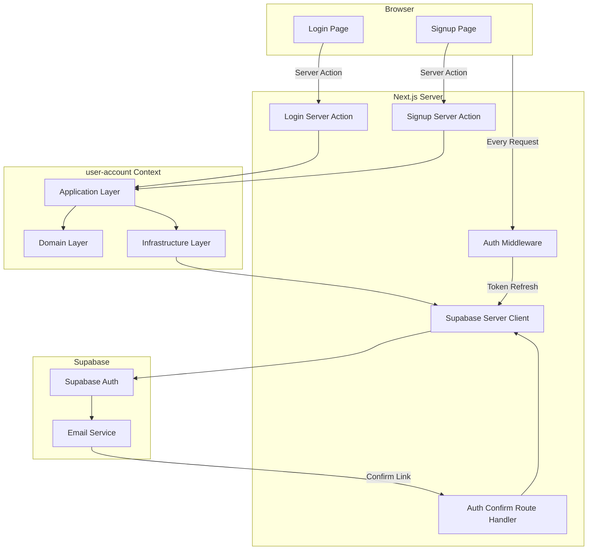
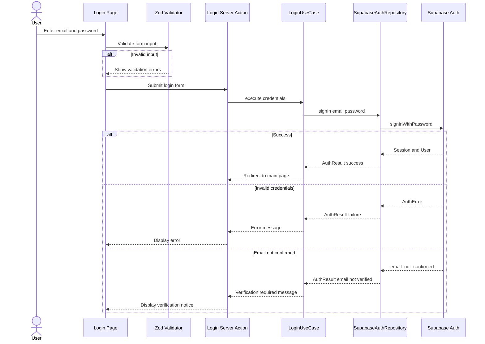
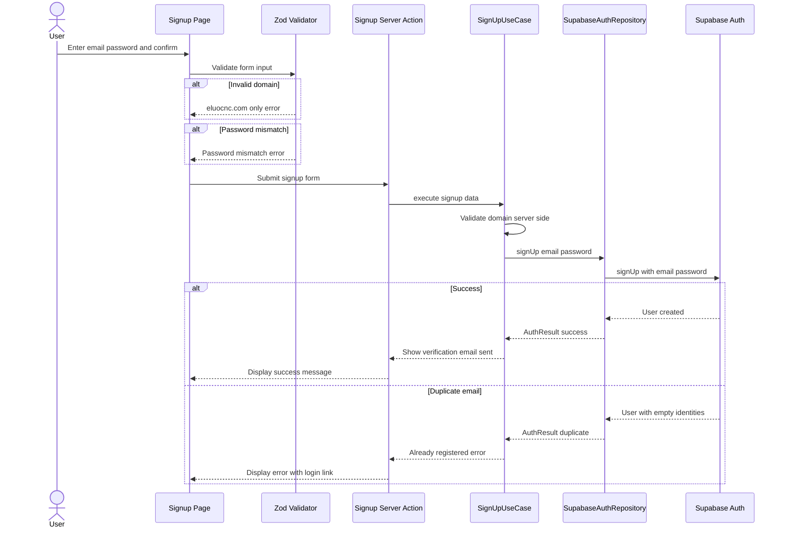
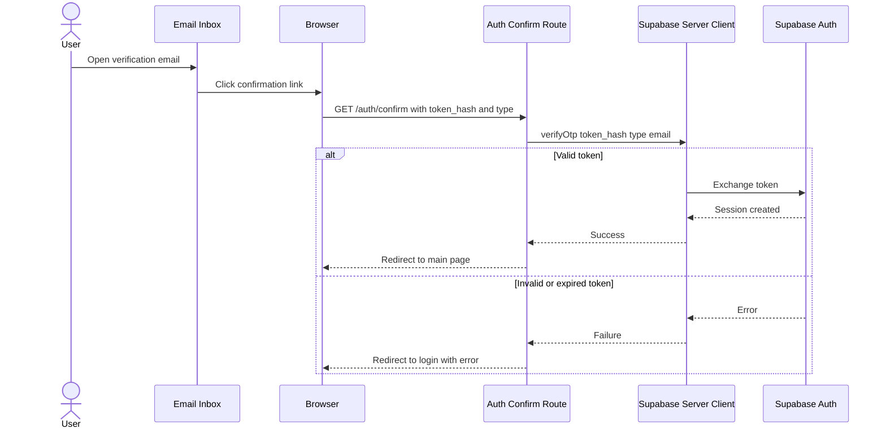

# Technical Design: auth-login-signup

## Overview

**Purpose**: 이 기능은 Eluo Skill Hub 플랫폼에 이메일/패스워드 기반 인증 시스템을 제공한다. `@eluocnc.com` 도메인 사용자만 가입할 수 있도록 제한하며, 이메일 인증 코드 확인을 통해 신원을 검증한다.

**Users**: Eluo CNC 소속 직원(스킬 소비자, 스킬 제작자)이 로그인/회원가입을 통해 플랫폼에 접근한다. 플랫폼 관리자는 인증된 사용자 기반으로 권한을 관리한다.

**Impact**: 기존 인증 없이 접근 가능한 상태에서 Supabase Auth 기반 세션 관리 체계로 전환한다. `@supabase/ssr` 패키지를 도입하여 기존 Supabase 클라이언트 구조를 SSR 호환으로 리팩터링한다.

### Goals
- Supabase Auth 기반 이메일/패스워드 로그인 및 회원가입 구현
- `@eluocnc.com` 도메인 제한을 통한 사내 전용 접근 제어
- 이메일 인증 흐름을 통한 사용자 신원 검증
- SSR 환경에서 안전한 쿠키 기반 세션 관리

### Non-Goals
- 소셜 로그인(Google, GitHub 등) 지원은 현재 범위에 포함하지 않는다
- 패스워드 재설정 기능은 포함하지 않는다
- 사용자 프로필 관리 기능은 포함하지 않는다
- 역할 기반 접근 제어(RBAC)는 포함하지 않는다
- 이메일 인증 메일 재발송 기능은 포함하지 않는다

## Architecture

### Existing Architecture Analysis

현재 프로젝트는 DDD 3계층 구조를 기반으로 하며, `src/shared/` 모듈에 Entity, ValueObject, DomainEvent 기반 클래스가 정의되어 있다. Supabase 클라이언트는 `src/shared/infrastructure/supabase/client.ts`에서 `@supabase/supabase-js`의 `createClient`를 직접 사용하고 있으나, SSR 세션 관리를 지원하지 않는다. `middleware.ts`가 존재하지 않으며, 인증 관련 바운디드 컨텍스트는 아직 생성되지 않았다.

- 기존 Supabase 클라이언트(`createClient` 직접 호출)를 `@supabase/ssr` 기반으로 전환해야 한다
- `react-hook-form` + `zod` + shadcn/ui 폼 컴포넌트가 이미 설치되어 재활용 가능하다
- `user-account` 바운디드 컨텍스트를 신규 생성하여 Product Overview의 도메인 모델에 정의된 "User Account" 컨텍스트를 실현한다

### Architecture Pattern & Boundary Map



**Architecture Integration**:
- **Selected pattern**: Server Action 기반 인증. Next.js App Router의 Server Action에서 Supabase Auth API를 호출하여 서버 사이드 보안과 쿠키 기반 세션 관리를 통합한다.
- **Domain/feature boundaries**: `user-account` 바운디드 컨텍스트가 인증 도메인 로직(이메일 검증, 패스워드 정책)을 소유한다. 인증 인프라(Supabase Auth 호출)는 인프라 계층에 캡슐화한다.
- **Existing patterns preserved**: DDD 3계층 분리, Entity/ValueObject 기반 클래스, `@/` 경로 별칭
- **New components rationale**: 미들웨어(세션 갱신), SSR 클라이언트 유틸리티(서버/브라우저 분리), `user-account` 바운디드 컨텍스트(도메인 격리)
- **Steering compliance**: `any` 타입 금지, Aggregate Root를 통한 데이터 변경, 도메인 계층 외부 의존성 금지

### Technology Stack

| Layer | Choice / Version | Role in Feature | Notes |
|-------|------------------|-----------------|-------|
| Frontend | React 19 + Next.js 16 App Router | 로그인/회원가입 페이지 UI, Server Action 호출 | 기존 스택 유지 |
| Form Handling | react-hook-form 7.x + zod 4.x | 클라이언트 폼 상태 관리 및 유효성 검증 | 기존 설치 활용 |
| UI Components | shadcn/ui (Card, Input, Button, Form, Label) | 인증 폼 UI 구성 | 기존 컴포넌트 재사용 |
| Auth | @supabase/ssr + @supabase/supabase-js 2.x | SSR 호환 쿠키 기반 세션 관리 | 신규 의존성 추가 |
| Infrastructure | Supabase Auth (PostgreSQL 기반) | 사용자 인증, 세션 토큰, 이메일 발송 | 외부 서비스 |

## System Flows

### Login Flow



### Signup Flow



### Email Confirmation Flow



## Requirements Traceability

| Requirement | Summary | Components | Interfaces | Flows |
|-------------|---------|------------|------------|-------|
| 1.1 | /login 라우트 페이지 제공 | LoginPage | - | - |
| 1.2 | 이메일, 패스워드 필드, 로그인 버튼 | LoginForm | LoginFormProps | - |
| 1.3 | signInWithPassword 호출 | LoginUseCase, SupabaseAuthRepository | AuthRepository, LoginAction | Login Flow |
| 1.4 | 성공 시 메인 페이지 리다이렉트 | LoginAction | - | Login Flow |
| 1.5 | 이메일 형식 검증 | loginFormSchema (zod) | - | - |
| 1.6 | 패스워드 빈 값 검증 | loginFormSchema (zod) | - | - |
| 1.7 | 잘못된 자격증명 에러 | LoginUseCase | AuthResult | Login Flow |
| 1.8 | 미가입 이메일 안내 | LoginUseCase, LoginForm | AuthResult | Login Flow |
| 1.9 | 이메일 미인증 사용자 안내 | LoginUseCase, LoginForm | AuthResult | Login Flow |
| 2.1 | /signup 라우트 페이지 제공 | SignupPage | - | - |
| 2.2 | 이메일, 패스워드, 패스워드 확인 필드, 가입 버튼 | SignupForm | SignupFormProps | - |
| 2.3 | eluocnc.com 도메인 제한 | EluoDomainEmail (ValueObject), signupFormSchema | - | - |
| 2.4 | 이메일 형식 검증 | signupFormSchema (zod) | - | - |
| 2.5 | 패스워드 정책 검증 (8자 이상, 특수문자) | Password (ValueObject), signupFormSchema | - | - |
| 2.6 | 패스워드 확인 일치 검증 | signupFormSchema (zod) | - | - |
| 2.7 | signUp 호출 및 이메일 인증 발송 | SignUpUseCase, SupabaseAuthRepository | AuthRepository, SignupAction | Signup Flow |
| 2.8 | 가입 성공 후 인증 메일 안내 | SignupForm | - | Signup Flow |
| 2.9 | 중복 이메일 안내 | SignUpUseCase, SignupForm | AuthResult | Signup Flow |
| 3.1 | 로그인 페이지에서 회원가입 링크 | LoginForm | - | - |
| 3.2 | 회원가입 페이지에서 로그인 링크 | SignupForm | - | - |
| 4.1 | 인증된 사용자의 로그인/회원가입 페이지 리다이렉트 | AuthMiddleware | - | - |
| 4.2 | Supabase Auth 기반 세션 관리 | AuthMiddleware, createSupabaseServerClient | - | - |
| 4.3 | 로그아웃 시 세션 종료 | LogoutAction | AuthRepository | - |
| 4.4 | 이메일 미인증 사용자 보호 페이지 차단 | AuthMiddleware | - | - |
| 5.1 | 로그인 시 로딩 인디케이터 및 중복 방지 | LoginForm (useAuthForm) | - | - |
| 5.2 | 회원가입 시 로딩 인디케이터 및 중복 방지 | SignupForm (useAuthForm) | - | - |
| 5.3 | 네트워크 오류 메시지 및 재시도 | LoginForm, SignupForm | AuthResult | - |

## Components and Interfaces

| Component | Domain/Layer | Intent | Req Coverage | Key Dependencies | Contracts |
|-----------|--------------|--------|--------------|------------------|-----------|
| EluoDomainEmail | user-account/domain | eluocnc.com 도메인 이메일 값 객체 | 2.3, 2.4 | - | - |
| Password | user-account/domain | 패스워드 정책 값 객체 | 2.5 | - | - |
| AuthResult | user-account/domain | 인증 결과 판별 합집합 타입 | 1.3-1.9, 2.7-2.9 | - | - |
| AuthRepository | user-account/domain | 인증 리포지토리 인터페이스 | 1.3, 2.7, 4.2, 4.3 | - | Service |
| LoginUseCase | user-account/application | 로그인 유스케이스 | 1.3, 1.4, 1.7-1.9 | AuthRepository (P0) | Service |
| SignUpUseCase | user-account/application | 회원가입 유스케이스 | 2.3, 2.7-2.9 | AuthRepository (P0) | Service |
| SupabaseAuthRepository | user-account/infrastructure | Supabase Auth 리포지토리 구현체 | 1.3, 2.7 | Supabase Server Client (P0) | Service |
| createSupabaseBrowserClient | shared/infrastructure | 브라우저용 Supabase 클라이언트 팩토리 | 4.2 | @supabase/ssr (P0) | - |
| createSupabaseServerClient | shared/infrastructure | 서버용 Supabase 클라이언트 팩토리 | 4.2 | @supabase/ssr (P0) | - |
| AuthMiddleware | Next.js middleware | 세션 갱신 및 인증 라우트 보호 | 4.1, 4.2, 4.4 | createSupabaseServerClient (P0) | - |
| LoginPage | app/login | 로그인 페이지 서버 컴포넌트 | 1.1 | LoginForm (P0) | - |
| SignupPage | app/signup | 회원가입 페이지 서버 컴포넌트 | 2.1 | SignupForm (P0) | - |
| LoginForm | UI component | 로그인 폼 클라이언트 컴포넌트 | 1.2, 1.5-1.9, 3.1, 5.1, 5.3 | useAuthForm (P0) | State |
| SignupForm | UI component | 회원가입 폼 클라이언트 컴포넌트 | 2.2, 2.4-2.6, 2.8-2.9, 3.2, 5.2, 5.3 | useAuthForm (P0) | State |
| useAuthForm | UI hook | 인증 폼 상태 관리 훅 | 5.1, 5.2, 5.3 | - | State |
| LoginAction | Server Action | 로그인 서버 액션 | 1.3, 1.4 | LoginUseCase (P0) | Service |
| SignupAction | Server Action | 회원가입 서버 액션 | 2.7 | SignUpUseCase (P0) | Service |
| LogoutAction | Server Action | 로그아웃 서버 액션 | 4.3 | AuthRepository (P0) | Service |
| AuthConfirmRoute | Route Handler | 이메일 인증 콜백 처리 | 2.7 | createSupabaseServerClient (P0) | API |

### Domain Layer (user-account/domain)

#### EluoDomainEmail

| Field | Detail |
|-------|--------|
| Intent | `@eluocnc.com` 도메인으로 제한된 이메일 주소 값 객체 |
| Requirements | 2.3, 2.4 |

**Responsibilities & Constraints**
- 이메일 형식 유효성 검증 (RFC 5322 기본 패턴)
- `@eluocnc.com` 도메인 제한 검증
- 불변 값 객체로 생성 시 검증 완료

**Dependencies**
- Outbound: ValueObject (shared/domain) -- 기반 클래스 (P2)

```typescript
interface EluoDomainEmailProps {
  readonly value: string;
}

class EluoDomainEmail extends ValueObject<EluoDomainEmailProps> {
  static create(email: string): EluoDomainEmail; // throws if invalid
  static isValid(email: string): boolean;
  static isEluoDomain(email: string): boolean;
  get value(): string;
}
```
- Preconditions: 이메일 문자열이 비어 있지 않아야 한다
- Postconditions: 유효한 이메일 형식이며 `@eluocnc.com` 도메인이다
- Invariants: 생성된 인스턴스는 항상 유효한 eluocnc.com 이메일이다

#### Password

| Field | Detail |
|-------|--------|
| Intent | 패스워드 정책(최소 8자, 특수문자 1개 이상)을 강제하는 값 객체 |
| Requirements | 2.5 |

**Responsibilities & Constraints**
- 최소 8자 길이 검증
- 특수문자 1개 이상 포함 검증
- 평문 패스워드를 보유하되, 도메인 외부로 전달 시에만 사용

**Dependencies**
- Outbound: ValueObject (shared/domain) -- 기반 클래스 (P2)

```typescript
interface PasswordProps {
  readonly value: string;
}

class Password extends ValueObject<PasswordProps> {
  static create(password: string): Password; // throws if invalid
  static isValid(password: string): boolean;
  get value(): string;
}
```
- Preconditions: 패스워드 문자열이 비어 있지 않아야 한다
- Postconditions: 최소 8자 이상이며 특수문자를 1개 이상 포함한다
- Invariants: 생성된 인스턴스는 항상 정책을 만족하는 패스워드이다

#### AuthResult

| Field | Detail |
|-------|--------|
| Intent | 인증 작업 결과를 표현하는 판별 합집합(discriminated union) 타입 |
| Requirements | 1.3-1.9, 2.7-2.9, 5.3 |

**Responsibilities & Constraints**
- 인증 성공/실패/이메일 미인증/중복 가입/네트워크 오류 등 모든 결과 상태를 타입 안전하게 표현
- 직렬화 가능한 순수 데이터 구조 (Server Action 반환용)

```typescript
type AuthResult =
  | { status: 'success'; redirectTo: string }
  | { status: 'error'; code: AuthErrorCode; message: string }
  | { status: 'signup_success'; message: string };

type AuthErrorCode =
  | 'invalid_credentials'
  | 'email_not_confirmed'
  | 'email_already_registered'
  | 'invalid_email_domain'
  | 'network_error'
  | 'unknown_error';
```

#### AuthRepository

| Field | Detail |
|-------|--------|
| Intent | 인증 관련 인프라 작업의 리포지토리 인터페이스 (의존성 역전) |
| Requirements | 1.3, 2.7, 4.2, 4.3 |

**Responsibilities & Constraints**
- 도메인 계층에 위치하여 인프라 의존성을 역전시킨다
- Supabase Auth 세부사항을 추상화한다

**Contracts**: Service [x]

##### Service Interface

```typescript
interface AuthRepository {
  signIn(email: string, password: string): Promise<AuthResult>;
  signUp(email: string, password: string): Promise<AuthResult>;
  signOut(): Promise<void>;
  verifyOtp(tokenHash: string, type: string): Promise<AuthResult>;
}
```
- Preconditions: email과 password는 비어 있지 않은 문자열이다
- Postconditions: AuthResult를 통해 성공 또는 실패 상태를 반환한다
- Invariants: 도메인 계층에서 외부 라이브러리를 직접 참조하지 않는다

### Application Layer (user-account/application)

#### LoginUseCase

| Field | Detail |
|-------|--------|
| Intent | 이메일/패스워드 로그인 유스케이스 오케스트레이션 |
| Requirements | 1.3, 1.4, 1.7, 1.8, 1.9 |

**Responsibilities & Constraints**
- AuthRepository를 통해 로그인을 수행하고 결과를 AuthResult로 반환
- 성공 시 리다이렉트 경로를 포함한 AuthResult 반환
- 에러 코드에 따라 적절한 사용자 메시지를 매핑

**Dependencies**
- Inbound: LoginAction (Server Action) -- 유스케이스 호출 (P0)
- Outbound: AuthRepository (domain) -- 인증 수행 (P0)

**Contracts**: Service [x]

##### Service Interface

```typescript
interface LoginUseCaseInput {
  readonly email: string;
  readonly password: string;
}

class LoginUseCase {
  constructor(authRepository: AuthRepository);
  execute(input: LoginUseCaseInput): Promise<AuthResult>;
}
```
- Preconditions: input의 email과 password가 비어 있지 않다
- Postconditions: AuthResult를 반환한다. 성공 시 `status: 'success'`, 실패 시 적절한 `AuthErrorCode`를 포함한다

#### SignUpUseCase

| Field | Detail |
|-------|--------|
| Intent | 회원가입 유스케이스 오케스트레이션 (도메인 검증 포함) |
| Requirements | 2.3, 2.7, 2.8, 2.9 |

**Responsibilities & Constraints**
- EluoDomainEmail 값 객체를 통한 서버 사이드 도메인 검증
- Password 값 객체를 통한 서버 사이드 패스워드 정책 검증
- AuthRepository를 통해 회원가입 수행
- 중복 이메일 감지 및 적절한 AuthResult 반환

**Dependencies**
- Inbound: SignupAction (Server Action) -- 유스케이스 호출 (P0)
- Outbound: AuthRepository (domain) -- 회원가입 수행 (P0)

**Contracts**: Service [x]

##### Service Interface

```typescript
interface SignUpUseCaseInput {
  readonly email: string;
  readonly password: string;
}

class SignUpUseCase {
  constructor(authRepository: AuthRepository);
  execute(input: SignUpUseCaseInput): Promise<AuthResult>;
}
```
- Preconditions: input의 email이 `@eluocnc.com` 도메인이며, password가 정책을 만족한다
- Postconditions: 성공 시 `status: 'signup_success'`, 중복 시 `status: 'error'` with `code: 'email_already_registered'`

### Infrastructure Layer (user-account/infrastructure)

#### SupabaseAuthRepository

| Field | Detail |
|-------|--------|
| Intent | AuthRepository의 Supabase Auth 기반 구현체 |
| Requirements | 1.3, 2.7, 4.2, 4.3 |

**Responsibilities & Constraints**
- Supabase Auth API 호출을 AuthRepository 인터페이스에 맞게 어댑팅
- Supabase AuthError를 AuthResult의 AuthErrorCode로 매핑
- 중복 이메일 감지: `signUp` 반환값의 `user.identities` 배열이 비어 있으면 이미 등록된 이메일로 판별

**Dependencies**
- Inbound: LoginUseCase, SignUpUseCase (application) -- 인증 수행 (P0)
- External: @supabase/ssr createServerClient -- Supabase Auth API 접근 (P0)

**Contracts**: Service [x]

##### Service Interface

```typescript
class SupabaseAuthRepository implements AuthRepository {
  constructor(supabaseClient: SupabaseClient);
  signIn(email: string, password: string): Promise<AuthResult>;
  signUp(email: string, password: string): Promise<AuthResult>;
  signOut(): Promise<void>;
  verifyOtp(tokenHash: string, type: string): Promise<AuthResult>;
}
```

**Implementation Notes**
- Integration: `signInWithPassword` 에러 응답이 계정 미존재와 패스워드 불일치를 구분하지 않는다. `invalid_credentials` 에러 코드 하나로 통합 처리하되, `email_not_confirmed`만 별도 분기한다.
- Validation: 중복 이메일은 `signUp` 반환값의 `data.user?.identities?.length === 0` 조건으로 감지한다.
- Risks: Supabase Auth 에러 코드가 향후 버전에서 변경될 수 있다. 에러 매핑 로직을 한 곳에 집중시켜 변경 영향을 최소화한다.

### Shared Infrastructure (shared/infrastructure/supabase)

#### createSupabaseBrowserClient

| Field | Detail |
|-------|--------|
| Intent | 클라이언트 컴포넌트용 Supabase 브라우저 클라이언트 팩토리 |
| Requirements | 4.2 |

**Responsibilities & Constraints**
- `@supabase/ssr`의 `createBrowserClient`를 래핑
- 환경변수 `NEXT_PUBLIC_SUPABASE_URL`, `NEXT_PUBLIC_SUPABASE_PUBLISHABLE_DEFAULT_KEY` 사용

```typescript
// src/shared/infrastructure/supabase/client.ts (리팩터링)
import { createBrowserClient } from '@supabase/ssr';

function createSupabaseBrowserClient(): SupabaseClient {
  return createBrowserClient(
    process.env.NEXT_PUBLIC_SUPABASE_URL!,
    process.env.NEXT_PUBLIC_SUPABASE_PUBLISHABLE_DEFAULT_KEY!
  );
}
```

**Implementation Notes**
- Integration: 기존 `client.ts`의 `supabase` 싱글톤 export를 이 팩토리 함수로 대체한다. 기존 코드에서 `supabase`를 사용하는 부분은 `createSupabaseBrowserClient()`호출로 전환한다.

#### createSupabaseServerClient

| Field | Detail |
|-------|--------|
| Intent | 서버 컴포넌트/서버 액션/라우트 핸들러용 Supabase 서버 클라이언트 팩토리 |
| Requirements | 4.2 |

**Responsibilities & Constraints**
- `@supabase/ssr`의 `createServerClient`를 래핑
- Next.js `cookies()` API를 통한 쿠키 기반 세션 관리
- 매 호출마다 새 인스턴스를 생성하여 요청 간 세션 격리 보장

```typescript
// src/shared/infrastructure/supabase/server.ts (신규)
import { createServerClient } from '@supabase/ssr';
import { cookies } from 'next/headers';
import type { SupabaseClient } from '@supabase/supabase-js';

async function createSupabaseServerClient(): Promise<SupabaseClient> {
  const cookieStore = await cookies();
  return createServerClient(
    process.env.NEXT_PUBLIC_SUPABASE_URL!,
    process.env.NEXT_PUBLIC_SUPABASE_PUBLISHABLE_DEFAULT_KEY!,
    {
      cookies: {
        getAll(): Array<{ name: string; value: string }> {
          return cookieStore.getAll();
        },
        setAll(cookiesToSet: Array<{ name: string; value: string; options: CookieOptions }>): void {
          cookiesToSet.forEach(({ name, value, options }) => {
            cookieStore.set(name, value, options);
          });
        },
      },
    }
  );
}
```

### Next.js Middleware

#### AuthMiddleware

| Field | Detail |
|-------|--------|
| Intent | Auth 토큰 갱신 및 인증 라우트 보호를 위한 미들웨어 |
| Requirements | 4.1, 4.2, 4.4 |

**Responsibilities & Constraints**
- 모든 요청에서 Supabase Auth 토큰을 갱신한다
- 인증된 사용자가 `/login`, `/signup`에 접근 시 메인 페이지로 리다이렉트한다
- 정적 자산, 이미지 파일 요청은 제외한다

**Dependencies**
- External: @supabase/ssr createServerClient -- 토큰 갱신 (P0)

```typescript
// middleware.ts (프로젝트 루트, src 외부)
import { type NextRequest, NextResponse } from 'next/server';
import { createServerClient } from '@supabase/ssr';

async function updateSession(request: NextRequest): Promise<NextResponse>;

const config = {
  matcher: [
    '/((?!_next/static|_next/image|favicon.ico|.*\\.(?:svg|png|jpg|jpeg|gif|webp)$).*)',
  ],
};
```

**Implementation Notes**
- Integration: 미들웨어에서는 `cookies()` 대신 `request.cookies`와 `response.cookies`를 사용하여 토큰을 갱신한다.
- Validation: `supabase.auth.getUser()` 결과로 인증 상태를 판별한다. `getSession()`은 JWT를 재검증하지 않으므로 사용하지 않는다.
- Risks: 미들웨어가 모든 요청에서 실행되므로 매처 설정이 정확해야 한다. 정적 자산 패턴을 충분히 제외한다.

### Server Actions (app/actions)

#### LoginAction

| Field | Detail |
|-------|--------|
| Intent | 로그인 폼 제출을 처리하는 서버 액션 |
| Requirements | 1.3, 1.4 |

**Responsibilities & Constraints**
- LoginUseCase를 호출하고 AuthResult를 반환한다
- 성공 시 메인 페이지(`/`)로 리다이렉트한다

**Dependencies**
- Outbound: LoginUseCase (application) -- 로그인 수행 (P0)
- Outbound: createSupabaseServerClient (shared) -- 클라이언트 생성 (P0)

**Contracts**: Service [x]

##### Service Interface

```typescript
// src/app/(auth)/login/actions.ts
async function loginAction(
  prevState: AuthResult | null,
  formData: FormData
): Promise<AuthResult>;
```
- Preconditions: formData에 email, password 필드가 존재한다
- Postconditions: AuthResult를 반환한다. 성공 시 redirect()를 호출한다

#### SignupAction

| Field | Detail |
|-------|--------|
| Intent | 회원가입 폼 제출을 처리하는 서버 액션 |
| Requirements | 2.7 |

**Responsibilities & Constraints**
- SignUpUseCase를 호출하고 AuthResult를 반환한다
- 성공 시 가입 완료 안내 메시지를 포함한 AuthResult를 반환한다

**Dependencies**
- Outbound: SignUpUseCase (application) -- 회원가입 수행 (P0)
- Outbound: createSupabaseServerClient (shared) -- 클라이언트 생성 (P0)

**Contracts**: Service [x]

##### Service Interface

```typescript
// src/app/(auth)/signup/actions.ts
async function signupAction(
  prevState: AuthResult | null,
  formData: FormData
): Promise<AuthResult>;
```

#### LogoutAction

| Field | Detail |
|-------|--------|
| Intent | 로그아웃을 처리하는 서버 액션 |
| Requirements | 4.3 |

```typescript
// src/app/actions/auth.ts
async function logoutAction(): Promise<void>;
```

### Route Handlers

#### AuthConfirmRoute

| Field | Detail |
|-------|--------|
| Intent | 이메일 인증 링크의 콜백을 처리하는 라우트 핸들러 |
| Requirements | 2.7 |

**Responsibilities & Constraints**
- `token_hash`와 `type` 쿼리 파라미터를 추출하여 `verifyOtp`를 호출한다
- 성공 시 메인 페이지로, 실패 시 로그인 페이지로 리다이렉트한다

**Dependencies**
- External: createSupabaseServerClient -- OTP 검증 (P0)

**Contracts**: API [x]

##### API Contract

| Method | Endpoint | Request | Response | Errors |
|--------|----------|---------|----------|--------|
| GET | /auth/confirm | Query: token_hash, type | Redirect to / or /login | Invalid token redirect |

### UI Components

#### LoginForm

| Field | Detail |
|-------|--------|
| Intent | 로그인 폼 UI. 이메일/패스워드 입력, 유효성 검증, 서버 액션 호출, 에러 표시 |
| Requirements | 1.2, 1.5, 1.6, 1.7, 1.8, 1.9, 3.1, 5.1, 5.3 |

**Responsibilities & Constraints**
- react-hook-form + zod로 클라이언트 사이드 폼 유효성 검증
- useActionState로 서버 액션 호출 및 결과 상태 관리
- 로딩 상태에서 버튼 비활성화 및 로딩 인디케이터 표시
- 에러 코드에 따른 적절한 메시지 표시 및 회원가입 링크 제공

**Dependencies**
- Outbound: LoginAction -- 서버 액션 호출 (P0)
- Outbound: useAuthForm -- 폼 상태 관리 (P1)
- External: react-hook-form, zod -- 폼 검증 (P0)
- External: shadcn/ui (Card, Input, Button, Form, Label) -- UI 렌더링 (P1)

**Contracts**: State [x]

##### State Management

```typescript
// loginFormSchema (zod)
const loginFormSchema = z.object({
  email: z.string().email('유효한 이메일 주소를 입력해주세요'),
  password: z.string().min(1, '패스워드를 입력해주세요'),
});

type LoginFormValues = z.infer<typeof loginFormSchema>;
```

**Implementation Notes**
- Integration: shadcn/ui의 Form, FormField, FormItem, FormLabel, FormControl, FormMessage 컴포넌트를 활용한다
- Validation: 클라이언트 zod 검증은 즉각적 UX 피드백용이며, 최종 검증은 서버 사이드에서 수행한다
- Risks: useActionState의 반환 타입이 React 19의 실험적 API일 수 있으나, Next.js 16에서 안정적으로 지원한다

#### SignupForm

| Field | Detail |
|-------|--------|
| Intent | 회원가입 폼 UI. 이메일/패스워드/패스워드 확인 입력, 도메인 검증, 서버 액션 호출 |
| Requirements | 2.2, 2.3, 2.4, 2.5, 2.6, 2.8, 2.9, 3.2, 5.2, 5.3 |

**Responsibilities & Constraints**
- react-hook-form + zod로 클라이언트 사이드 폼 유효성 검증
- `@eluocnc.com` 도메인 제한을 zod 스키마에서 클라이언트 검증
- 패스워드 정책(8자 이상, 특수문자 1개 이상) 검증
- 패스워드 확인 일치 검증
- 가입 성공 시 인증 메일 발송 안내 화면 표시

**Dependencies**
- Outbound: SignupAction -- 서버 액션 호출 (P0)
- Outbound: useAuthForm -- 폼 상태 관리 (P1)
- External: react-hook-form, zod -- 폼 검증 (P0)
- External: shadcn/ui (Card, Input, Button, Form, Label) -- UI 렌더링 (P1)

**Contracts**: State [x]

##### State Management

```typescript
// signupFormSchema (zod)
const signupFormSchema = z.object({
  email: z.string()
    .email('유효한 이메일 주소를 입력해주세요')
    .refine(
      (email) => email.endsWith('@eluocnc.com'),
      'eluocnc.com 이메일만 가입이 가능합니다'
    ),
  password: z.string()
    .min(8, '패스워드는 최소 8자 이상이어야 합니다')
    .regex(
      /[!@#$%^&*()_+\-=\[\]{};':"\\|,.<>\/?]/,
      '패스워드는 특수문자를 1개 이상 포함해야 합니다'
    ),
  passwordConfirm: z.string(),
}).refine(
  (data) => data.password === data.passwordConfirm,
  { message: '패스워드가 일치하지 않습니다', path: ['passwordConfirm'] }
);

type SignupFormValues = z.infer<typeof signupFormSchema>;
```

#### useAuthForm

| Field | Detail |
|-------|--------|
| Intent | 인증 폼의 공통 상태 관리 (로딩, 에러, 서버 액션 결과) 훅 |
| Requirements | 5.1, 5.2, 5.3 |

**Responsibilities & Constraints**
- `useActionState`를 래핑하여 서버 액션 호출 상태를 관리
- 로딩 상태 추적 및 중복 제출 방지
- 네트워크 에러 감지 및 재시도 상태 관리

```typescript
interface UseAuthFormReturn {
  state: AuthResult | null;
  formAction: (payload: FormData) => void;
  isPending: boolean;
}

function useAuthForm(
  action: (prevState: AuthResult | null, formData: FormData) => Promise<AuthResult>
): UseAuthFormReturn;
```

#### LoginPage / SignupPage

LoginPage와 SignupPage는 서버 컴포넌트로 `/login`과 `/signup` 라우트에 각각 대응한다. 레이아웃 구성만을 담당하며 별도 비즈니스 로직을 포함하지 않는다.

**Implementation Notes**
- Integration: `(auth)` 라우트 그룹을 사용하여 인증 페이지 전용 레이아웃을 분리한다. 이 레이아웃은 사이드바와 헤더 없이 중앙 정렬된 카드 형태의 인증 폼을 표시한다.

## Data Models

### Domain Model

인증 기능은 Supabase Auth가 사용자 데이터와 세션을 관리하므로 자체 데이터베이스 테이블을 생성하지 않는다. 도메인 모델은 값 객체와 결과 타입으로 구성된다.

- **Aggregates**: 해당 없음. Supabase Auth가 사용자 엔티티의 영속성을 관리한다.
- **Value Objects**: `EluoDomainEmail` (이메일 주소), `Password` (패스워드)
- **Domain Types**: `AuthResult` (인증 결과), `AuthErrorCode` (에러 코드)
- **Business Rules**:
  - 이메일 도메인은 반드시 `@eluocnc.com`이어야 한다
  - 패스워드는 최소 8자 이상이며 특수문자를 1개 이상 포함해야 한다
  - 이메일 인증이 완료되지 않은 사용자는 로그인할 수 없다

### Logical Data Model

Supabase Auth는 `auth.users` 테이블을 내부적으로 관리한다. 이 기능에서 직접 스키마를 정의하지 않으며, Supabase Auth API를 통해 간접적으로 상호작용한다.

**Supabase Auth 활용 필드** (참조용):
- `id` (UUID): 사용자 고유 식별자
- `email` (string): 사용자 이메일 주소
- `email_confirmed_at` (timestamp | null): 이메일 인증 완료 시각
- `created_at` (timestamp): 계정 생성 시각
- `identities` (array): 연결된 인증 제공자 목록 (중복 가입 감지용)

## Error Handling

### Error Strategy

인증 에러를 `AuthResult` 판별 합집합 타입으로 표현하여 타입 안전한 에러 처리를 보장한다. Supabase AuthError를 도메인 수준의 `AuthErrorCode`로 매핑하여 인프라 세부사항을 캡슐화한다.

### Error Categories and Responses

**User Errors (클라이언트 검증)**:
- 이메일 형식 오류 -> zod 스키마에서 필드 수준 검증 메시지
- 패스워드 빈 값 -> zod 스키마에서 필드 수준 검증 메시지
- 도메인 제한 위반 -> zod refine에서 "eluocnc.com 이메일만 가입이 가능합니다"
- 패스워드 정책 위반 -> zod 스키마에서 "패스워드는 최소 8자 이상이며 특수문자를 1개 이상 포함해야 합니다"
- 패스워드 불일치 -> zod refine에서 "패스워드가 일치하지 않습니다"

**Authentication Errors (서버 처리)**:
- `invalid_credentials` -> "이메일 또는 패스워드가 올바르지 않습니다" + 회원가입 링크
- `email_not_confirmed` -> "이메일 인증이 필요합니다. 가입 시 발송된 인증 메일을 확인해주세요"
- `email_already_registered` -> "이미 가입된 이메일입니다" + 로그인 링크

**System Errors (네트워크/인프라)**:
- `network_error` -> "네트워크 오류가 발생했습니다. 잠시 후 다시 시도해주세요" + 재시도 버튼
- `unknown_error` -> "알 수 없는 오류가 발생했습니다. 잠시 후 다시 시도해주세요"

## Testing Strategy

### Unit Tests
- `EluoDomainEmail.create()`: 유효한 eluocnc.com 이메일 생성 성공, 타 도메인 거부, 잘못된 형식 거부
- `Password.create()`: 유효한 패스워드 생성 성공, 8자 미만 거부, 특수문자 미포함 거부
- `LoginUseCase.execute()`: 성공/실패/이메일 미인증 각 시나리오 AuthResult 반환 검증
- `SignUpUseCase.execute()`: 성공/중복 이메일/도메인 위반 각 시나리오 검증
- `SupabaseAuthRepository`: Supabase AuthError를 AuthErrorCode로 올바르게 매핑하는지 검증

### Component Tests
- `LoginForm`: 폼 렌더링, zod 유효성 검증 에러 표시, 서버 에러 메시지 표시, 로딩 상태 UI
- `SignupForm`: 폼 렌더링, 도메인 제한 에러, 패스워드 정책 에러, 가입 성공 안내 화면 전환
- 네비게이션 링크: 로그인 -> 회원가입, 회원가입 -> 로그인 링크 동작 검증

### E2E Tests
- 유효한 자격증명으로 로그인 후 메인 페이지 리다이렉트
- eluocnc.com 이메일로 회원가입 후 인증 메일 안내 화면 표시
- 타 도메인 이메일 가입 시도 시 거부 확인
- 인증된 사용자가 /login 접근 시 메인 페이지 리다이렉트

## Security Considerations

- **Server Action 기반 인증**: 모든 인증 로직은 서버 사이드에서 실행되어 클라이언트에 민감한 로직이 노출되지 않는다
- **CSRF 보호**: Next.js Server Action은 CSRF 보호를 내장하고 있다
- **JWT 검증**: 서버 코드에서 `supabase.auth.getUser()`를 사용하여 JWT를 항상 재검증한다. `getSession()`은 사용하지 않는다
- **에러 메시지 보안**: 로그인 실패 시 계정 존재 여부를 명시적으로 노출하지 않는 통합 에러 메시지를 사용한다
- **도메인 이중 검증**: eluocnc.com 도메인 제한을 클라이언트와 서버 모두에서 검증하여 우회를 방지한다
- **쿠키 보안**: `@supabase/ssr`이 httpOnly, secure, sameSite 속성을 자동 설정한다

## File Structure

```
src/
  user-account/
    domain/
      EluoDomainEmail.ts
      Password.ts
      AuthResult.ts
      AuthRepository.ts
    application/
      LoginUseCase.ts
      SignUpUseCase.ts
    infrastructure/
      SupabaseAuthRepository.ts
  shared/
    infrastructure/
      supabase/
        client.ts          (리팩터링: createSupabaseBrowserClient)
        server.ts          (신규: createSupabaseServerClient)
  app/
    (auth)/
      layout.tsx           (인증 페이지 전용 레이아웃)
      login/
        page.tsx
        actions.ts
      signup/
        page.tsx
        actions.ts
    auth/
      confirm/
        route.ts           (이메일 인증 콜백 라우트 핸들러)
    actions/
      auth.ts              (logoutAction)
middleware.ts              (프로젝트 루트)
```
