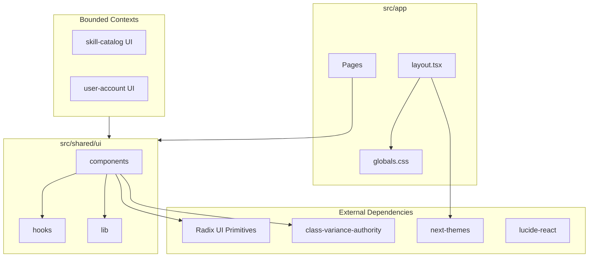
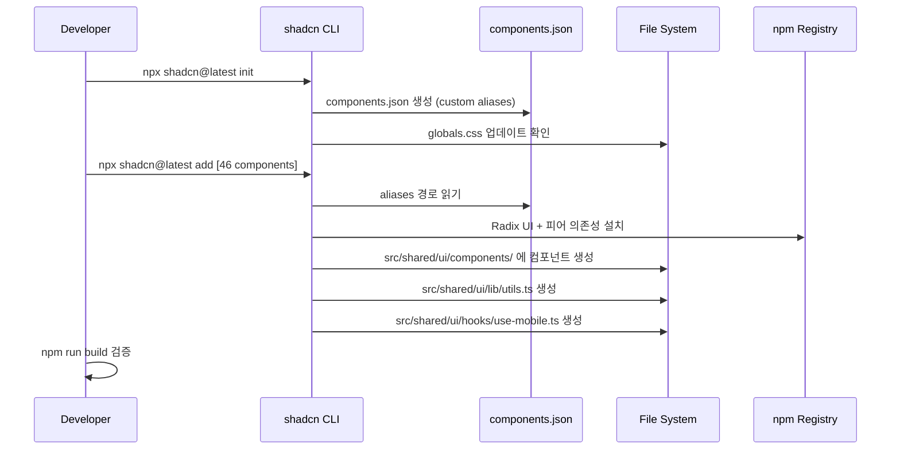
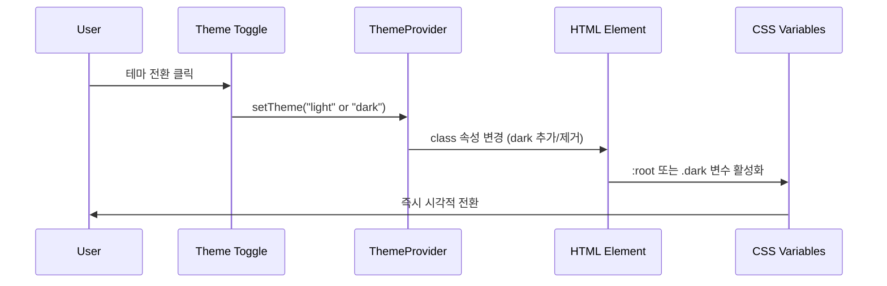
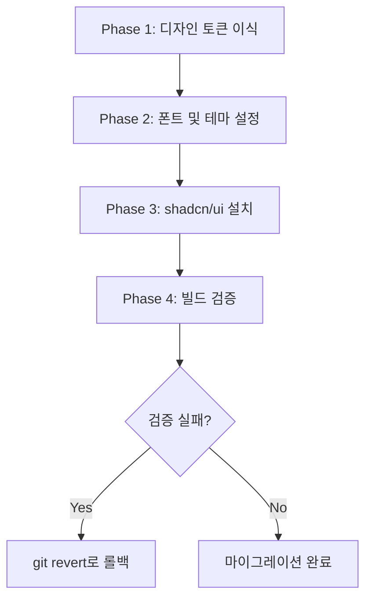

# Design System 기술 설계

## Overview

**Purpose**: 이 기능은 Eluo Skill Hub 프로젝트에 통일된 디자인 시스템을 제공한다. 레퍼런스 디자인(Vite + React 18)의 디자인 토큰, 타이포그래피, 다크 모드, shadcn/ui 컴포넌트 라이브러리를 Next.js 16 + React 19 환경으로 이식하여, 모든 바운디드 컨텍스트의 UI가 일관된 시각적 언어를 사용하도록 보장한다.

**Users**: 프로젝트의 모든 프론트엔드 개발자가 `@/shared/ui/` 경로에서 프리미티브 컴포넌트와 디자인 토큰을 import하여 각 도메인별 UI를 구축한다.

**Impact**: 현재 Next.js 기본 스캐폴딩 상태(Geist 폰트, 최소 CSS 변수)에서 46개 shadcn/ui 컴포넌트, 한글 타이포그래피, 다크 모드가 완비된 디자인 시스템으로 전환한다.

### Goals
- 레퍼런스 `theme.css`의 모든 디자인 토큰(30개 이상 CSS 변수)을 `globals.css`로 완전 이식한다.
- Noto Sans KR 폰트를 `next/font/google` 자체 호스팅으로 통합하고 한글 타이포그래피를 최적화한다.
- `next-themes` 기반 class 다크 모드 전환을 구현하고 `defaultTheme="dark"`를 적용한다.
- shadcn/ui CLI로 46개 프리미티브 컴포넌트를 `src/shared/ui/` 경로에 설치한다.
- TypeScript strict mode에서 `any` 타입 없이 빌드 통과를 보장한다.

### Non-Goals
- 커스텀 복합 컴포넌트(예: SkillCard, SearchBar 등 도메인별 UI) 개발은 이 명세에 포함하지 않는다.
- 컴포넌트 단위 테스트 작성은 이 명세에 포함하지 않는다(빌드 검증만 수행).
- MUI, Emotion 등 레퍼런스 전용 라이브러리의 마이그레이션은 수행하지 않는다(제외 대상).
- 디자인 토큰의 시각적 동일성 검증(Figma 비교)은 이 명세의 범위가 아니다.

## Architecture

### Existing Architecture Analysis

현재 프로젝트는 Next.js 16 기본 스캐폴딩 상태이며, DDD 기반 구조가 `src/shared/domain/`에 일부 구축되어 있다. UI 관련 파일은 다음과 같다.

- `src/app/layout.tsx`: Geist + Geist_Mono 폰트, 기본 레이아웃
- `src/app/globals.css`: 최소 CSS 변수(`--background`, `--foreground`), `@theme inline` 기본 구조
- `tsconfig.json`: `@/*` -> `./src/*` 경로 별칭 설정 완료
- `postcss.config.mjs`: `@tailwindcss/postcss` 플러그인 구성 완료
- `tailwind.config.ts`: 존재하지 않음 (Tailwind CSS v4 config-free 방식)

디자인 시스템은 기존 `src/shared/` 모듈 하위에 `ui/` 디렉터리를 추가하여 DDD 구조와 일관성을 유지한다.

### Architecture Pattern & Boundary Map



**Architecture Integration**:
- **Selected pattern**: Shared UI Module -- 모든 바운디드 컨텍스트가 `@/shared/ui/`에서 프리미티브 컴포넌트를 import하는 구조. DDD steering 원칙에 따라 UI 프리미티브는 `shared` 모듈에 위치한다.
- **Domain/feature boundaries**: 디자인 시스템은 `src/shared/ui/`에 격리되며, 각 바운디드 컨텍스트는 이를 import만 한다. 디자인 토큰은 `src/app/globals.css`에서 전역으로 제공한다.
- **Existing patterns preserved**: `@/*` 경로 별칭, `src/shared/` 모듈 구조, Tailwind CSS v4 config-free 방식
- **New components rationale**: `src/shared/ui/` 디렉터리는 shadcn/ui 컴포넌트와 UI 유틸리티를 DDD 구조 내에 배치하기 위해 필요하다.
- **Steering compliance**: DDD 3계층 원칙 준수(UI는 shared 모듈), TypeScript strict mode, `any` 타입 금지

### Technology Stack

| Layer | Choice / Version | Role in Feature | Notes |
|-------|------------------|-----------------|-------|
| Frontend | Next.js 16.1.6, React 19.2.3 | App Router 레이아웃, 서버/클라이언트 컴포넌트 | 기존 설치 유지 |
| UI Components | shadcn/ui (latest), Radix UI (React 19 호환) | 46개 프리미티브 컴포넌트 | CLI 신규 설치 |
| Styling | Tailwind CSS v4, tw-animate-css | 유틸리티 클래스, 애니메이션 | config-free 방식 |
| Theme | next-themes 0.4.x | 다크 모드 전환 | class 기반 |
| Typography | Noto Sans KR (next/font/google), Geist Mono | 한글 기본 폰트, 코드 블록 폰트 | 자체 호스팅 |
| Utilities | clsx, tailwind-merge, class-variance-authority | 클래스 병합, 변형 관리 | shadcn/ui 의존성 |
| Icons | lucide-react | 아이콘 시스템 | shadcn/ui 기본 아이콘 |

## System Flows

### shadcn/ui 컴포넌트 설치 프로세스



### 다크 모드 전환 흐름



## Requirements Traceability

| Requirement | Summary | Components | Interfaces | Flows |
|-------------|---------|------------|------------|-------|
| 1.1 ~ 1.5 | 디자인 토큰 이식 | GlobalsCSS | CSS Custom Properties | - |
| 2.1 ~ 2.7 | 타이포그래피 시스템 | FontConfig, GlobalsCSS | CSS Variables, next/font API | - |
| 3.1 ~ 3.6 | 다크 모드 | ThemeProvider, GlobalsCSS | ThemeProviderProps | 다크 모드 전환 |
| 4.1 ~ 4.7 | shadcn/ui 컴포넌트 설치 | ComponentsJSON, ShadcnComponents | ComponentsJSON Schema | 설치 프로세스 |
| 5.1 ~ 5.5 | 파일 구조 및 경로 | ComponentsJSON, TSConfig | Path Aliases | - |
| 6.1 ~ 6.5 | 제외 라이브러리 | DependencyPolicy | - | - |
| 7.1 ~ 7.3 | cn() 유틸리티 | CnUtility | cn() Signature | - |
| 8.1 ~ 8.5 | 품질 검증 | BuildVerification | - | - |

## Components and Interfaces

| Component | Domain/Layer | Intent | Req Coverage | Key Dependencies (P0/P1) | Contracts |
|-----------|--------------|--------|--------------|--------------------------|-----------|
| GlobalsCSS | App Layer / Styling | 디자인 토큰, 타이포그래피, 다크 모드 CSS 변수 정의 | 1.1~1.5, 2.3~2.6, 3.2 | Tailwind CSS v4 (P0) | State |
| FontConfig | App Layer / Layout | next/font/google 폰트 로딩 및 CSS 변수 등록 | 2.1, 2.2, 2.7 | next/font/google (P0) | Service |
| ThemeProvider | Shared UI / Components | next-themes 기반 다크 모드 전환 래퍼 | 3.1, 3.3~3.6 | next-themes (P0) | Service, State |
| ComponentsJSON | Project Root / Config | shadcn/ui CLI 설정 및 경로 매핑 | 4.1~4.4, 5.1~5.5 | shadcn/ui CLI (P0) | - |
| CnUtility | Shared UI / Lib | Tailwind CSS 클래스 병합 유틸리티 | 7.1~7.3 | clsx (P0), tailwind-merge (P0) | Service |
| ShadcnComponents | Shared UI / Components | 46개 프리미티브 UI 컴포넌트 | 4.5~4.7, 8.1~8.5 | Radix UI (P0), CVA (P0) | - |
| DependencyPolicy | Project / Config | 제외 라이브러리 목록 및 허용 의존성 정의 | 6.1~6.5 | - | - |
| RootLayout | App Layer / Layout | 폰트, ThemeProvider, globals.css 통합 | 2.1, 3.3, 3.5 | FontConfig (P0), ThemeProvider (P0) | - |

### App Layer / Styling

#### GlobalsCSS

| Field | Detail |
|-------|--------|
| Intent | 레퍼런스 theme.css의 디자인 토큰을 globals.css에 이식하고 Tailwind CSS v4 테마로 매핑한다 |
| Requirements | 1.1, 1.2, 1.3, 1.4, 1.5, 2.3, 2.4, 2.5, 2.6, 3.2 |

**Responsibilities & Constraints**
- `@import "tailwindcss"`로 Tailwind CSS v4를 로드한다.
- `@custom-variant dark (&:is(.dark *))` 구문으로 다크 모드 변형을 정의한다.
- `:root` 블록에서 라이트 모드 CSS 변수(background, foreground, card, popover, primary, secondary, muted, accent, destructive, border, input, input-background, switch-background, ring, chart-1~5, radius, sidebar 계열, font-size, font-weight-medium, font-weight-normal)를 정의한다.
- `.dark` 블록에서 다크 모드 CSS 변수 오버라이드를 정의한다.
- `@theme inline` 블록에서 CSS 변수를 Tailwind 테마 토큰으로 매핑한다.
- `@layer base` 블록에서 전역 리셋 스타일과 타이포그래피를 정의한다.

**Dependencies**
- External: Tailwind CSS v4 -- CSS 프레임워크 (P0)
- External: tw-animate-css -- 애니메이션 유틸리티 (P1)

**Contracts**: State [x]

##### State Management

**State model**: CSS Custom Properties 기반 테마 상태

```
globals.css 구조:

1. @import "tailwindcss"
2. @import "tw-animate-css"
3. @custom-variant dark (&:is(.dark *))

4. :root {
     // 30+ CSS custom properties (라이트 모드)
     --background, --foreground, --card, --card-foreground,
     --popover, --popover-foreground, --primary, --primary-foreground,
     --secondary, --secondary-foreground, --muted, --muted-foreground,
     --accent, --accent-foreground, --destructive, --destructive-foreground,
     --border, --input, --input-background, --switch-background,
     --ring, --chart-1~5, --radius,
     --sidebar, --sidebar-foreground, --sidebar-primary,
     --sidebar-primary-foreground, --sidebar-accent,
     --sidebar-accent-foreground, --sidebar-border, --sidebar-ring,
     --font-size, --font-weight-medium, --font-weight-normal
   }

5. .dark {
     // 다크 모드 CSS 변수 오버라이드
   }

6. @theme inline {
     // CSS 변수 -> Tailwind 테마 매핑
     --color-*: var(--*)
     --radius-sm/md/lg/xl: calc(var(--radius) +/- offset)
     --color-sidebar-*: var(--sidebar-*)
     --font-sans: var(--font-noto-sans-kr)
     --font-mono: var(--font-geist-mono)
   }

7. @layer base {
     * { @apply border-border outline-ring/50 }
     body { @apply bg-background text-foreground; font-family: ... }
     html { font-size, font-family }
     h1~h4, label, button, input { typography styles }
   }
```

- **Persistence**: CSS 파일로 정적 정의. 런타임 상태 변경은 `.dark` 클래스 토글로 처리한다.
- **Consistency**: 모든 CSS 변수 값은 레퍼런스 `theme.css`와 1:1 대응한다.

**Implementation Notes**
- Integration: `@import "tw-animate-css"`를 `@import "tailwindcss"` 직후에 배치한다. `@custom-variant dark` 선언은 `:root` 블록 앞에 위치한다.
- Validation: 빌드 후 레퍼런스 `theme.css`의 모든 CSS 변수가 `globals.css`에 존재하는지 검증한다.
- Risks: `@media (prefers-color-scheme: dark)` 기존 블록을 제거하고 `.dark` 클래스 기반으로 전환해야 한다. 기존 `globals.css`의 `body` 스타일도 `@layer base` 내부로 이동한다.

### App Layer / Layout

#### FontConfig

| Field | Detail |
|-------|--------|
| Intent | next/font/google로 Noto Sans KR과 Geist Mono를 로딩하고 CSS 변수로 등록한다 |
| Requirements | 2.1, 2.2, 2.7 |

**Responsibilities & Constraints**
- `layout.tsx`에서 `Noto_Sans_KR`을 `next/font/google`로 import하고 CSS 변수 `--font-noto-sans-kr`로 등록한다.
- `Geist_Mono`를 코드 블록 전용 CSS 변수 `--font-geist-mono`로 등록한다.
- 기존 `Geist` (Sans) 폰트 import를 제거하고 `Noto_Sans_KR`로 대체한다.
- Google Fonts CDN `@import`를 사용하지 않는다.

**Dependencies**
- External: next/font/google -- Next.js 폰트 최적화 API (P0)

**Contracts**: Service [x]

##### Service Interface

```typescript
// layout.tsx 내 폰트 설정 (구현이 아닌 계약 정의)

// Noto Sans KR 폰트 인스턴스
interface NotoSansKRConfig {
  subsets: ["latin", "latin-ext"];
  weight: ["400", "500", "700"];
  variable: "--font-noto-sans-kr";
  display: "swap";
}

// Geist Mono 폰트 인스턴스
interface GeistMonoConfig {
  variable: "--font-geist-mono";
  subsets: ["latin"];
}

// HTML 요소에 적용되는 CSS 변수 클래스
// <html className={`${notoSansKR.variable} ${geistMono.variable}`}>
```

- Preconditions: `next/font/google` 패키지가 Next.js에 내장되어 있어야 한다.
- Postconditions: `--font-noto-sans-kr`와 `--font-geist-mono` CSS 변수가 전역으로 사용 가능하다.
- Invariants: Google Fonts CDN `@import`가 사용되지 않는다.

**Implementation Notes**
- Integration: `<html>` 요소의 `className`에 두 폰트의 `variable` 클래스를 적용한다. `lang` 속성을 `"ko"`로 변경한다.
- Validation: 브라우저 DevTools에서 `--font-noto-sans-kr` CSS 변수가 존재하고 Noto Sans KR 폰트가 적용되는지 확인한다.
- Risks: Noto Sans KR의 한글 서브셋은 `next/font/google`이 자동 처리하므로 `subsets`에 명시적으로 추가하지 않는다. 폰트 로딩 실패 시 fallback 폰트(`-apple-system, BlinkMacSystemFont, 'Segoe UI', sans-serif`)가 적용된다.

#### RootLayout

| Field | Detail |
|-------|--------|
| Intent | 폰트, ThemeProvider, globals.css를 통합하는 루트 레이아웃 |
| Requirements | 2.1, 3.3, 3.5 |

**Responsibilities & Constraints**
- `<html>` 요소에 `lang="ko"`, `suppressHydrationWarning`, 폰트 CSS 변수 클래스를 적용한다.
- `<body>` 내부에 `ThemeProvider`를 배치하여 자식 컴포넌트에 테마 컨텍스트를 제공한다.
- `globals.css`를 import하여 디자인 토큰과 타이포그래피를 전역 적용한다.

**Implementation Notes**
- Integration: `ThemeProvider`는 클라이언트 컴포넌트이므로 별도 파일에서 import한다. `layout.tsx` 자체는 서버 컴포넌트로 유지한다.

### Shared UI / Components

#### ThemeProvider

| Field | Detail |
|-------|--------|
| Intent | next-themes의 ThemeProvider를 App Router 호환 클라이언트 컴포넌트로 래핑한다 |
| Requirements | 3.1, 3.3, 3.4, 3.5, 3.6 |

**Responsibilities & Constraints**
- `"use client"` 지시문을 포함하는 클라이언트 컴포넌트이다.
- `next-themes`의 `ThemeProvider`를 re-export하며, 기본 props를 설정한다.
- `attribute="class"` 설정으로 `<html>` 요소의 class 속성을 통해 테마를 전환한다.
- `defaultTheme="dark"` 설정으로 초기 테마를 다크 모드로 지정한다.
- `enableSystem` 설정으로 OS color-scheme 자동 감지를 지원한다.

**Dependencies**
- External: next-themes 0.4.x -- 테마 관리 라이브러리 (P0)

**Contracts**: Service [x] / State [x]

##### Service Interface

```typescript
// src/shared/ui/components/theme-provider.tsx

import { ThemeProvider as NextThemesProvider } from "next-themes";

interface ThemeProviderProps {
  children: React.ReactNode;
  attribute?: "class" | "data-theme";
  defaultTheme?: string;
  enableSystem?: boolean;
  disableTransitionOnChange?: boolean;
  storageKey?: string;
}

// ThemeProvider 컴포넌트는 NextThemesProvider를 래핑하며
// 기본값: attribute="class", defaultTheme="dark", enableSystem=true
```

- Preconditions: `next-themes` 패키지가 설치되어 있어야 한다. `<html>` 요소에 `suppressHydrationWarning`이 적용되어야 한다.
- Postconditions: 하위 컴포넌트에서 `useTheme()` 훅으로 테마 상태에 접근할 수 있다. `<html>` 요소에 `dark` 클래스가 조건부로 적용된다.
- Invariants: 서버-클라이언트 하이드레이션 불일치가 발생하지 않는다.

##### State Management

- **State model**: `next-themes`가 `localStorage`에 테마 설정을 저장하고, `<html>` 요소의 class 속성을 관리한다.
- **Persistence**: `localStorage` (키: `theme`). 페이지 새로고침 시에도 테마가 유지된다.
- **Concurrency strategy**: 단일 탭 기준 상태 관리. 다중 탭 간 동기화는 `next-themes`가 `storage` 이벤트로 처리한다.

**Implementation Notes**
- Integration: `layout.tsx`의 `<body>` 내부에서 `<ThemeProvider>` 로 children을 래핑한다. `<html>` 요소에는 `suppressHydrationWarning` 속성만 추가한다.
- Risks: `next-themes` 0.4.x가 React 19와 호환되지 않을 경우, 최신 버전으로 업데이트하거나 `rc` 버전을 사용한다.

### Shared UI / Lib

#### CnUtility

| Field | Detail |
|-------|--------|
| Intent | clsx와 tailwind-merge를 조합하여 Tailwind CSS 클래스 충돌을 자동 해결하는 유틸리티 함수를 제공한다 |
| Requirements | 7.1, 7.2, 7.3 |

**Responsibilities & Constraints**
- `src/shared/ui/lib/utils.ts`에 위치한다.
- `clsx`로 조건부 클래스를 처리하고, `tailwind-merge`로 Tailwind 클래스 충돌을 해결한다.
- 모든 shadcn/ui 컴포넌트가 이 함수를 import한다.

**Dependencies**
- External: clsx -- 조건부 클래스 유틸리티 (P0)
- External: tailwind-merge -- Tailwind 클래스 병합 (P0)

**Contracts**: Service [x]

##### Service Interface

```typescript
// src/shared/ui/lib/utils.ts

import { clsx, type ClassValue } from "clsx";
import { twMerge } from "tailwind-merge";

function cn(...inputs: ClassValue[]): string;
```

- Preconditions: `clsx`와 `tailwind-merge` 패키지가 설치되어 있어야 한다.
- Postconditions: 입력된 클래스 문자열이 충돌 없이 병합되어 반환된다. Tailwind의 `p-4`와 `p-2`가 동시에 전달되면 마지막 값(`p-2`)만 남는다.
- Invariants: `undefined`, `null`, `false` 값은 무시된다.

**Implementation Notes**
- Integration: shadcn/ui CLI가 `components.json`의 `aliases.utils` 설정에 따라 자동으로 이 파일을 생성한다. 수동 생성 불필요.
- Risks: `aliases.utils`가 `@/shared/ui/lib/utils`로 올바르게 설정되지 않으면 컴포넌트의 import 경로가 잘못된다.

### Project Root / Config

#### ComponentsJSON

| Field | Detail |
|-------|--------|
| Intent | shadcn/ui CLI의 컴포넌트 설치 경로, 스타일, TSX 설정을 정의한다 |
| Requirements | 4.1, 4.2, 4.3, 4.4, 5.1, 5.2, 5.3, 5.4, 5.5 |

**Responsibilities & Constraints**
- 프로젝트 루트에 `components.json` 파일로 위치한다.
- shadcn/ui CLI가 이 파일을 읽어 컴포넌트 생성 경로와 import 별칭을 결정한다.
- Tailwind CSS v4 config-free 방식에 맞게 `tailwind.config` 필드를 빈 문자열로 설정한다.

**Dependencies**
- External: shadcn/ui CLI -- 컴포넌트 코드 생성 도구 (P0)

**Contracts**: State [x]

##### State Management

**State model**: 정적 JSON 설정 파일

```typescript
// components.json 스키마 (구현이 아닌 계약 정의)

interface ComponentsJSON {
  $schema: "https://ui.shadcn.com/schema.json";
  style: "new-york";
  rsc: true;
  tsx: true;
  tailwind: {
    config: "";  // Tailwind CSS v4: config-free
    css: "src/app/globals.css";
    baseColor: "zinc";
    cssVariables: true;
    prefix: "";
  };
  aliases: {
    components: "@/shared/ui/components";
    ui: "@/shared/ui/components";
    hooks: "@/shared/ui/hooks";
    lib: "@/shared/ui/lib";
    utils: "@/shared/ui/lib/utils";
  };
}
```

- **Persistence**: 프로젝트 루트의 `components.json` 파일. Git으로 버전 관리된다.
- **Consistency**: `aliases` 필드의 경로가 `tsconfig.json`의 `@/*` 매핑과 일치해야 한다.

**Implementation Notes**
- Integration: `npx shadcn@latest init` 실행 시 대화형으로 설정하거나, 위 스키마에 맞게 수동 생성한다. CLI 실행 시 기존 `globals.css`를 덮어쓰지 않도록 주의한다.
- Validation: `npx shadcn@latest add button`을 테스트 실행하여 `src/shared/ui/components/button.tsx`에 파일이 생성되는지 확인한다.
- Risks: CLI가 `globals.css`를 자동 수정할 수 있으므로, `init` 실행 후 `globals.css` 변경 사항을 검토하고 레퍼런스 디자인 토큰이 유지되는지 확인한다.

### Shared UI / Components (Summary-only)

#### ShadcnComponents

| Field | Detail |
|-------|--------|
| Intent | 46개 shadcn/ui 프리미티브 컴포넌트를 설치하여 재사용 가능한 UI 라이브러리를 구축한다 |
| Requirements | 4.5, 4.6, 4.7, 8.1, 8.2, 8.3, 8.4, 8.5 |

46개 컴포넌트 목록: accordion, alert, alert-dialog, aspect-ratio, avatar, badge, breadcrumb, button, calendar, card, carousel, chart, checkbox, collapsible, command, context-menu, dialog, drawer, dropdown-menu, form, hover-card, input, input-otp, label, menubar, navigation-menu, pagination, popover, progress, radio-group, resizable, scroll-area, select, separator, sheet, sidebar, skeleton, slider, sonner, switch, table, tabs, textarea, toggle, toggle-group, tooltip

**Implementation Notes**
- Integration: `npx shadcn@latest add accordion alert alert-dialog aspect-ratio avatar badge breadcrumb button calendar card carousel chart checkbox collapsible command context-menu dialog drawer dropdown-menu form hover-card input input-otp label menubar navigation-menu pagination popover progress radio-group resizable scroll-area select separator sheet sidebar skeleton slider sonner switch table tabs textarea toggle toggle-group tooltip` 단일 명령으로 일괄 설치한다.
- Validation: 설치 후 `npm run build` 실행으로 TypeScript 타입 오류 및 빌드 오류 부재를 확인한다.
- Risks: React 19 피어 의존성 충돌 시 `--legacy-peer-deps` 플래그를 사용한다. 설치된 컴포넌트에 `"use client"` 지시문이 필요한 경우 shadcn/ui CLI가 자동으로 포함한다.

### Project / Config (Summary-only)

#### DependencyPolicy

| Field | Detail |
|-------|--------|
| Intent | 제외 대상 라이브러리를 명시하고 허용 의존성만 프로젝트에 포함되도록 한다 |
| Requirements | 6.1, 6.2, 6.3, 6.4, 6.5 |

**제외 대상 라이브러리**:

| Package | 제외 사유 |
|---------|-----------|
| `@mui/material`, `@mui/icons-material` | shadcn/ui + Radix UI로 대체 |
| `@emotion/react`, `@emotion/styled` | Tailwind CSS로 대체 |
| `react-router` | Next.js App Router로 대체 |
| `react-dnd`, `react-dnd-html5-backend` | 현재 범위 외, 필요 시 `@dnd-kit` 검토 |
| `react-popper`, `@popperjs/core` | Radix UI의 내장 포지셔닝으로 대체 |
| `react-slick` | `embla-carousel-react`로 대체 (shadcn/ui carousel) |
| `react-responsive-masonry` | 현재 범위 외 |

**허용 의존성** (shadcn/ui 피어 의존성):

| Package | 용도 |
|---------|------|
| `@radix-ui/react-*` (React 19 호환) | 프리미티브 컴포넌트 기반 |
| `class-variance-authority` | 컴포넌트 변형 관리 |
| `clsx` | 조건부 클래스 유틸리티 |
| `tailwind-merge` | Tailwind 클래스 충돌 해결 |
| `lucide-react` | 아이콘 시스템 |
| `next-themes` | 다크 모드 전환 |
| `tw-animate-css` | CSS 애니메이션 유틸리티 |
| `sonner` | 토스트 알림 |
| `vaul` | Drawer 컴포넌트 |
| `cmdk` | Command 컴포넌트 |
| `embla-carousel-react` | Carousel 컴포넌트 |
| `input-otp` | OTP Input 컴포넌트 |
| `react-day-picker`, `date-fns` | Calendar 컴포넌트 |
| `react-resizable-panels` | Resizable 컴포넌트 |
| `recharts` | Chart 컴포넌트 |
| `react-hook-form` | Form 컴포넌트 |

**Implementation Notes**
- Validation: `npm run build` 후 `package.json`에 제외 대상 패키지가 포함되지 않았는지 확인한다.

## Data Models

이 기능은 데이터베이스를 사용하지 않으며, 도메인 모델이나 물리 데이터 모델이 존재하지 않는다. 상태는 CSS Custom Properties(디자인 토큰)와 `localStorage`(테마 설정)로 관리된다.

### Data Contracts & Integration

**CSS Custom Properties Contract**

모든 shadcn/ui 컴포넌트는 다음 CSS 변수에 의존한다. 이 변수들이 `globals.css`의 `:root`와 `.dark` 블록에 정의되지 않으면 컴포넌트 스타일이 깨진다.

필수 CSS 변수 목록:
- **색상**: `--background`, `--foreground`, `--card`, `--card-foreground`, `--popover`, `--popover-foreground`, `--primary`, `--primary-foreground`, `--secondary`, `--secondary-foreground`, `--muted`, `--muted-foreground`, `--accent`, `--accent-foreground`, `--destructive`, `--destructive-foreground`, `--border`, `--input`, `--ring`
- **차트**: `--chart-1` ~ `--chart-5`
- **레이아웃**: `--radius`
- **사이드바**: `--sidebar`, `--sidebar-foreground`, `--sidebar-primary`, `--sidebar-primary-foreground`, `--sidebar-accent`, `--sidebar-accent-foreground`, `--sidebar-border`, `--sidebar-ring`
- **커스텀**: `--input-background`, `--switch-background`, `--font-size`, `--font-weight-medium`, `--font-weight-normal`

## Error Handling

### Error Strategy

디자인 시스템은 런타임 오류가 발생하는 구조가 아니므로, 오류 처리는 주로 빌드 시점 검증에 집중한다.

### Error Categories and Responses

**빌드 오류** (TypeScript/Tailwind):
- CSS 변수 참조 누락 -> `globals.css`에 해당 변수 추가
- 컴포넌트 import 경로 불일치 -> `components.json`의 `aliases` 설정과 `tsconfig.json`의 `paths` 확인
- `any` 타입 사용 -> TypeScript strict mode 오류로 빌드 차단

**런타임 오류**:
- 폰트 로딩 실패 -> `next/font/google`의 `display: "swap"`으로 FOIT 방지, fallback 폰트 체인 적용
- 테마 하이드레이션 불일치 -> `suppressHydrationWarning`으로 경고 억제, `ThemeProvider` 클라이언트 컴포넌트 분리로 방지

## Testing Strategy

### Build Verification (빌드 검증)
- `npm run build` 실행으로 TypeScript 컴파일 오류 부재 확인
- 46개 컴포넌트 파일이 모두 `src/shared/ui/components/` 에 존재하는지 확인
- `src/shared/ui/lib/utils.ts`와 `src/shared/ui/hooks/use-mobile.ts` 파일 존재 확인
- `any` 타입이 사용된 파일이 없는지 정적 분석

### TypeScript Type Safety (타입 안전성)
- TypeScript strict mode 활성화 상태에서 전체 프로젝트 빌드 통과 확인
- 컴포넌트 Props 타입이 명시적으로 정의되어 있는지 확인 (shadcn/ui CLI가 자동 생성)
- `@/shared/ui/components/button` 등 절대 경로 import가 정상 해석되는지 확인

### Visual Smoke Test (시각적 기본 확인)
- `npm run dev` 실행 후 브라우저에서 라이트/다크 모드 전환이 정상 동작하는지 확인
- Noto Sans KR 폰트가 한글 텍스트에 올바르게 적용되는지 확인
- 기본 컴포넌트(Button, Card, Input) 렌더링이 시각적으로 정상인지 확인

### Dependency Audit (의존성 검증)
- `package.json`에 제외 대상 패키지(@mui, @emotion, react-router)가 포함되지 않았는지 확인
- `npm ls`로 의존성 트리에 충돌이 없는지 확인

## Migration Strategy



**Phase 1: 디자인 토큰 이식**
- `globals.css`에 레퍼런스 `theme.css`의 CSS 변수를 이식한다.
- `@custom-variant dark`, `:root`, `.dark`, `@theme inline`, `@layer base` 구조를 완성한다.

**Phase 2: 폰트 및 테마 설정**
- `layout.tsx`에서 Geist Sans를 Noto Sans KR로 교체한다.
- `ThemeProvider` 클라이언트 컴포넌트를 생성하고 `layout.tsx`에 배치한다.
- `next-themes` 패키지를 설치한다.

**Phase 3: shadcn/ui 설치**
- `components.json`을 생성하고 커스텀 경로를 설정한다.
- `npx shadcn@latest add`로 46개 컴포넌트를 일괄 설치한다.

**Phase 4: 빌드 검증**
- `npm run build` 실행으로 빌드 오류 부재를 확인한다.
- 의존성 감사를 수행한다.

**Rollback trigger**: 빌드 실패, 타입 오류, 제외 대상 패키지 포함 시 `git revert`로 이전 상태로 복원한다.
