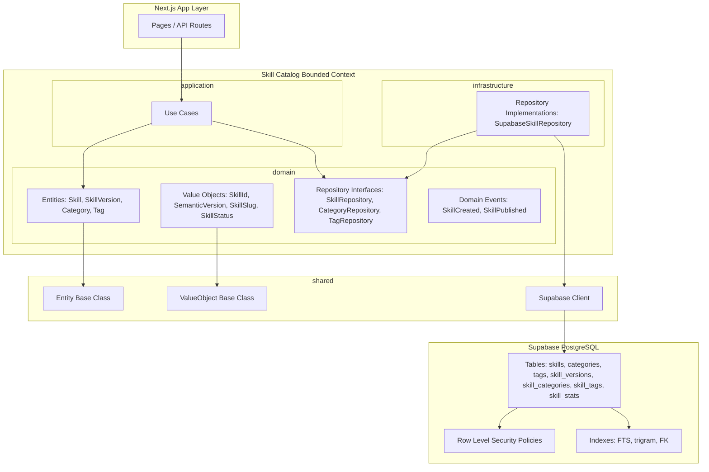
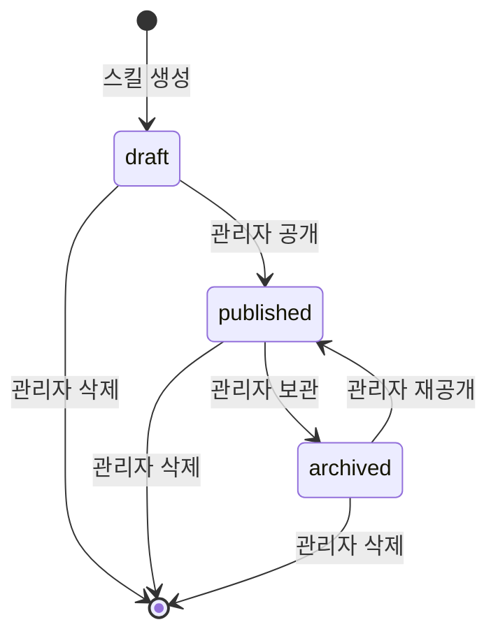
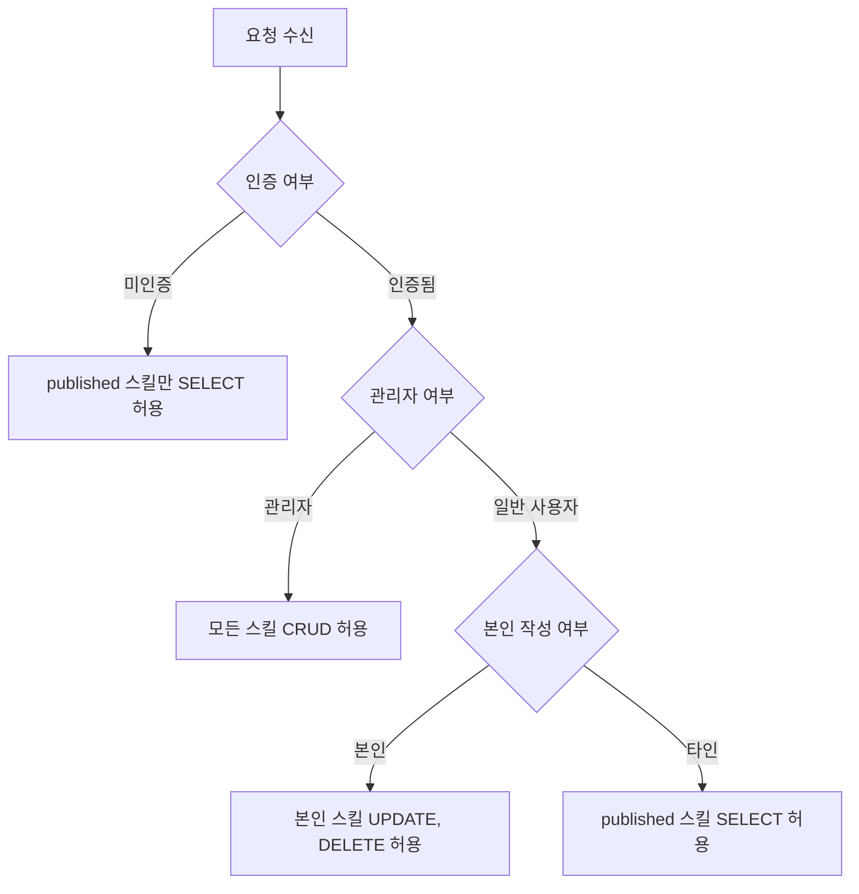
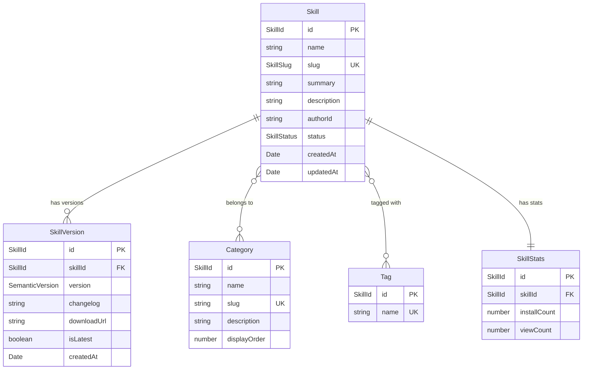

# Technical Design Document

## Overview

**Purpose**: 이 기능은 Eluo Skill Hub의 핵심 바운디드 컨텍스트인 **Skill Catalog**의 데이터베이스 스키마와 도메인 모델을 제공한다. 관리자가 플러그인/스킬 정보를 체계적으로 저장하고 관리할 수 있는 데이터 기반을 구축하며, 스킬 소비자가 카테고리, 태그, 전문 검색 등 다양한 방법으로 스킬을 탐색할 수 있는 구조를 마련한다.

**Users**: 플랫폼 관리자는 스킬 메타데이터 CRUD 및 통계 관리에, 스킬 소비자는 카테고리/태그/키워드 기반 검색에, 스킬 제작자는 버전 관리에 이 데이터 모델을 활용한다.

**Impact**: 현재 존재하지 않는 `src/skill-catalog/` 바운디드 컨텍스트 모듈을 신규 생성하고, Supabase PostgreSQL에 7개 테이블과 RLS 정책을 포함한 SQL 마이그레이션을 도입한다.

### Goals

- Supabase PostgreSQL 기반으로 DDD 원칙에 부합하는 Skill Catalog 스키마를 정의한다
- Skill 엔티티를 Aggregate Root로 설계하여 데이터 일관성을 보장한다
- 한국어 콘텐츠에 대한 전문 검색(simple tsvector + pg_trgm)을 지원한다
- RLS 정책으로 역할 기반 접근 제어를 구현한다
- TypeScript 도메인 모델과 SQL 스키마 간 정합성을 유지한다

### Non-Goals

- 스킬 실행 환경 및 런타임 관련 스키마는 이 범위에 포함하지 않는다
- Review & Rating 바운디드 컨텍스트의 리뷰/평점 테이블은 별도 스펙에서 다룬다
- User Account 바운디드 컨텍스트의 사용자 프로필 테이블은 별도 스펙에서 다룬다
- 외부 검색 엔진(Elasticsearch 등) 연동은 향후 확장으로 남긴다
- Installation 바운디드 컨텍스트의 설치/의존성 관리 스키마는 별도 스펙에서 다룬다

## Architecture

### Architecture Pattern & Boundary Map



**Architecture Integration**:
- **Selected pattern**: Hybrid SQL Migration + TypeScript Domain Model. SQL 마이그레이션으로 물리적 스키마를 정의하고, TypeScript 도메인 계층에서 엔티티/값 객체/리포지토리 인터페이스를 정의한다.
- **Domain/feature boundaries**: Skill Catalog 컨텍스트는 스킬 메타데이터, 카테고리, 태그, 버전, 통계를 소유한다. 사용자 인증/프로필은 User Account 컨텍스트에 위임한다.
- **Existing patterns preserved**: `Entity<T>` 베이스 클래스(도메인 이벤트 관리 포함), `ValueObject<T>` 베이스 클래스, `@/shared/infrastructure/supabase/client.ts` 싱글톤 패턴을 재사용한다.
- **New components rationale**: Skill Catalog 도메인 모듈은 프로젝트 최초의 바운디드 컨텍스트 구현체로서 향후 다른 컨텍스트의 참조 모델 역할을 한다.
- **Steering compliance**: DDD 3계층 원칙, Aggregate Root 패턴, `any` 타입 금지, snake_case 테이블/컬럼 명명 규칙을 준수한다.

### Technology Stack

| Layer | Choice / Version | Role in Feature | Notes |
|-------|------------------|-----------------|-------|
| Data / Storage | Supabase PostgreSQL | 스킬 카탈로그 데이터 영속성, RLS 기반 접근 제어 | `gen_random_uuid()` 네이티브 UUID 생성 |
| Data / Extensions | `pg_trgm` (PostgreSQL built-in) | 한국어 trigram 인덱스 기반 부분 문자열 검색 | Supabase 호스팅에서 기본 제공 |
| Backend / Services | TypeScript strict mode | 도메인 모델(엔티티, VO, 리포지토리 인터페이스) 정의 | `any` 타입 금지 |
| Backend / Services | `@supabase/supabase-js` | 인프라 계층 리포지토리 구현체의 DB 클라이언트 | 기존 `client.ts` 싱글톤 활용 |
| Infrastructure / Runtime | SQL Migration files | 스키마 정의, 인덱스, RLS 정책, 시드 데이터 | `supabase/migrations/` 디렉토리에 배치 |

## System Flows

### Skill 생명주기 상태 전이



- Skill은 `draft` 상태로 생성되며, 관리자가 공개(`published`) 또는 보관(`archived`) 상태로 전이할 수 있다.
- 삭제 시 CASCADE로 연관 데이터(버전, 카테고리 매핑, 태그 매핑, 통계)가 함께 삭제된다.

### RLS 접근 제어 판단 흐름



- `app_metadata.user_role = 'admin'` 패턴으로 관리자 역할을 확인한다. `user_metadata`는 사용자가 변경 가능하므로 사용하지 않는다.

## Requirements Traceability

| Requirement | Summary | Components | Interfaces | Flows |
|-------------|---------|------------|------------|-------|
| 1.1 | 스킬 메타데이터 필드 저장 | Skill, SkillId, SkillSlug, SkillStatus, skills 테이블 | SkillRepository | - |
| 1.2 | 스킬 이름 길이 제한 | skills 테이블 CHECK 제약 | - | - |
| 1.3 | 스킬 슬러그 고유성 | SkillSlug, skills 테이블 UNIQUE 제약 | - | - |
| 1.4 | 생성/수정일시 자동 설정 | skills 테이블 DEFAULT, 트리거 | - | - |
| 1.5 | 수정일시 자동 갱신 | update_updated_at 트리거 함수 | - | - |
| 1.6 | 공개 상태 관리 | SkillStatus, skills 테이블 status 컬럼 | - | Skill 상태 전이 |
| 2.1 | 카테고리 테이블 정의 | Category, categories 테이블 | CategoryRepository | - |
| 2.2 | 스킬-카테고리 N:M 관계 | skill_categories 매핑 테이블 | SkillRepository | - |
| 2.3 | 기본 카테고리 시드 데이터 | 시드 SQL 마이그레이션 | - | - |
| 2.4 | 카테고리 삭제 시 매핑만 제거 | skill_categories FK CASCADE | - | - |
| 2.5 | 카테고리 슬러그 고유성 | categories 테이블 UNIQUE 제약 | - | - |
| 3.1 | 스킬 버전 테이블 정의 | SkillVersion, SemanticVersion, skill_versions 테이블 | SkillRepository | - |
| 3.2 | 시맨틱 버전 형식 저장 | SemanticVersion, CHECK 제약 | - | - |
| 3.3 | 동일 스킬 내 버전 고유성 | skill_versions UNIQUE(skill_id, version) | - | - |
| 3.4 | 활성 버전 플래그 | skill_versions is_latest 컬럼 | - | - |
| 3.5 | 버전 생성일시 자동 설정 | skill_versions DEFAULT | - | - |
| 4.1 | 태그 테이블 정의 | Tag, tags 테이블 | TagRepository | - |
| 4.2 | 스킬-태그 N:M 관계 | skill_tags 매핑 테이블 | SkillRepository | - |
| 4.3 | 태그 이름 고유성 | tags 테이블 UNIQUE 제약 | - | - |
| 4.4 | 태그 이름 길이 제한 | tags 테이블 CHECK 제약 | - | - |
| 4.5 | 태그 삭제 시 매핑만 제거 | skill_tags FK CASCADE | - | - |
| 5.1 | 전문 검색 인덱스 | fts Generated Column, GIN 인덱스, pg_trgm GiST 인덱스 | - | - |
| 5.2 | 카테고리별 필터링 인덱스 | skill_categories 복합 인덱스 | - | - |
| 5.3 | 상태별 필터링 인덱스 | skills status 인덱스 | - | - |
| 5.4 | 정렬용 인덱스 | skills created_at, updated_at 인덱스 | - | - |
| 5.5 | 태그 기반 필터링 구조 | skill_tags 복합 인덱스 | - | - |
| 6.1 | 통계 데이터 저장 | skill_stats 테이블 | SkillRepository | - |
| 6.2 | 설치 수 증가 | skill_stats increment 함수 | SkillRepository | - |
| 6.3 | 조회 수 증가 | skill_stats increment 함수 | SkillRepository | - |
| 6.4 | 통계 기준 정렬 인덱스 | skill_stats install_count, view_count 인덱스 | - | - |
| 7.1 | 스킬-버전 FK | skill_versions FK -> skills | - | - |
| 7.2 | 스킬-카테고리 매핑 FK | skill_categories FK -> skills, categories | - | - |
| 7.3 | 스킬-태그 매핑 FK | skill_tags FK -> skills, tags | - | - |
| 7.4 | 스킬 삭제 시 CASCADE | 모든 관련 테이블 ON DELETE CASCADE | - | Skill 삭제 |
| 7.5 | UUID 기본 키 | 모든 테이블 uuid DEFAULT gen_random_uuid() | - | - |
| 7.6 | FK 참조 무결성 거부 | PostgreSQL FK 제약 조건 기본 동작 | - | - |
| 8.1 | 모든 테이블 RLS 활성화 | ENABLE ROW LEVEL SECURITY | - | - |
| 8.2 | 미인증 사용자 published만 읽기 | anon SELECT 정책 | - | RLS 판단 흐름 |
| 8.3 | 인증 사용자 본인 스킬 수정/삭제 | authenticated UPDATE/DELETE 정책 | - | RLS 판단 흐름 |
| 8.4 | 관리자 전체 접근 | admin CRUD 정책 | - | RLS 판단 흐름 |
| 8.5 | 카테고리/태그 관리자만 수정 | categories, tags UPDATE/DELETE 정책 | - | - |
| 9.1 | Skill Aggregate Root | Skill 엔티티 설계 | SkillRepository | - |
| 9.2 | 값 객체 타입 제약 | SkillId, SemanticVersion, SkillSlug VO | - | - |
| 9.3 | 리포지토리 인터페이스 | SkillRepository, CategoryRepository, TagRepository | 각 Repository 인터페이스 | - |
| 9.4 | snake_case 명명 규칙 | 모든 테이블/컬럼 명명 | - | - |
| 9.5 | SQL 마이그레이션 파일 | supabase/migrations/ 디렉토리 | - | - |

## Components and Interfaces

| Component | Domain/Layer | Intent | Req Coverage | Key Dependencies | Contracts |
|-----------|--------------|--------|--------------|------------------|-----------|
| Skill | domain/entities | Skill Catalog Aggregate Root | 1.1-1.6, 9.1 | Entity base (P0) | Service |
| SkillVersion | domain/entities | 스킬 버전 정보 엔티티 | 3.1-3.5 | Entity base (P0) | - |
| Category | domain/entities | 카테고리 정보 엔티티 | 2.1, 2.5 | Entity base (P0) | - |
| Tag | domain/entities | 태그 정보 엔티티 | 4.1, 4.3, 4.4 | Entity base (P0) | - |
| SkillId | domain/value-objects | 스킬 고유 식별자 VO | 7.5, 9.2 | ValueObject base (P0) | - |
| SemanticVersion | domain/value-objects | 시맨틱 버전 VO | 3.2, 9.2 | ValueObject base (P0) | - |
| SkillSlug | domain/value-objects | 스킬 슬러그 VO | 1.3, 9.2 | ValueObject base (P0) | - |
| SkillStatus | domain/value-objects | 스킬 공개 상태 VO | 1.6, 9.2 | - | - |
| SkillRepository | domain/repositories | 스킬 리포지토리 인터페이스 | 9.3 | - | Service |
| CategoryRepository | domain/repositories | 카테고리 리포지토리 인터페이스 | 9.3 | - | Service |
| TagRepository | domain/repositories | 태그 리포지토리 인터페이스 | 9.3 | - | Service |
| SupabaseSkillRepository | infrastructure | SkillRepository Supabase 구현체 | 9.3 | supabase client (P0) | Service |
| SupabaseCategoryRepository | infrastructure | CategoryRepository Supabase 구현체 | 9.3 | supabase client (P0) | Service |
| SupabaseTagRepository | infrastructure | TagRepository Supabase 구현체 | 9.3 | supabase client (P0) | Service |
| SQL Migrations | infrastructure/migrations | 테이블, 인덱스, RLS, 시드 정의 | 5.1-5.5, 6.4, 7.1-7.6, 8.1-8.5, 9.4-9.5 | Supabase PostgreSQL (P0) | - |

### Domain Layer

#### Skill (Aggregate Root)

| Field | Detail |
|-------|--------|
| Intent | Skill Catalog의 Aggregate Root로서 스킬 메타데이터를 소유하고 관련 데이터의 일관성을 관리한다 |
| Requirements | 1.1, 1.2, 1.3, 1.4, 1.5, 1.6, 9.1 |

**Responsibilities & Constraints**
- 스킬의 메타데이터(이름, 슬러그, 요약, 상세 설명, 작성자, 상태, 생성/수정일시)를 캡슐화한다
- 상태 전이 불변식을 강제한다: `draft -> published -> archived`, `archived -> published`
- 이름 길이 불변식(1-100자)을 생성 및 수정 시 검증한다
- 자식 엔티티(SkillVersion)와 연관 데이터(카테고리, 태그, 통계) 변경의 진입점 역할을 한다

**Dependencies**
- Inbound: UseCases -- Skill 조회/생성/수정/삭제 요청 (P0)
- Outbound: SkillVersion -- 버전 관리 위임 (P1)
- External: None

**Contracts**: Service [x] / API [ ] / Event [x] / Batch [ ] / State [ ]

##### Service Interface

```typescript
interface SkillProps {
  readonly name: string;
  readonly slug: SkillSlug;
  readonly summary: string;
  readonly description: string;
  readonly authorId: string;
  readonly status: SkillStatus;
  readonly createdAt: Date;
  readonly updatedAt: Date;
}

class Skill extends Entity<SkillId> {
  private constructor(id: SkillId, props: SkillProps);

  static create(params: {
    name: string;
    slug: string;
    summary: string;
    description: string;
    authorId: string;
  }): Skill;

  updateMetadata(params: {
    name?: string;
    summary?: string;
    description?: string;
  }): void;

  publish(): void;
  archive(): void;
  republish(): void;

  get name(): string;
  get slug(): SkillSlug;
  get summary(): string;
  get description(): string;
  get authorId(): string;
  get status(): SkillStatus;
  get createdAt(): Date;
  get updatedAt(): Date;
}
```

- Preconditions: `create` 호출 시 name은 1-100자, slug은 고유 문자열이어야 한다
- Postconditions: `create` 호출 후 status는 `draft`, createdAt/updatedAt는 현재 시각이다
- Invariants: 이름은 항상 1-100자, 상태 전이는 정의된 규칙만 허용

##### Event Contract

- Published events:
  - `SkillCreated { skillId: string, authorId: string, occurredOn: Date }`
  - `SkillPublished { skillId: string, occurredOn: Date }`
  - `SkillArchived { skillId: string, occurredOn: Date }`
- Subscribed events: None (Aggregate Root는 외부 이벤트를 구독하지 않는다)
- Ordering / delivery guarantees: 도메인 이벤트는 동일 트랜잭션 내에서 수집되어 유스케이스 완료 후 순차 발행한다

#### SkillVersion

| Field | Detail |
|-------|--------|
| Intent | 스킬의 개별 버전 정보를 관리하는 엔티티 |
| Requirements | 3.1, 3.2, 3.3, 3.4, 3.5 |

**Responsibilities & Constraints**
- 버전별 시맨틱 버전 문자열, 변경 로그, 다운로드 URL, 생성일시를 캡슐화한다
- 동일 스킬 내 버전 문자열 중복을 방지한다
- `is_latest` 플래그로 현재 활성 버전을 식별한다

**Dependencies**
- Inbound: Skill -- Aggregate Root를 통한 접근 (P0)

**Contracts**: Service [x] / API [ ] / Event [ ] / Batch [ ] / State [ ]

##### Service Interface

```typescript
interface SkillVersionProps {
  readonly skillId: SkillId;
  readonly version: SemanticVersion;
  readonly changelog: string;
  readonly downloadUrl: string;
  readonly isLatest: boolean;
  readonly createdAt: Date;
}

class SkillVersion extends Entity<SkillId> {
  static create(params: {
    skillId: SkillId;
    version: string;
    changelog: string;
    downloadUrl: string;
  }): SkillVersion;

  markAsLatest(): void;
  unmarkAsLatest(): void;

  get skillId(): SkillId;
  get version(): SemanticVersion;
  get changelog(): string;
  get downloadUrl(): string;
  get isLatest(): boolean;
  get createdAt(): Date;
}
```

- Preconditions: version 문자열은 `major.minor.patch` 형식이어야 한다
- Postconditions: `create` 호출 후 createdAt은 현재 시각이다
- Invariants: 동일 스킬 내 version 문자열은 고유해야 한다

#### Category

| Field | Detail |
|-------|--------|
| Intent | 직군별 카테고리 정보를 관리하는 엔티티 |
| Requirements | 2.1, 2.5 |

**Responsibilities & Constraints**
- 카테고리 이름, 슬러그, 설명, 표시 순서를 캡슐화한다
- 슬러그는 고유 값을 유지한다

**Contracts**: Service [x] / API [ ] / Event [ ] / Batch [ ] / State [ ]

##### Service Interface

```typescript
interface CategoryProps {
  readonly name: string;
  readonly slug: string;
  readonly description: string;
  readonly displayOrder: number;
}

class Category extends Entity<SkillId> {
  static create(params: {
    name: string;
    slug: string;
    description: string;
    displayOrder: number;
  }): Category;

  updateInfo(params: {
    name?: string;
    description?: string;
    displayOrder?: number;
  }): void;

  get name(): string;
  get slug(): string;
  get description(): string;
  get displayOrder(): number;
}
```

#### Tag

| Field | Detail |
|-------|--------|
| Intent | 키워드 기반 검색을 위한 태그 정보를 관리하는 엔티티 |
| Requirements | 4.1, 4.3, 4.4 |

**Responsibilities & Constraints**
- 태그 이름(최대 50자)을 캡슐화한다
- 태그 이름은 고유 값을 유지한다

**Contracts**: Service [x] / API [ ] / Event [ ] / Batch [ ] / State [ ]

##### Service Interface

```typescript
interface TagProps {
  readonly name: string;
}

class Tag extends Entity<SkillId> {
  static create(params: { name: string }): Tag;

  get name(): string;
}
```

- Preconditions: name은 1-50자이어야 한다
- Invariants: name은 전역적으로 고유하다

#### Value Objects

##### SkillId

```typescript
class SkillId extends ValueObject<{ value: string }> {
  static create(value: string): SkillId;
  static generate(): SkillId;
  get value(): string;
}
```

- UUID v4 형식 검증을 수행한다

##### SemanticVersion

```typescript
class SemanticVersion extends ValueObject<{
  major: number;
  minor: number;
  patch: number;
}> {
  static fromString(version: string): SemanticVersion;
  toString(): string;
  get major(): number;
  get minor(): number;
  get patch(): number;
}
```

- `major.minor.patch` 형식(예: `1.0.0`)만 허용하며 음수는 불허한다

##### SkillSlug

```typescript
class SkillSlug extends ValueObject<{ value: string }> {
  static create(value: string): SkillSlug;
  get value(): string;
}
```

- 소문자 영숫자와 하이픈(`-`)만 허용한다. 정규식 패턴: `^[a-z0-9]+(?:-[a-z0-9]+)*$`

##### SkillStatus

```typescript
type SkillStatusType = 'draft' | 'published' | 'archived';

class SkillStatus extends ValueObject<{ value: SkillStatusType }> {
  static draft(): SkillStatus;
  static published(): SkillStatus;
  static archived(): SkillStatus;
  get value(): SkillStatusType;

  canTransitionTo(target: SkillStatus): boolean;
}
```

- 허용 전이: `draft -> published`, `published -> archived`, `archived -> published`

#### Repository Interfaces

##### SkillRepository

```typescript
interface SkillRepository {
  findById(id: SkillId): Promise<Skill | null>;
  findBySlug(slug: SkillSlug): Promise<Skill | null>;
  findAll(params: {
    status?: SkillStatusType;
    categoryId?: string;
    tagId?: string;
    searchQuery?: string;
    sortBy?: 'created_at' | 'updated_at' | 'install_count' | 'view_count';
    sortOrder?: 'asc' | 'desc';
    offset?: number;
    limit?: number;
  }): Promise<{ items: Skill[]; total: number }>;
  save(skill: Skill): Promise<void>;
  delete(id: SkillId): Promise<void>;

  findVersionsBySkillId(skillId: SkillId): Promise<SkillVersion[]>;
  saveVersion(version: SkillVersion): Promise<void>;

  findCategoriesBySkillId(skillId: SkillId): Promise<Category[]>;
  addCategory(skillId: SkillId, categoryId: string): Promise<void>;
  removeCategory(skillId: SkillId, categoryId: string): Promise<void>;

  findTagsBySkillId(skillId: SkillId): Promise<Tag[]>;
  addTag(skillId: SkillId, tagId: string): Promise<void>;
  removeTag(skillId: SkillId, tagId: string): Promise<void>;

  getStats(skillId: SkillId): Promise<{ installCount: number; viewCount: number }>;
  incrementInstallCount(skillId: SkillId): Promise<void>;
  incrementViewCount(skillId: SkillId): Promise<void>;
}
```

##### CategoryRepository

```typescript
interface CategoryRepository {
  findById(id: string): Promise<Category | null>;
  findBySlug(slug: string): Promise<Category | null>;
  findAll(params?: { sortBy?: 'display_order' | 'name' }): Promise<Category[]>;
  save(category: Category): Promise<void>;
  delete(id: string): Promise<void>;
}
```

##### TagRepository

```typescript
interface TagRepository {
  findById(id: string): Promise<Tag | null>;
  findByName(name: string): Promise<Tag | null>;
  findAll(params?: { searchQuery?: string; limit?: number }): Promise<Tag[]>;
  save(tag: Tag): Promise<void>;
  delete(id: string): Promise<void>;
}
```

### Infrastructure Layer

#### SupabaseSkillRepository

| Field | Detail |
|-------|--------|
| Intent | SkillRepository 인터페이스를 Supabase 클라이언트로 구현한다 |
| Requirements | 9.3 |

**Responsibilities & Constraints**
- `@/shared/infrastructure/supabase/client.ts`의 Supabase 클라이언트를 사용하여 DB 조작을 수행한다
- 도메인 엔티티와 데이터베이스 레코드 간 매핑(hydration/dehydration)을 담당한다
- 전문 검색 시 tsvector 쿼리와 pg_trgm ILIKE 쿼리를 병행한다

**Dependencies**
- Inbound: UseCases -- 리포지토리 인터페이스를 통한 접근 (P0)
- External: `@supabase/supabase-js` -- Supabase 클라이언트 (P0)

**Contracts**: Service [x] / API [ ] / Event [ ] / Batch [ ] / State [ ]

**Implementation Notes**
- Integration: 기존 `supabase` 클라이언트 싱글톤을 생성자 주입으로 받아 테스트 시 모킹 가능하게 설계한다
- Validation: DB 레코드에서 도메인 엔티티로 변환 시 값 객체 유효성 검증을 수행한다
- Risks: Supabase 클라이언트의 타입 안전성은 `Database` 타입 제네릭으로 확보한다

#### SupabaseCategoryRepository, SupabaseTagRepository

Summary-only 컴포넌트. CategoryRepository와 TagRepository 인터페이스를 동일한 Supabase 클라이언트 패턴으로 구현한다. SupabaseSkillRepository와 동일한 의존성 주입 및 매핑 패턴을 따른다.

### Infrastructure / Migrations

#### SQL Migration Files

| Field | Detail |
|-------|--------|
| Intent | Supabase PostgreSQL에 물리적 스키마를 생성하고 관리한다 |
| Requirements | 5.1-5.5, 6.4, 7.1-7.6, 8.1-8.5, 9.4, 9.5 |

**Responsibilities & Constraints**
- `supabase/migrations/` 디렉토리에 타임스탬프 기반 순서로 마이그레이션 파일을 배치한다
- 테이블 생성, 인덱스 생성, RLS 정책, 트리거 함수, 시드 데이터를 포함한다
- 각 마이그레이션은 멱등성을 갖추어 재실행에 안전해야 한다

**Implementation Notes**
- Integration: `supabase db push` 또는 `supabase migration up`으로 적용한다
- Risks: Generated Column에서 `to_tsvector` 사용 시 IMMUTABLE 래핑 함수가 필요할 수 있다. 마이그레이션 파일에 래핑 함수를 포함한다.

## Data Models

### Domain Model



**Aggregate Root**: `Skill`
- Skill은 SkillVersion, SkillStats와의 관계를 소유한다
- Category와 Tag는 독립 엔티티이지만 매핑 변경은 Skill을 통해 이루어진다
- 트랜잭션 경계: Skill과 관련 데이터(버전, 매핑, 통계)의 변경은 단일 리포지토리 메서드 호출 내에서 이루어진다

**Business Rules & Invariants**:
- 스킬 이름은 1-100자이어야 한다
- 스킬 슬러그는 전역 고유이다
- 동일 스킬 내 시맨틱 버전 문자열은 고유이다
- 태그 이름은 전역 고유이며 1-50자이다
- 카테고리 슬러그는 전역 고유이다
- 상태 전이는 정의된 규칙만 허용한다

### Logical Data Model

**Entity Relationships and Cardinality**:
- Skill (1) -- (0..N) SkillVersion: 하나의 스킬에 여러 버전이 존재할 수 있다
- Skill (N) -- (M) Category: 다대다 관계, skill_categories 매핑 테이블로 표현한다
- Skill (N) -- (M) Tag: 다대다 관계, skill_tags 매핑 테이블로 표현한다
- Skill (1) -- (0..1) SkillStats: 스킬 당 하나의 통계 레코드를 보유한다

**Referential Integrity Rules**:
- SkillVersion.skill_id -> Skill.id: ON DELETE CASCADE
- skill_categories.skill_id -> Skill.id: ON DELETE CASCADE
- skill_categories.category_id -> Category.id: ON DELETE CASCADE
- skill_tags.skill_id -> Skill.id: ON DELETE CASCADE
- skill_tags.tag_id -> Tag.id: ON DELETE CASCADE
- skill_stats.skill_id -> Skill.id: ON DELETE CASCADE (UNIQUE)

### Physical Data Model

#### Table: `skills`

| Column | Type | Constraints | Notes |
|--------|------|-------------|-------|
| `id` | `uuid` | `PRIMARY KEY DEFAULT gen_random_uuid()` | 스킬 고유 식별자 |
| `name` | `varchar(100)` | `NOT NULL CHECK (char_length(name) >= 1)` | 스킬 이름 (1-100자) |
| `slug` | `varchar(150)` | `NOT NULL UNIQUE` | URL 슬러그 |
| `summary` | `text` | `NOT NULL DEFAULT ''` | 요약 설명 |
| `description` | `text` | `NOT NULL DEFAULT ''` | 상세 설명 |
| `author_id` | `uuid` | `NOT NULL REFERENCES auth.users(id)` | 작성자 UUID |
| `status` | `varchar(20)` | `NOT NULL DEFAULT 'draft' CHECK (status IN ('draft', 'published', 'archived'))` | 공개 상태 |
| `created_at` | `timestamptz` | `NOT NULL DEFAULT now()` | 생성일시 |
| `updated_at` | `timestamptz` | `NOT NULL DEFAULT now()` | 수정일시 |
| `fts` | `tsvector` | `GENERATED ALWAYS AS (to_tsvector('simple', coalesce(name, '') \|\| ' ' \|\| coalesce(summary, ''))) STORED` | 전문 검색용 Generated Column |

**Indexes**:
- `idx_skills_slug` UNIQUE on `slug`
- `idx_skills_status` on `status`
- `idx_skills_author_id` on `author_id` (RLS 성능 최적화)
- `idx_skills_created_at` on `created_at`
- `idx_skills_updated_at` on `updated_at`
- `idx_skills_fts` GIN on `fts`
- `idx_skills_name_trgm` GiST on `name gist_trgm_ops` (pg_trgm)
- `idx_skills_summary_trgm` GiST on `summary gist_trgm_ops` (pg_trgm)

#### Table: `categories`

| Column | Type | Constraints | Notes |
|--------|------|-------------|-------|
| `id` | `uuid` | `PRIMARY KEY DEFAULT gen_random_uuid()` | 카테고리 고유 식별자 |
| `name` | `varchar(100)` | `NOT NULL` | 카테고리 이름 |
| `slug` | `varchar(150)` | `NOT NULL UNIQUE` | URL 슬러그 |
| `description` | `text` | `NOT NULL DEFAULT ''` | 카테고리 설명 |
| `display_order` | `integer` | `NOT NULL DEFAULT 0` | 표시 순서 |

#### Table: `tags`

| Column | Type | Constraints | Notes |
|--------|------|-------------|-------|
| `id` | `uuid` | `PRIMARY KEY DEFAULT gen_random_uuid()` | 태그 고유 식별자 |
| `name` | `varchar(50)` | `NOT NULL UNIQUE CHECK (char_length(name) >= 1)` | 태그 이름 (1-50자) |

#### Table: `skill_versions`

| Column | Type | Constraints | Notes |
|--------|------|-------------|-------|
| `id` | `uuid` | `PRIMARY KEY DEFAULT gen_random_uuid()` | 버전 고유 식별자 |
| `skill_id` | `uuid` | `NOT NULL REFERENCES skills(id) ON DELETE CASCADE` | 소속 스킬 FK |
| `version` | `varchar(20)` | `NOT NULL CHECK (version ~ '^\d+\.\d+\.\d+$')` | 시맨틱 버전 문자열 |
| `changelog` | `text` | `NOT NULL DEFAULT ''` | 변경 로그 |
| `download_url` | `text` | `NOT NULL` | 다운로드 URL |
| `is_latest` | `boolean` | `NOT NULL DEFAULT false` | 활성 버전 플래그 |
| `created_at` | `timestamptz` | `NOT NULL DEFAULT now()` | 생성일시 |

**Constraints**: `UNIQUE(skill_id, version)` -- 동일 스킬 내 버전 중복 방지

**Indexes**:
- `idx_skill_versions_skill_id` on `skill_id`
- `idx_skill_versions_is_latest` on `skill_id, is_latest` WHERE `is_latest = true` (partial index)

#### Table: `skill_categories` (매핑 테이블)

| Column | Type | Constraints | Notes |
|--------|------|-------------|-------|
| `skill_id` | `uuid` | `NOT NULL REFERENCES skills(id) ON DELETE CASCADE` | 스킬 FK |
| `category_id` | `uuid` | `NOT NULL REFERENCES categories(id) ON DELETE CASCADE` | 카테고리 FK |

**Constraints**: `PRIMARY KEY (skill_id, category_id)` -- 복합 기본 키

**Indexes**:
- `idx_skill_categories_category_id` on `category_id` (카테고리별 역방향 조회)

#### Table: `skill_tags` (매핑 테이블)

| Column | Type | Constraints | Notes |
|--------|------|-------------|-------|
| `skill_id` | `uuid` | `NOT NULL REFERENCES skills(id) ON DELETE CASCADE` | 스킬 FK |
| `tag_id` | `uuid` | `NOT NULL REFERENCES tags(id) ON DELETE CASCADE` | 태그 FK |

**Constraints**: `PRIMARY KEY (skill_id, tag_id)` -- 복합 기본 키

**Indexes**:
- `idx_skill_tags_tag_id` on `tag_id` (태그별 역방향 조회)

#### Table: `skill_stats`

| Column | Type | Constraints | Notes |
|--------|------|-------------|-------|
| `id` | `uuid` | `PRIMARY KEY DEFAULT gen_random_uuid()` | 통계 고유 식별자 |
| `skill_id` | `uuid` | `NOT NULL UNIQUE REFERENCES skills(id) ON DELETE CASCADE` | 스킬 FK (1:1) |
| `install_count` | `integer` | `NOT NULL DEFAULT 0 CHECK (install_count >= 0)` | 총 설치 수 |
| `view_count` | `integer` | `NOT NULL DEFAULT 0 CHECK (view_count >= 0)` | 총 조회 수 |

**Indexes**:
- `idx_skill_stats_install_count` on `install_count DESC`
- `idx_skill_stats_view_count` on `view_count DESC`

#### Trigger: `update_updated_at`

`skills` 테이블에 `BEFORE UPDATE` 트리거를 설정하여 `updated_at` 컬럼을 자동으로 현재 시각으로 갱신한다.

```sql
-- Trigger function
CREATE OR REPLACE FUNCTION update_updated_at_column()
RETURNS TRIGGER AS $$
BEGIN
  NEW.updated_at = now();
  RETURN NEW;
END;
$$ LANGUAGE plpgsql;
```

#### Immutable tsvector Wrapper (필요 시)

Generated Column에서 `to_tsvector`를 사용할 때 IMMUTABLE 속성이 필요한 경우를 대비한 래핑 함수.

```sql
CREATE OR REPLACE FUNCTION immutable_to_tsvector(config regconfig, text text)
RETURNS tsvector AS $$
BEGIN
  RETURN to_tsvector(config, text);
END;
$$ LANGUAGE plpgsql IMMUTABLE;
```

#### RLS Policies

**skills 테이블**:
- `skills_select_published`: `anon`, `authenticated` 역할 -- `status = 'published'` 조건으로 SELECT 허용
- `skills_select_own`: `authenticated` 역할 -- `author_id = auth.uid()` 조건으로 본인 스킬 SELECT 허용
- `skills_select_admin`: `authenticated` 역할 -- `app_metadata.user_role = 'admin'` 조건으로 모든 스킬 SELECT 허용
- `skills_insert_authenticated`: `authenticated` 역할 -- INSERT 허용 (`author_id = auth.uid()` 조건)
- `skills_update_own`: `authenticated` 역할 -- `author_id = auth.uid()` 조건으로 UPDATE 허용
- `skills_update_admin`: `authenticated` 역할 -- `app_metadata.user_role = 'admin'` 조건으로 UPDATE 허용
- `skills_delete_own`: `authenticated` 역할 -- `author_id = auth.uid()` 조건으로 DELETE 허용
- `skills_delete_admin`: `authenticated` 역할 -- `app_metadata.user_role = 'admin'` 조건으로 DELETE 허용

**categories, tags 테이블**:
- SELECT: 모든 역할(`anon`, `authenticated`)에 허용
- INSERT, UPDATE, DELETE: `authenticated` 역할 + `app_metadata.user_role = 'admin'` 조건으로만 허용

**skill_versions, skill_categories, skill_tags, skill_stats 테이블**:
- 부모 `skills` 테이블의 RLS 정책과 연동하여, 관련 스킬의 소유자 또는 관리자만 변경 가능하도록 설정한다
- SELECT은 공개 스킬의 관련 데이터에 한해 허용한다

#### Seed Data: 기본 카테고리

```sql
INSERT INTO categories (name, slug, description, display_order) VALUES
  ('기획', 'planning', '기획 직군을 위한 스킬', 1),
  ('디자인', 'design', '디자인 직군을 위한 스킬', 2),
  ('퍼블리싱', 'publishing', '퍼블리싱 직군을 위한 스킬', 3),
  ('개발', 'development', '개발 직군을 위한 스킬', 4),
  ('QA', 'qa', 'QA 직군을 위한 스킬', 5);
```

## Error Handling

### Error Strategy

도메인 계층에서 발생하는 비즈니스 규칙 위반은 discriminated union 기반 `Result` 타입으로 처리하고, 인프라 계층의 DB 오류는 리포지토리 구현체에서 도메인 예외로 변환한다.

### Error Categories and Responses

**Business Logic Errors (422)**:
- `InvalidSkillName`: 이름 길이 위반 (1-100자) -- 허용 범위 안내
- `InvalidSemanticVersion`: 버전 형식 위반 -- `major.minor.patch` 형식 안내
- `InvalidSlug`: 슬러그 형식 위반 -- 허용 패턴 안내
- `InvalidStatusTransition`: 허용되지 않는 상태 전이 -- 현재 상태와 허용 전이 목록 안내
- `DuplicateSlug`: 슬러그 중복 -- 다른 슬러그 사용 안내
- `DuplicateVersion`: 동일 스킬 내 버전 중복 -- 다른 버전 사용 안내
- `DuplicateTagName`: 태그 이름 중복 -- 기존 태그 사용 안내

**User Errors (4xx)**:
- `SkillNotFound`: 존재하지 않는 스킬 접근 -- 404 응답
- `Unauthorized`: 미인증 상태에서 보호된 리소스 접근 -- 401 응답
- `Forbidden`: 권한 없는 수정/삭제 시도 -- 403 응답 (RLS에 의해 자동 처리)

**System Errors (5xx)**:
- DB 연결 실패 -- 재시도 후 503 응답
- FK 위반 (참조 대상 없음) -- 409 응답으로 변환

### Error Type Definition

```typescript
type SkillCatalogError =
  | { type: 'INVALID_SKILL_NAME'; message: string }
  | { type: 'INVALID_SEMANTIC_VERSION'; message: string }
  | { type: 'INVALID_SLUG'; message: string }
  | { type: 'INVALID_STATUS_TRANSITION'; currentStatus: string; targetStatus: string }
  | { type: 'DUPLICATE_SLUG'; slug: string }
  | { type: 'DUPLICATE_VERSION'; skillId: string; version: string }
  | { type: 'DUPLICATE_TAG_NAME'; name: string }
  | { type: 'SKILL_NOT_FOUND'; skillId: string }
  | { type: 'CATEGORY_NOT_FOUND'; categoryId: string }
  | { type: 'TAG_NOT_FOUND'; tagId: string }
  | { type: 'UNAUTHORIZED' }
  | { type: 'FORBIDDEN' }
  | { type: 'DATABASE_ERROR'; cause: string };

type Result<T, E = SkillCatalogError> =
  | { ok: true; value: T }
  | { ok: false; error: E };
```

## Testing Strategy

### Unit Tests (Domain Layer)
- Skill 엔티티 생성 및 메타데이터 유효성 검증 (이름 길이, 슬러그 형식)
- SkillStatus 상태 전이 규칙 검증 (허용/거부 전이)
- SemanticVersion 파싱 및 비교 검증
- SkillSlug 형식 검증 (유효/무효 패턴)
- SkillId UUID 형식 검증

### Integration Tests (Infrastructure Layer)
- SupabaseSkillRepository CRUD 작업 -- 엔티티-레코드 매핑 정합성 검증
- 전문 검색 쿼리 (tsvector + pg_trgm) 결과 검증
- CASCADE 삭제 동작 검증 (스킬 삭제 시 연관 데이터 삭제 확인)
- RLS 정책 동작 검증 (미인증, 인증, 관리자 역할별)
- 동시 통계 증가(increment) 연산의 원자성 검증

### E2E Tests
- 스킬 생성 -> 카테고리/태그 할당 -> 검색 -> 삭제 전체 플로우
- 관리자 vs 일반 사용자 접근 권한 차이 검증
- 시드 데이터(기본 카테고리) 존재 확인

## Security Considerations

- **RLS 기반 접근 제어**: 모든 테이블에 Row Level Security를 활성화하여 DB 수준에서 접근을 제한한다. 애플리케이션 레벨 우회를 원천 차단한다.
- **app_metadata 기반 역할 확인**: `auth.jwt() -> 'app_metadata' ->> 'user_role'`를 사용하여 관리자 역할을 확인한다. `user_metadata`는 사용자가 직접 변경할 수 있으므로 권한 제어에 사용하지 않는다.
- **author_id 무결성**: `author_id`는 `auth.users(id)`를 참조하는 FK로 설정하며, INSERT 시 `auth.uid()`와 일치 여부를 RLS 정책으로 검증한다.
- **SQL Injection 방지**: Supabase 클라이언트의 파라미터화된 쿼리를 사용하여 SQL Injection을 방지한다. Raw SQL 사용을 금지한다.

## Performance & Scalability

- **인덱스 전략**: RLS 정책에서 참조하는 `author_id`, `status` 컬럼에 인덱스를 추가하여 정책 평가 성능을 최적화한다.
- **전문 검색 성능**: tsvector Generated Column은 STORED로 물리적 저장되어 쿼리 시 재계산이 불필요하다. GIN 인덱스로 빠른 전문 검색을 지원한다.
- **통계 증가 원자성**: `skill_stats`의 `install_count`, `view_count` 증가는 PostgreSQL의 원자적 UPDATE (`SET count = count + 1`)로 구현하여 동시성 문제를 방지한다.
- **Partial Index**: `skill_versions`의 `is_latest = true` 조건 부분 인덱스로 활성 버전 조회 성능을 최적화한다.

## Migration Strategy

### Phase 1: 스키마 생성
1. pg_trgm 확장 활성화
2. immutable tsvector 래핑 함수 생성
3. update_updated_at 트리거 함수 생성
4. skills, categories, tags 기본 테이블 생성
5. skill_versions, skill_categories, skill_tags, skill_stats 관련 테이블 생성
6. 모든 인덱스 생성

### Phase 2: 보안 정책
7. 모든 테이블에 RLS 활성화
8. SELECT, INSERT, UPDATE, DELETE 정책 생성

### Phase 3: 시드 데이터
9. 기본 카테고리(기획, 디자인, 퍼블리싱, 개발, QA) 시드 삽입

### Rollback Strategy
- 각 마이그레이션 파일에 대응하는 rollback SQL을 준비한다
- 테이블 DROP 시 CASCADE 옵션으로 의존 객체를 함께 제거한다
- RLS 정책 제거 후 테이블 제거 순서를 준수한다
