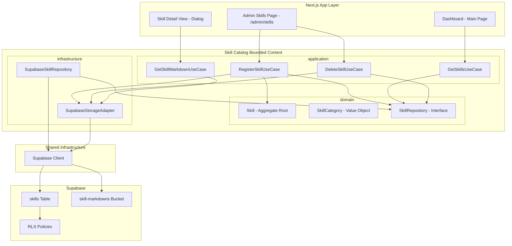
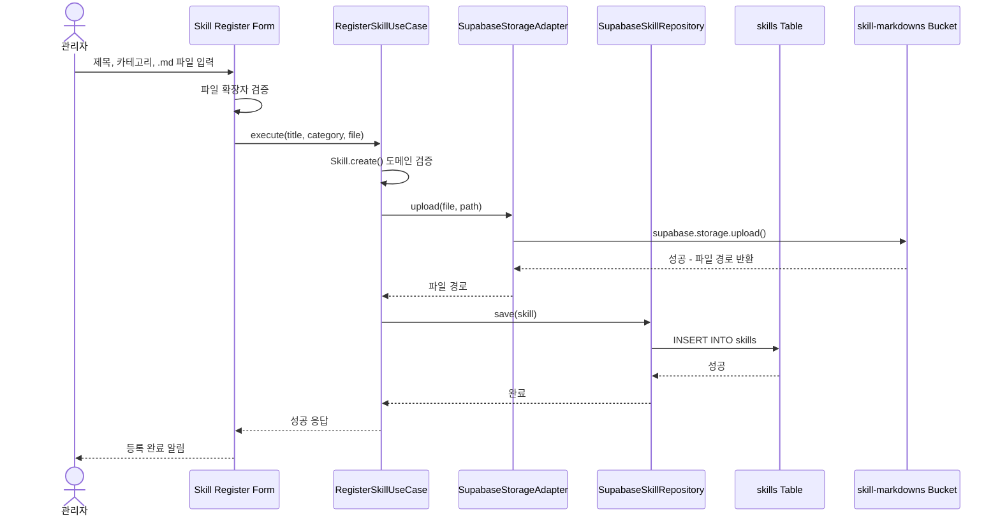
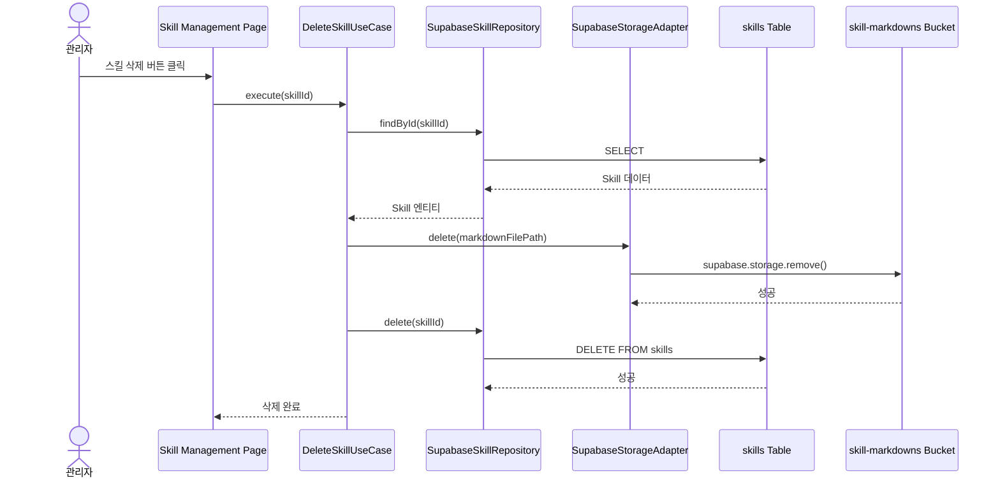
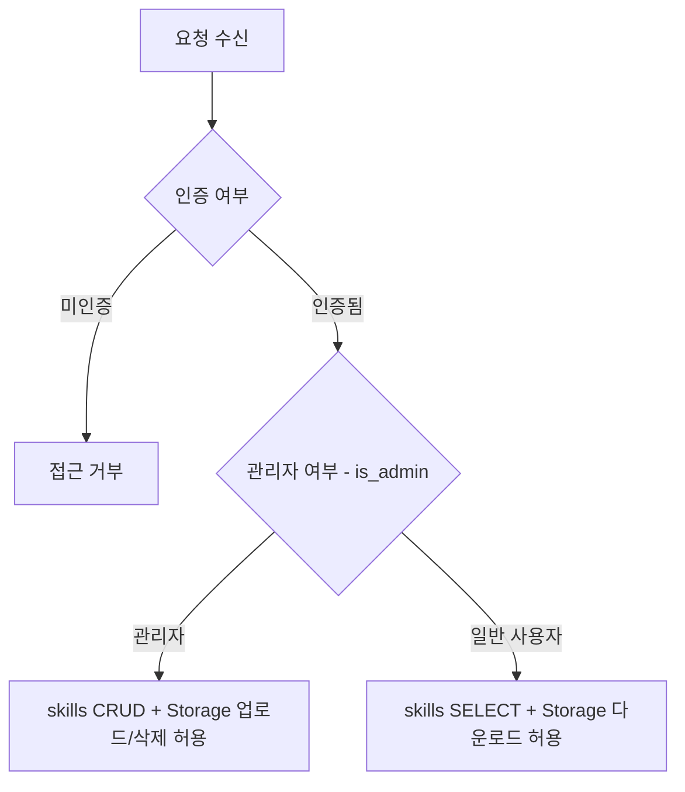
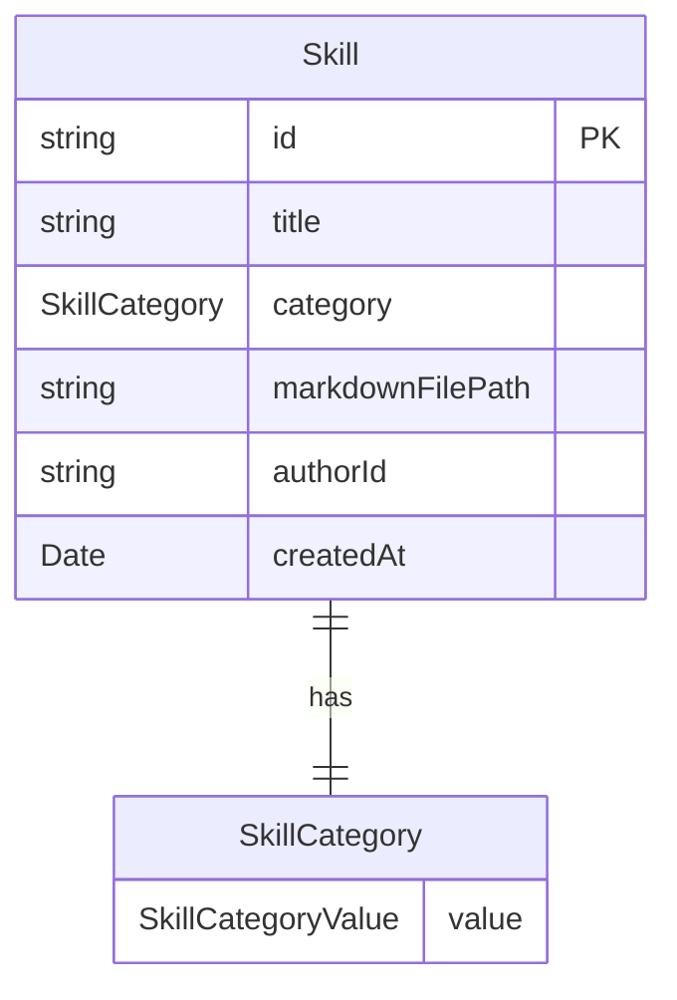

# Technical Design Document

## Overview

**Purpose**: 이 기능은 Eluo Skill Hub의 **Skill Catalog** 바운디드 컨텍스트를 단순화된 마크다운 파일 기반 스킬 등록 시스템으로 재설계한다. 기존 7개 테이블(skills, categories, tags, skill_versions, skill_categories, skill_tags, skill_stats) 기반의 복잡한 스키마를 폐기하고, 관리자가 마크다운 파일을 업로드하여 스킬을 등록하면 대시보드에서 해당 마크다운 콘텐츠를 열람하는 단순한 구조로 전환한다.

**Users**: 플랫폼 관리자는 관리자 페이지(`/admin/skills`)에서 스킬 제목, 카테고리, 마크다운 파일을 입력하여 스킬을 등록한다. 스킬 소비자는 메인 대시보드에서 스킬 목록을 조회하고 카드를 클릭하여 마크다운 콘텐츠를 열람한다.

**Impact**: 기존 `src/skill-catalog/` 바운디드 컨텍스트의 도메인 코드(엔티티, 값 객체, 리포지토리)를 단순화된 모델로 교체한다. Supabase PostgreSQL에 단일 `skills` 테이블과 Supabase Storage에 `skill-markdowns` 버킷을 생성한다. 메인 대시보드의 목업 데이터를 실제 DB 조회로 대체한다. `react-markdown` 라이브러리를 신규 추가한다.

### Goals

- 단일 `skills` 테이블과 Supabase Storage 버킷으로 마크다운 기반 스킬 등록/조회 시스템을 구현한다
- 기존 복잡한 7-테이블 도메인 모델을 단순화된 Skill 엔티티 + SkillCategory 값 객체로 교체한다
- RLS 정책으로 역할 기반 접근 제어를 구현한다 (관리자: CRUD, 인증 사용자: 읽기)
- `react-markdown`을 사용하여 마크다운 콘텐츠를 HTML로 렌더링한다
- 메인 대시보드의 목업 데이터를 실제 Supabase 데이터로 대체한다

### Non-Goals

- 스킬 버전 관리(skill_versions)는 이 범위에 포함하지 않는다
- 태그 시스템(tags, skill_tags)은 이 범위에 포함하지 않는다
- 스킬 통계(skill_stats, 조회 수, 설치 수)는 이 범위에 포함하지 않는다
- 전문 검색(tsvector, pg_trgm)은 이 범위에 포함하지 않는다 (클라이언트 측 제목 필터링으로 대체)
- 스킬 수정(UPDATE) 기능은 이 범위에 포함하지 않는다 (등록/삭제만 지원)
- 마크다운 파일 내 이미지 첨부 기능은 향후 확장으로 남긴다

## Architecture

### Existing Architecture Analysis

기존 시스템의 관련 구조와 이번 변경 사항을 정리한다.

- **기존 skill-catalog 도메인 코드**: `src/skill-catalog/` 디렉토리에 Skill, SkillVersion, Category, Tag 엔티티, SkillId/SemanticVersion/SkillSlug/SkillStatus 값 객체, SkillRepository/CategoryRepository/TagRepository 리포지토리 인터페이스 및 Supabase 구현체가 존재한다. 이 코드를 단순화된 모델로 교체한다.
- **대시보드 UI**: `src/shared/ui/` 디렉토리에 `mockSkills` 정적 데이터, `SkillSummary` 타입, `SkillCard`/`SkillCardGrid`/`MainContent` 컴포넌트, `useDashboardState` 훅이 존재한다. 목업 데이터를 DB 조회로 대체하고, 스킬 카드 클릭 시 마크다운 상세 뷰를 추가한다.
- **관리자 페이지**: `src/app/(admin)/admin/` 경로에 레이아웃(사이드바 네비게이션), 대시보드, 사용자 관리 페이지가 존재한다. "스킬 관리" 네비게이션 항목과 스킬 등록 폼 페이지를 추가한다.
- **Supabase 인프라**: `src/shared/infrastructure/supabase/`에 클라이언트(Browser/Server) 팩토리가 존재한다. `supabase/migrations/`에 profiles 테이블과 역할 관련 마이그레이션이 존재한다. `is_admin()` SECURITY DEFINER 함수가 이미 구현되어 있다.
- **공유 도메인 기반**: `Entity<T>`, `ValueObject<T>`, `DomainEvent` 인터페이스가 `src/shared/domain/`에 존재한다.

### Architecture Pattern & Boundary Map



**Architecture Integration**:
- **Selected pattern**: DDD 3계층(domain/application/infrastructure) + Supabase Storage. 기존 프로젝트의 DDD 패턴을 유지하되, 도메인 모델을 대폭 단순화한다.
- **Domain/feature boundaries**: Skill Catalog 컨텍스트는 스킬 메타데이터(제목, 카테고리, 파일 경로, 작성자)와 마크다운 파일 저장/조회를 소유한다. 사용자 인증/역할은 User Account 컨텍스트에 위임한다.
- **Existing patterns preserved**: `Entity<T>` 베이스 클래스, `ValueObject<T>` 베이스 클래스, Supabase 클라이언트 싱글톤(Browser/Server), `is_admin()` SECURITY DEFINER 함수를 재사용한다.
- **New components rationale**: `SupabaseStorageAdapter`는 Storage 파일 업로드/다운로드/삭제를 캡슐화하여 도메인 계층의 Storage 의존을 방지한다.
- **Steering compliance**: DDD 3계층 원칙, Aggregate Root 패턴, `any` 타입 금지, snake_case 테이블/컬럼 명명 규칙을 준수한다.

### Technology Stack

| Layer | Choice / Version | Role in Feature | Notes |
|-------|------------------|-----------------|-------|
| Frontend / UI | `react-markdown` v10 | 마크다운 콘텐츠를 HTML로 렌더링 | 신규 의존성 |
| Frontend / UI | `remark-gfm` | GFM 문법(테이블, 체크리스트) 지원 | 신규 의존성 |
| Frontend / UI | `@tailwindcss/typography` | 마크다운 렌더링 `prose` 스타일링 | 신규 devDependency |
| Backend / Services | TypeScript strict mode | 도메인 모델, 유스케이스, 리포지토리 정의 | `any` 타입 금지 |
| Backend / Services | `@supabase/supabase-js` v2 | DB CRUD 및 Storage 파일 조작 | 기존 의존성 활용 |
| Data / Storage | Supabase PostgreSQL | skills 테이블 영속성, RLS 기반 접근 제어 | 단일 테이블 |
| Data / Storage | Supabase Storage | 마크다운 파일 저장 (`skill-markdowns` 버킷) | 신규 버킷 생성 |
| Infrastructure / Runtime | SQL Migration files | 스키마 정의, RLS 정책 | `supabase/migrations/` |

## System Flows

### 스킬 등록 흐름 (관리자)



- Storage 업로드가 실패하면 skills 레코드를 생성하지 않는다 (요구사항 3.5).
- 파일 경로는 `{uuid}.md` 형식으로 생성하여 충돌을 방지한다.

### 스킬 삭제 흐름 (관리자)



- 스킬 삭제 시 마크다운 파일도 Storage에서 함께 삭제한다 (요구사항 5.5).

### RLS 접근 제어 판단 흐름



- `public.is_admin(auth.uid())` 함수를 사용하여 관리자 역할을 확인한다.
- 미인증 사용자는 skills 테이블과 Storage 모두 접근 불가하다.

## Requirements Traceability

| Requirement | Summary | Components | Interfaces | Flows |
|-------------|---------|------------|------------|-------|
| 1.1 | 등록 폼 제공(제목, 카테고리, .md 파일) | SkillRegisterForm | - | 스킬 등록 흐름 |
| 1.2 | Storage 업로드 + skills 테이블 저장 | RegisterSkillUseCase, SupabaseStorageAdapter, SupabaseSkillRepository | SkillRepository, StorageAdapter | 스킬 등록 흐름 |
| 1.3 | 마크다운 파일 형식 제한 | SkillRegisterForm | - | - |
| 1.4 | 비마크다운 파일 업로드 거부 | SkillRegisterForm | - | - |
| 1.5 | 카테고리 5개 선택 제한 | SkillCategory, SkillRegisterForm | - | - |
| 1.6 | 생성일시 자동 설정 | skills 테이블 DEFAULT | - | - |
| 2.1 | skills 테이블 컬럼 정의 | skills 테이블 | - | - |
| 2.2 | UUID 기본 키 | skills 테이블 | - | - |
| 2.3 | category CHECK 제약 | skills 테이블 | - | - |
| 2.4 | title NOT NULL | skills 테이블 | - | - |
| 2.5 | markdown_file_path NOT NULL | skills 테이블 | - | - |
| 2.6 | author_id FK -> auth.users | skills 테이블 | - | - |
| 3.1 | skill-markdowns 버킷 생성 | SQL Migration, SupabaseStorageAdapter | StorageAdapter | - |
| 3.2 | 파일 경로를 skills 테이블에 기록 | RegisterSkillUseCase | SkillRepository | 스킬 등록 흐름 |
| 3.3 | 인증 사용자 읽기 허용 | Storage RLS 정책 | - | RLS 판단 흐름 |
| 3.4 | 관리자 업로드/삭제 허용 | Storage RLS 정책 | - | RLS 판단 흐름 |
| 3.5 | 업로드 실패 시 레코드 미생성 | RegisterSkillUseCase | - | 스킬 등록 흐름 |
| 4.1 | 대시보드 스킬 목록 표시 | GetSkillsUseCase, SkillCardGrid | SkillRepository | - |
| 4.2 | 스킬 카드 클릭 시 마크다운 렌더링 | GetSkillMarkdownUseCase, SkillDetailView | StorageAdapter | - |
| 4.3 | 마크다운 HTML 변환 렌더링 | SkillDetailView, react-markdown | - | - |
| 4.4 | 카테고리별 필터링 | GetSkillsUseCase 또는 클라이언트 필터 | SkillRepository | - |
| 4.5 | mockSkills를 실제 DB 조회로 대체 | GetSkillsUseCase, useDashboardState 훅 수정 | SkillRepository | - |
| 5.1 | skills 테이블 RLS 활성화 | SQL Migration | - | - |
| 5.2 | 인증 사용자 SELECT 허용 | SQL Migration RLS 정책 | - | RLS 판단 흐름 |
| 5.3 | 관리자 INSERT/UPDATE/DELETE 허용 | SQL Migration RLS 정책 | - | RLS 판단 흐름 |
| 5.4 | 비관리자 등록/수정/삭제 거부 | RLS 정책 | - | RLS 판단 흐름 |
| 5.5 | 삭제 시 Storage 파일도 삭제 | DeleteSkillUseCase | StorageAdapter | 스킬 삭제 흐름 |
| 6.1 | Skill Aggregate Root | Skill 엔티티 | - | - |
| 6.2 | SkillRepository 인터페이스 + Supabase 구현체 | SkillRepository, SupabaseSkillRepository | SkillRepository | - |
| 6.3 | domain 계층 외부 의존 금지 | Skill, SkillCategory | - | - |
| 6.4 | snake_case 테이블/PascalCase 도메인 | 전체 컴포넌트 | - | - |
| 6.5 | SkillCategory 값 객체 | SkillCategory | - | - |

## Components and Interfaces

| Component | Domain/Layer | Intent | Req Coverage | Key Dependencies | Contracts |
|-----------|--------------|--------|--------------|------------------|-----------|
| Skill | domain/entities | Skill Catalog Aggregate Root | 6.1, 6.3 | Entity base (P0) | Service |
| SkillCategory | domain/value-objects | 카테고리 제한 값 객체 | 1.5, 2.3, 6.5 | ValueObject base (P0) | Service |
| SkillRepository | domain/repositories | 스킬 리포지토리 인터페이스 | 6.2 | - | Service |
| StorageAdapter | domain/repositories | Storage 파일 조작 인터페이스 | 3.1, 3.2 | - | Service |
| RegisterSkillUseCase | application | 스킬 등록 유스케이스 | 1.1, 1.2, 3.2, 3.5 | SkillRepository (P0), StorageAdapter (P0) | Service |
| GetSkillsUseCase | application | 스킬 목록 조회 유스케이스 | 4.1, 4.4, 4.5 | SkillRepository (P0) | Service |
| DeleteSkillUseCase | application | 스킬 삭제 유스케이스 | 5.5 | SkillRepository (P0), StorageAdapter (P0) | Service |
| GetSkillMarkdownUseCase | application | 마크다운 콘텐츠 조회 유스케이스 | 4.2 | StorageAdapter (P0) | Service |
| SupabaseSkillRepository | infrastructure | SkillRepository Supabase 구현체 | 6.2 | Supabase Client (P0) | Service |
| SupabaseStorageAdapter | infrastructure | StorageAdapter Supabase 구현체 | 3.1-3.5 | Supabase Client (P0) | Service |
| SkillRegisterForm | UI/admin | 스킬 등록 폼 컴포넌트 | 1.1, 1.3, 1.4, 1.5 | RegisterSkillUseCase (P0) | - |
| SkillDetailView | UI/shared | 마크다운 콘텐츠 상세 뷰 | 4.2, 4.3 | react-markdown (P0) | - |
| SQL Migrations | infrastructure/migrations | 테이블, RLS, Storage 버킷 정의 | 2.1-2.6, 3.1, 5.1-5.4 | Supabase PostgreSQL (P0) | - |

### Domain Layer

#### Skill (Aggregate Root)

| Field | Detail |
|-------|--------|
| Intent | Skill Catalog의 Aggregate Root로서 스킬 메타데이터를 소유하고 생성/삭제의 진입점 역할을 한다 |
| Requirements | 6.1, 6.3 |

**Responsibilities & Constraints**
- 스킬의 메타데이터(제목, 카테고리, 마크다운 파일 경로, 작성자 ID, 생성일시)를 캡슐화한다
- 팩토리 메서드에서 제목 NOT NULL, 카테고리 유효성을 검증한다
- DB 레코드로부터 엔티티를 복원(reconstruct)하는 정적 메서드를 제공한다

**Dependencies**
- Inbound: UseCases -- Skill 생성/조회/삭제 요청 (P0)
- External: None (도메인 계층은 외부 의존 없음)

**Contracts**: Service [x] / API [ ] / Event [ ] / Batch [ ] / State [ ]

##### Service Interface

```typescript
interface SkillProps {
  readonly title: string;
  readonly category: SkillCategory;
  readonly markdownFilePath: string;
  readonly authorId: string;
  readonly createdAt: Date;
}

class Skill extends Entity<string> {
  private constructor(id: string, props: SkillProps);

  static create(params: {
    id: string;
    title: string;
    category: string;
    markdownFilePath: string;
    authorId: string;
  }): Skill;

  static reconstruct(
    id: string,
    props: SkillProps
  ): Skill;

  get title(): string;
  get category(): SkillCategory;
  get markdownFilePath(): string;
  get authorId(): string;
  get createdAt(): Date;
}
```

- Preconditions: `create` 호출 시 title은 빈 문자열이 아니어야 하며, category는 허용된 5개 값 중 하나여야 한다
- Postconditions: `create` 호출 후 createdAt은 현재 시각으로 설정된다
- Invariants: title은 항상 NOT NULL, category는 항상 유효한 SkillCategory

#### SkillCategory (Value Object)

| Field | Detail |
|-------|--------|
| Intent | 스킬 카테고리를 5개 허용 값으로 제한하는 값 객체 |
| Requirements | 1.5, 2.3, 6.5 |

**Responsibilities & Constraints**
- 허용된 카테고리 값(기획, 디자인, 퍼블리싱, 개발, QA)만 생성 가능하다
- 유효하지 않은 값으로 생성 시도 시 에러를 반환한다

**Contracts**: Service [x] / API [ ] / Event [ ] / Batch [ ] / State [ ]

##### Service Interface

```typescript
type SkillCategoryValue = '기획' | '디자인' | '퍼블리싱' | '개발' | 'QA';

const VALID_CATEGORIES: ReadonlyArray<SkillCategoryValue> = [
  '기획', '디자인', '퍼블리싱', '개발', 'QA'
] as const;

class SkillCategory extends ValueObject<{ value: SkillCategoryValue }> {
  static create(value: string): SkillCategory;
  static isValid(value: string): value is SkillCategoryValue;
  get value(): SkillCategoryValue;
}
```

- Preconditions: value는 VALID_CATEGORIES에 포함된 값이어야 한다
- Invariants: 생성 후 value는 변경 불가(불변)

#### SkillRepository (Interface)

| Field | Detail |
|-------|--------|
| Intent | 스킬 영속화를 위한 리포지토리 인터페이스 |
| Requirements | 6.2 |

**Contracts**: Service [x] / API [ ] / Event [ ] / Batch [ ] / State [ ]

##### Service Interface

```typescript
interface SkillRepository {
  findById(id: string): Promise<Skill | null>;
  findAll(params?: {
    category?: SkillCategoryValue;
  }): Promise<ReadonlyArray<Skill>>;
  save(skill: Skill): Promise<void>;
  delete(id: string): Promise<void>;
}
```

- Preconditions: save 호출 시 Skill 엔티티는 유효한 상태여야 한다
- Postconditions: save 성공 후 findById로 동일 엔티티를 조회할 수 있다

#### StorageAdapter (Interface)

| Field | Detail |
|-------|--------|
| Intent | 마크다운 파일의 업로드/다운로드/삭제를 추상화하는 인터페이스 |
| Requirements | 3.1, 3.2 |

**Contracts**: Service [x] / API [ ] / Event [ ] / Batch [ ] / State [ ]

##### Service Interface

```typescript
interface StorageAdapter {
  upload(file: File, path: string): Promise<{ path: string }>;
  download(path: string): Promise<string>;
  delete(path: string): Promise<void>;
}
```

- Preconditions: upload 시 file은 `.md` 확장자여야 한다
- Postconditions: upload 성공 후 download로 동일 파일을 조회할 수 있다
- download는 마크다운 파일의 텍스트 내용을 문자열로 반환한다

### Application Layer

#### RegisterSkillUseCase

| Field | Detail |
|-------|--------|
| Intent | 관리자가 마크다운 파일을 업로드하여 스킬을 등록하는 유스케이스 |
| Requirements | 1.1, 1.2, 3.2, 3.5 |

**Responsibilities & Constraints**
- Storage에 마크다운 파일을 먼저 업로드하고, 성공 시에만 skills 테이블에 레코드를 저장한다
- Storage 업로드 실패 시 skills 레코드를 생성하지 않고 오류를 반환한다

**Dependencies**
- Outbound: SkillRepository -- 스킬 레코드 저장 (P0)
- Outbound: StorageAdapter -- 마크다운 파일 업로드 (P0)

**Contracts**: Service [x] / API [ ] / Event [ ] / Batch [ ] / State [ ]

##### Service Interface

```typescript
interface RegisterSkillInput {
  readonly title: string;
  readonly category: string;
  readonly file: File;
  readonly authorId: string;
}

type RegisterSkillResult =
  | { status: 'success'; skill: Skill }
  | { status: 'error'; message: string };

class RegisterSkillUseCase {
  constructor(
    skillRepository: SkillRepository,
    storageAdapter: StorageAdapter
  );

  execute(input: RegisterSkillInput): Promise<RegisterSkillResult>;
}
```

**Implementation Notes**
- Integration: 파일 경로는 `{crypto.randomUUID()}.md` 형식으로 생성하여 파일명 충돌을 방지한다
- Validation: 도메인 엔티티 생성(Skill.create)에서 제목과 카테고리 유효성을 검증한다
- Risks: Storage 업로드 성공 후 DB 저장 실패 시 고아 파일이 남을 수 있다. 이 경우 Storage 파일 삭제를 시도하되, 실패하더라도 에러를 사용자에게 반환한다.

#### GetSkillsUseCase

| Field | Detail |
|-------|--------|
| Intent | 스킬 목록을 조회하고 카테고리별 필터링을 지원하는 유스케이스 |
| Requirements | 4.1, 4.4, 4.5 |

**Contracts**: Service [x] / API [ ] / Event [ ] / Batch [ ] / State [ ]

##### Service Interface

```typescript
interface GetSkillsInput {
  readonly category?: SkillCategoryValue;
}

type GetSkillsResult =
  | { status: 'success'; skills: ReadonlyArray<Skill> }
  | { status: 'error'; message: string };

class GetSkillsUseCase {
  constructor(skillRepository: SkillRepository);
  execute(input?: GetSkillsInput): Promise<GetSkillsResult>;
}
```

#### DeleteSkillUseCase

| Field | Detail |
|-------|--------|
| Intent | 관리자가 스킬을 삭제하고 연관 마크다운 파일도 함께 삭제하는 유스케이스 |
| Requirements | 5.5 |

**Contracts**: Service [x] / API [ ] / Event [ ] / Batch [ ] / State [ ]

##### Service Interface

```typescript
interface DeleteSkillInput {
  readonly skillId: string;
}

type DeleteSkillResult =
  | { status: 'success' }
  | { status: 'error'; message: string };

class DeleteSkillUseCase {
  constructor(
    skillRepository: SkillRepository,
    storageAdapter: StorageAdapter
  );

  execute(input: DeleteSkillInput): Promise<DeleteSkillResult>;
}
```

**Implementation Notes**
- Integration: 먼저 findById로 스킬 정보를 조회하여 파일 경로를 획득한 후, Storage 파일 삭제 -> DB 레코드 삭제 순서로 진행한다

#### GetSkillMarkdownUseCase

| Field | Detail |
|-------|--------|
| Intent | 특정 스킬의 마크다운 파일 내용을 Storage에서 조회하여 반환하는 유스케이스 |
| Requirements | 4.2 |

**Contracts**: Service [x] / API [ ] / Event [ ] / Batch [ ] / State [ ]

##### Service Interface

```typescript
interface GetSkillMarkdownInput {
  readonly filePath: string;
}

type GetSkillMarkdownResult =
  | { status: 'success'; content: string }
  | { status: 'error'; message: string };

class GetSkillMarkdownUseCase {
  constructor(storageAdapter: StorageAdapter);
  execute(input: GetSkillMarkdownInput): Promise<GetSkillMarkdownResult>;
}
```

### Infrastructure Layer

#### SupabaseSkillRepository

| Field | Detail |
|-------|--------|
| Intent | SkillRepository 인터페이스를 Supabase 클라이언트로 구현한다 |
| Requirements | 6.2 |

**Responsibilities & Constraints**
- Supabase 클라이언트를 생성자 주입으로 받아 테스트 시 모킹 가능하게 설계한다
- 도메인 엔티티(Skill)와 데이터베이스 레코드 간 매핑(hydration/dehydration)을 담당한다
- DB 레코드의 snake_case를 도메인 엔티티의 camelCase로 변환한다

**Dependencies**
- External: `@supabase/supabase-js` -- Supabase 클라이언트 (P0)

**Contracts**: Service [x] / API [ ] / Event [ ] / Batch [ ] / State [ ]

##### Service Interface

```typescript
interface SkillRow {
  readonly id: string;
  readonly title: string;
  readonly category: string;
  readonly markdown_file_path: string;
  readonly author_id: string;
  readonly created_at: string;
}

class SupabaseSkillRepository implements SkillRepository {
  constructor(supabaseClient: SupabaseClient);

  findById(id: string): Promise<Skill | null>;
  findAll(params?: { category?: SkillCategoryValue }): Promise<ReadonlyArray<Skill>>;
  save(skill: Skill): Promise<void>;
  delete(id: string): Promise<void>;

  private toDomain(row: SkillRow): Skill;
}
```

**Implementation Notes**
- Integration: 기존 `createSupabaseServerClient()`로 생성한 클라이언트를 주입받는다
- Validation: DB 레코드에서 도메인 엔티티로 변환 시 SkillCategory 유효성을 재검증한다
- Risks: RLS 정책에 의해 권한 없는 요청은 빈 결과 또는 에러로 반환된다

#### SupabaseStorageAdapter

| Field | Detail |
|-------|--------|
| Intent | StorageAdapter 인터페이스를 Supabase Storage로 구현한다 |
| Requirements | 3.1-3.5 |

**Responsibilities & Constraints**
- `skill-markdowns` 버킷을 대상으로 파일 업로드, 다운로드, 삭제를 수행한다
- 다운로드 시 Blob을 텍스트 문자열로 변환하여 반환한다

**Dependencies**
- External: `@supabase/supabase-js` -- Supabase Storage API (P0)

**Contracts**: Service [x] / API [ ] / Event [ ] / Batch [ ] / State [ ]

##### Service Interface

```typescript
class SupabaseStorageAdapter implements StorageAdapter {
  private static readonly BUCKET_NAME = 'skill-markdowns';

  constructor(supabaseClient: SupabaseClient);

  upload(file: File, path: string): Promise<{ path: string }>;
  download(path: string): Promise<string>;
  delete(path: string): Promise<void>;
}
```

**Implementation Notes**
- Integration: `supabase.storage.from('skill-markdowns').upload(path, file, { contentType: 'text/markdown', upsert: false })` 패턴 사용
- Validation: upload 전 파일 확장자가 `.md`인지 검증한다
- Risks: 네트워크 오류 시 업로드/다운로드 실패 가능. 적절한 에러 메시지를 반환한다.

### UI Layer (Summary-only)

#### SkillRegisterForm

관리자 페이지(`/admin/skills`)에서 스킬 제목, 카테고리 드롭다운(기획/디자인/퍼블리싱/개발/QA), 마크다운 파일 업로드 입력을 받는 폼 컴포넌트. Server Action 또는 API Route를 통해 `RegisterSkillUseCase`를 호출한다. 파일 확장자 검증은 클라이언트 측(`accept=".md"`)과 서버 측 모두에서 수행한다.

#### SkillDetailView

스킬 카드 클릭 시 Dialog 형태로 마크다운 콘텐츠를 표시하는 컴포넌트. `react-markdown`과 `remark-gfm`을 사용하여 마크다운을 HTML로 렌더링하며, `@tailwindcss/typography`의 `prose` 클래스로 스타일링한다.

#### AdminSkillsPage

`/admin/skills` 라우트의 서버 컴포넌트. 등록된 스킬 목록을 테이블 형태로 표시하고, 스킬 등록 폼과 삭제 버튼을 제공한다. 기존 관리자 레이아웃의 사이드바에 "스킬 관리" 네비게이션 항목을 추가한다.

## Data Models

### Domain Model



**Aggregate Root**: `Skill`
- Skill은 단일 엔티티로서 스킬 메타데이터를 소유한다
- SkillCategory는 값 객체로서 Skill에 내장된다
- 마크다운 파일 자체는 Supabase Storage에 저장되며, Skill 엔티티는 파일 경로만 보유한다

**Business Rules & Invariants**:
- 스킬 제목은 빈 문자열이 아니어야 한다 (NOT NULL)
- 카테고리는 기획, 디자인, 퍼블리싱, 개발, QA 중 하나여야 한다
- 마크다운 파일 경로는 빈 문자열이 아니어야 한다 (NOT NULL)
- 작성자 ID는 auth.users 테이블의 유효한 UUID를 참조한다

### Physical Data Model

#### Table: `skills`

| Column | Type | Constraints | Notes |
|--------|------|-------------|-------|
| `id` | `uuid` | `PRIMARY KEY DEFAULT gen_random_uuid()` | 스킬 고유 식별자 |
| `title` | `text` | `NOT NULL` | 스킬 제목 |
| `category` | `text` | `NOT NULL CHECK (category IN ('기획', '디자인', '퍼블리싱', '개발', 'QA'))` | 직군 카테고리 |
| `markdown_file_path` | `text` | `NOT NULL` | Storage 내 마크다운 파일 경로 |
| `author_id` | `uuid` | `NOT NULL REFERENCES auth.users(id)` | 작성자 UUID (FK) |
| `created_at` | `timestamptz` | `NOT NULL DEFAULT now()` | 생성일시 |

**Indexes**:
- `idx_skills_category` on `category` (카테고리별 필터링 성능)
- `idx_skills_author_id` on `author_id` (RLS 정책 성능)
- `idx_skills_created_at` on `created_at DESC` (최신순 정렬)

#### Supabase Storage: `skill-markdowns` Bucket

- **Bucket type**: 프라이빗 (RLS 기반 접근 제어)
- **File format**: `.md` (마크다운) 파일만 저장
- **File path pattern**: `{uuid}.md` (UUID 기반 고유 파일명)
- **Content type**: `text/markdown`

#### RLS Policies

**skills 테이블**:
- `skills_select_authenticated`: `authenticated` 역할 -- SELECT 허용 (인증된 사용자는 모든 스킬 조회 가능)
- `skills_insert_admin`: `authenticated` 역할 -- `public.is_admin(auth.uid())` 조건으로 INSERT 허용
- `skills_update_admin`: `authenticated` 역할 -- `public.is_admin(auth.uid())` 조건으로 UPDATE 허용
- `skills_delete_admin`: `authenticated` 역할 -- `public.is_admin(auth.uid())` 조건으로 DELETE 허용

**Storage `skill-markdowns` 버킷 (`storage.objects` 테이블)**:
- `skill_markdowns_select_authenticated`: `authenticated` 역할 -- `bucket_id = 'skill-markdowns'` 조건으로 SELECT 허용
- `skill_markdowns_insert_admin`: `authenticated` 역할 -- `bucket_id = 'skill-markdowns' AND public.is_admin(auth.uid())` 조건으로 INSERT 허용
- `skill_markdowns_delete_admin`: `authenticated` 역할 -- `bucket_id = 'skill-markdowns' AND public.is_admin(auth.uid())` 조건으로 DELETE 허용

## Error Handling

### Error Strategy

도메인 계층에서 발생하는 비즈니스 규칙 위반과 인프라 계층의 DB/Storage 오류를 `{ status: 'success' | 'error' }` 패턴으로 처리한다. 기존 프로젝트의 `GetDashboardStatsUseCase` 등에서 사용하는 패턴과 일관성을 유지한다.

### Error Categories and Responses

**Business Logic Errors (422)**:
- `InvalidTitle`: 빈 제목 -- "스킬 제목을 입력해 주세요" 메시지 표시
- `InvalidCategory`: 유효하지 않은 카테고리 -- "올바른 카테고리를 선택해 주세요" 메시지 표시
- `InvalidFileType`: `.md` 파일이 아닌 파일 업로드 -- "마크다운(.md) 파일만 업로드할 수 있습니다" 메시지 표시

**User Errors (4xx)**:
- `SkillNotFound`: 존재하지 않는 스킬 접근 -- 404 응답
- `Unauthorized`: 미인증 상태에서 접근 -- 로그인 페이지로 리다이렉트
- `Forbidden`: 관리자가 아닌 사용자의 등록/삭제 시도 -- RLS에 의해 자동 차단

**System Errors (5xx)**:
- Storage 업로드 실패 -- "파일 업로드에 실패했습니다. 다시 시도해 주세요" 메시지 표시
- DB 저장 실패 -- "스킬 등록에 실패했습니다. 다시 시도해 주세요" 메시지 표시
- Storage 다운로드 실패 -- "마크다운 파일을 불러올 수 없습니다" 메시지 표시

### Error Type Definition

```typescript
type SkillCatalogError =
  | { type: 'INVALID_TITLE'; message: string }
  | { type: 'INVALID_CATEGORY'; message: string }
  | { type: 'INVALID_FILE_TYPE'; message: string }
  | { type: 'SKILL_NOT_FOUND'; skillId: string }
  | { type: 'STORAGE_UPLOAD_FAILED'; cause: string }
  | { type: 'STORAGE_DOWNLOAD_FAILED'; cause: string }
  | { type: 'DATABASE_ERROR'; cause: string };
```

## Testing Strategy

### Unit Tests (Domain Layer)
- Skill 엔티티 생성: 유효한 입력으로 생성 성공, 빈 제목/잘못된 카테고리로 생성 실패
- SkillCategory 값 객체: 유효한 카테고리(기획, 디자인, 퍼블리싱, 개발, QA) 생성 성공, 잘못된 값으로 생성 실패
- Skill.reconstruct: DB 레코드에서 엔티티 복원 검증

### Integration Tests (Infrastructure Layer)
- SupabaseSkillRepository: CRUD 작업 및 카테고리 필터링 검증
- SupabaseStorageAdapter: 마크다운 파일 업로드/다운로드/삭제 검증
- RLS 정책: 인증 사용자 조회 가능, 관리자만 등록/삭제 가능 검증

### E2E Tests
- 관리자: 스킬 등록(제목, 카테고리, .md 파일) -> 대시보드에서 등록된 스킬 확인 -> 스킬 카드 클릭 시 마크다운 렌더링 확인 -> 스킬 삭제
- 일반 사용자: 스킬 목록 조회 가능, 등록/삭제 버튼 미표시 확인
- 파일 형식 제한: `.md` 외 파일 업로드 시 오류 메시지 표시 확인

## Security Considerations

- **RLS 기반 접근 제어**: skills 테이블과 Storage 버킷 모두 RLS를 활성화하여 DB 및 파일 수준에서 접근을 제한한다
- **is_admin() SECURITY DEFINER 함수**: 기존 프로젝트의 관리자 확인 함수를 재사용하여 일관된 역할 기반 접근 제어를 구현한다
- **파일 형식 제한**: 클라이언트(accept 속성)와 서버(확장자 검증) 양쪽에서 `.md` 파일만 허용하여 악성 파일 업로드를 방지한다
- **마크다운 렌더링 보안**: `react-markdown`은 기본적으로 raw HTML을 삽입하지 않으므로 XSS 공격에 안전하다. `rehype-raw` 플러그인을 사용하지 않아 HTML 인젝션을 차단한다
- **author_id 무결성**: `author_id`는 `auth.users(id)`를 참조하는 FK로 설정한다

## Migration Strategy

### Phase 1: 기존 Skill Catalog 도메인 코드 정리
1. `src/skill-catalog/` 디렉토리의 기존 복잡한 도메인 코드(7-테이블 기반)를 제거한다
2. 단순화된 Skill 엔티티, SkillCategory 값 객체, SkillRepository 인터페이스를 생성한다

### Phase 2: 데이터베이스 스키마 및 Storage 설정
3. skills 테이블 생성 마이그레이션 작성 및 적용
4. RLS 정책 생성 마이그레이션 작성 및 적용
5. `skill-markdowns` Storage 버킷 생성 및 Storage RLS 정책 설정

### Phase 3: 인프라 및 애플리케이션 계층 구현
6. SupabaseSkillRepository, SupabaseStorageAdapter 구현
7. RegisterSkillUseCase, GetSkillsUseCase, DeleteSkillUseCase, GetSkillMarkdownUseCase 구현

### Phase 4: UI 구현
8. 관리자 스킬 등록 페이지(/admin/skills) 및 등록 폼 구현
9. 대시보드 목업 데이터를 실제 DB 조회로 교체
10. 스킬 상세 뷰(마크다운 렌더링) 구현

### Rollback Strategy
- 각 마이그레이션 파일에 대응하는 rollback SQL을 준비한다
- skills 테이블 DROP 시 Storage 버킷 내 파일도 수동 삭제가 필요하다
- 도메인 코드는 Git 히스토리에서 복원 가능하다
