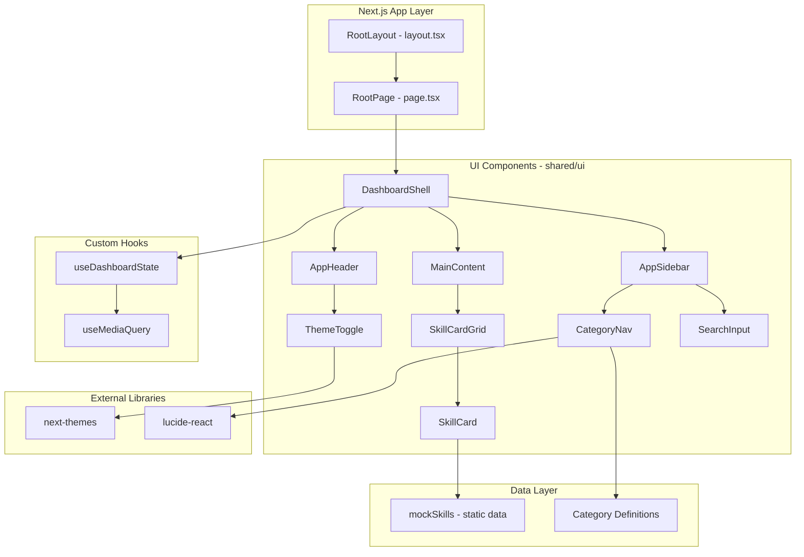
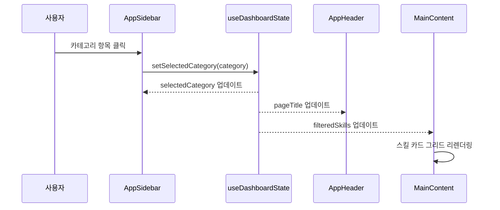
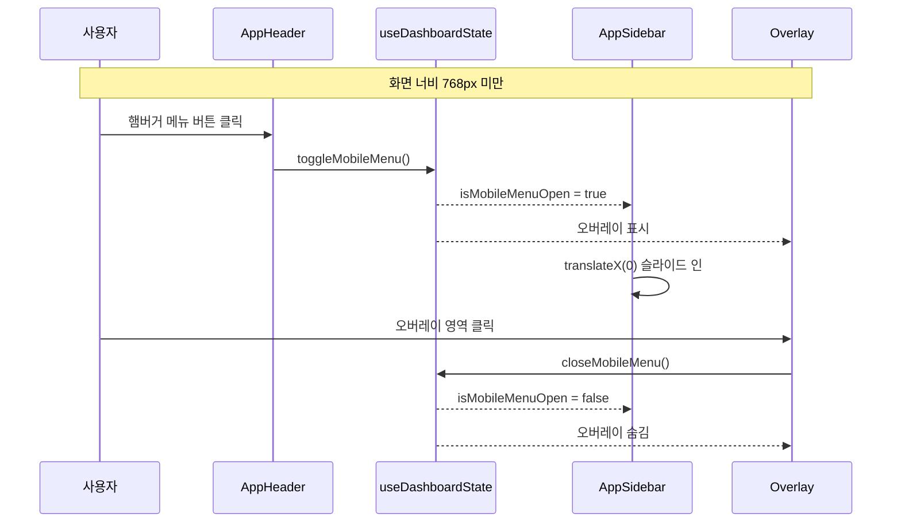

# Technical Design: Root Page Layout

## Overview

**Purpose**: 이 기능은 Eluo Skill Hub의 루트 페이지 대시보드 레이아웃을 제공하여, 사용자가 사이드바 내비게이션/상단 헤더/메인 콘텐츠 영역으로 구성된 일관된 UI를 통해 5개 직군(기획/디자인/퍼블리싱/개발/QA)별 스킬을 탐색할 수 있게 한다.

**Users**: 스킬 소비자가 카테고리별 스킬 검색 및 탐색 워크플로우에서 사용한다. 스킬 제작자와 플랫폼 관리자도 동일한 레이아웃 기반 위에서 작업한다.

**Impact**: 기존 Next.js 기본 보일러플레이트(`page.tsx`)를 3분할 대시보드 레이아웃으로 교체한다. 기존 `layout.tsx`의 ThemeProvider 구성은 유지하며, 사이드바 전용 CSS 변수가 이미 `globals.css`에 정의되어 있어 이를 활용한다.

### Goals
- 사이드바/헤더/메인 콘텐츠 3분할 레이아웃을 구현하여 직관적인 대시보드 탐색 경험을 제공한다
- 5개 직군 카테고리(기획/디자인/퍼블리싱/개발/QA)를 사이드바 내비게이션으로 노출한다
- 768px 기준 반응형 레이아웃(모바일 오버레이 사이드바, 적응형 그리드)을 지원한다
- 기존 `next-themes` 인프라를 활용한 라이트/다크 모드 전환을 제공한다
- 시맨틱 HTML과 키보드 내비게이션 기반 접근성을 보장한다

### Non-Goals
- Supabase 데이터 연동은 이 스펙 범위에 포함하지 않는다 (정적 목 데이터 사용)
- 사용자 인증/로그인 기능은 포함하지 않는다
- 스킬 상세 모달은 이 스펙에서 구현하지 않는다
- 사이드바 축소(collapse) 기능은 구현하지 않는다
- URL 기반 라우팅(카테고리별 경로)은 향후 스펙에서 다룬다

## Architecture

> 상세 디스커버리 결과는 `research.md`에 기록되어 있다. 이 문서는 설계 결정 사항과 인터페이스 계약에 집중한다.

### Architecture Pattern & Boundary Map



**Architecture Integration**:
- **Selected pattern**: 컴포넌트 합성(Composition) 패턴 + 커스텀 훅 기반 상태 관리. DashboardShell이 레이아웃 오케스트레이션을 담당하고, 각 하위 컴포넌트는 props를 통해 데이터를 수신한다.
- **Domain/feature boundaries**: UI 컴포넌트는 `src/shared/ui/components/` 아래에 배치하고, 목 데이터와 타입 정의는 `src/shared/ui/data/` 및 `src/shared/ui/types/`에 위치한다. 향후 Skill Catalog 바운디드 컨텍스트의 도메인 모델과 연결될 때 데이터 소스만 교체하면 된다.
- **Existing patterns preserved**: ThemeProvider 구성(layout.tsx), CSS 변수 기반 테마 시스템(globals.css), `@/` 경로 별칭
- **New components rationale**: DashboardShell은 레이아웃 상태 관리와 반응형 로직을 캡슐화한다. 개별 UI 컴포넌트(AppSidebar, AppHeader, MainContent)는 단일 책임 원칙에 따라 분리한다.
- **Steering compliance**: DDD 3계층 원칙을 준수하되, 현재 단계는 UI 계층만 관련되므로 shared UI 모듈에 집중한다. `any` 타입 금지, TypeScript strict mode 준수.

### Technology Stack

| Layer | Choice / Version | Role in Feature | Notes |
|-------|------------------|-----------------|-------|
| Frontend Framework | Next.js 16.1.6 (App Router) | 레이아웃 라우팅, 서버 컴포넌트 | 기존 설치 |
| UI Library | React 19.2.3 | 컴포넌트 렌더링 | 기존 설치 |
| Styling | Tailwind CSS v4 | 유틸리티 기반 스타일링 | 기존 설치 |
| Icons | lucide-react (신규) | 카테고리 아이콘, UI 아이콘 | 신규 의존성 추가 필요 |
| Theme | next-themes 0.4.6 | 다크/라이트 모드 전환 | 기존 설치 |

> `lucide-react` 추가 사유와 대안 비교는 `research.md`의 아이콘 라이브러리 조사 섹션에 기록되어 있다.

## System Flows

### 카테고리 선택 플로우



### 모바일 반응형 플로우



## Requirements Traceability

| Requirement | Summary | Components | Interfaces | Flows |
|-------------|---------|------------|------------|-------|
| 1.1 | 3분할 레이아웃 렌더링 | DashboardShell | DashboardShellProps | - |
| 1.2 | 사이드바 왼쪽 고정 배치 | DashboardShell, AppSidebar | AppSidebarProps | - |
| 1.3 | 헤더 오른쪽 상단 고정 | DashboardShell, AppHeader | AppHeaderProps | - |
| 1.4 | 메인 콘텐츠 남은 공간 채움 | DashboardShell, MainContent | MainContentProps | - |
| 1.5 | 100vh 뷰포트 사용 | DashboardShell | DashboardShellProps | - |
| 2.1 | 사이드바 로고/서비스명 표시 | AppSidebar | AppSidebarProps | - |
| 2.2 | 5개 직군 카테고리 메뉴 | CategoryNav | CategoryNavProps | 카테고리 선택 |
| 2.3 | 카테고리 아이콘 표시 | CategoryNav | CategoryItem | - |
| 2.4 | 활성 카테고리 시각적 표시 | CategoryNav | CategoryNavProps | 카테고리 선택 |
| 2.5 | 카테고리 선택 시 상태 전달 | CategoryNav, useDashboardState | DashboardState | 카테고리 선택 |
| 3.1 | 현재 카테고리/페이지 제목 | AppHeader | AppHeaderProps | 카테고리 선택 |
| 3.2 | 검색 입력 필드 | AppHeader, SearchInput | SearchInputProps | - |
| 3.3 | 사용자 프로필 영역 | AppHeader | AppHeaderProps | - |
| 3.4 | 카테고리 변경 시 제목 반영 | AppHeader, useDashboardState | DashboardState | 카테고리 선택 |
| 4.1 | 대시보드 요약 정보 | MainContent | MainContentProps | - |
| 4.2 | 스킬 카드 그리드 표시 | SkillCardGrid | SkillCardGridProps | 카테고리 선택 |
| 4.3 | 스킬 카드 정보 표시 | SkillCard | SkillCardProps | - |
| 4.4 | 세로 스크롤 지원 | MainContent | - | - |
| 4.5 | 로딩 인디케이터 | MainContent | MainContentProps | - |
| 4.6 | 빈 상태 메시지 | MainContent | MainContentProps | - |
| 5.1 | 768px 미만 사이드바 숨김 + 햄버거 | DashboardShell, AppHeader | DashboardState | 모바일 반응형 |
| 5.2 | 오버레이 사이드바 표시 | DashboardShell, AppSidebar | DashboardState | 모바일 반응형 |
| 5.3 | 오버레이 외부 클릭 시 닫기 | DashboardShell | DashboardState | 모바일 반응형 |
| 5.4 | 768px 이상 사이드바 항상 표시 | DashboardShell | DashboardState | - |
| 5.5 | 반응형 그리드 열 수 조정 | SkillCardGrid | - | - |
| 6.1 | 시스템 테마 감지 | ThemeProvider | - | - |
| 6.2 | 테마 전환 토글 버튼 | ThemeToggle | ThemeToggleProps | - |
| 6.3 | 전체 레이아웃 색상 즉시 전환 | ThemeToggle, ThemeProvider | - | - |
| 6.4 | 테마 localStorage 저장 | ThemeProvider (next-themes) | - | - |
| 7.1 | nav 시맨틱 태그 + aria-label | AppSidebar | - | - |
| 7.2 | header 시맨틱 태그 | AppHeader | - | - |
| 7.3 | main 시맨틱 태그 | MainContent | - | - |
| 7.4 | Tab 키 내비게이션 | CategoryNav | - | - |
| 7.5 | Enter 키 항목 활성화 | CategoryNav | - | - |

## Components and Interfaces

| Component | Domain/Layer | Intent | Req Coverage | Key Dependencies | Contracts |
|-----------|--------------|--------|--------------|------------------|-----------|
| DashboardShell | UI / Layout | 3분할 레이아웃 오케스트레이션 및 상태 관리 | 1.1-1.5, 5.1-5.4 | useDashboardState (P0), useMediaQuery (P1) | State |
| AppSidebar | UI / Navigation | 사이드바 내비게이션 (로고, 카테고리, 검색) | 2.1-2.5, 7.1 | CategoryNav (P0), lucide-react (P1) | - |
| AppHeader | UI / Navigation | 상단 헤더 (제목, 검색, 프로필, 테마 토글) | 3.1-3.4, 5.1, 6.2, 7.2 | ThemeToggle (P1), SearchInput (P1) | - |
| MainContent | UI / Content | 메인 콘텐츠 영역 (대시보드/스킬 그리드) | 4.1-4.6, 7.3 | SkillCardGrid (P0) | - |
| CategoryNav | UI / Navigation | 카테고리 목록 렌더링 및 선택 처리 | 2.2-2.5, 7.4-7.5 | lucide-react (P1) | - |
| SkillCardGrid | UI / Content | 스킬 카드 그리드 레이아웃 | 4.2, 4.6, 5.5 | SkillCard (P0) | - |
| SkillCard | UI / Content | 개별 스킬 카드 표시 | 4.3 | - | - |
| ThemeToggle | UI / Action | 다크/라이트 모드 전환 버튼 | 6.2-6.3 | next-themes (P0) | - |
| SearchInput | UI / Input | 검색 입력 필드 | 3.2 | - | - |
| useDashboardState | Hook / State | 대시보드 상태 관리 (카테고리, 검색, 모바일 메뉴) | 2.4-2.5, 3.4, 5.1-5.4 | useMediaQuery (P1) | State |
| useMediaQuery | Hook / Utility | 미디어 쿼리 매칭 | 5.1, 5.4 | - | - |

### Shared Interfaces & Props

```typescript
/** 직군 카테고리 타입 */
type JobCategory = "기획" | "디자인" | "퍼블리싱" | "개발" | "QA";

/** 전체 포함 카테고리 선택 타입 */
type CategorySelection = "전체" | JobCategory;

/** 카테고리 정의 항목 */
interface CategoryItem {
  readonly id: CategorySelection;
  readonly label: string;
  readonly icon: LucideIcon;
}

/** 스킬 카드 데이터 */
interface SkillSummary {
  readonly id: string;
  readonly name: string;
  readonly description: string;
  readonly category: JobCategory;
  readonly tags: readonly string[];
  readonly icon: string;
}

/** 대시보드 상태 */
interface DashboardState {
  readonly selectedCategory: CategorySelection;
  readonly searchQuery: string;
  readonly isMobileMenuOpen: boolean;
  readonly isMobile: boolean;
  readonly pageTitle: string;
  readonly filteredSkills: readonly SkillSummary[];
}

/** 대시보드 상태 액션 */
interface DashboardActions {
  setSelectedCategory: (category: CategorySelection) => void;
  setSearchQuery: (query: string) => void;
  toggleMobileMenu: () => void;
  closeMobileMenu: () => void;
}
```

### UI / Layout

#### DashboardShell

| Field | Detail |
|-------|--------|
| Intent | 3분할 레이아웃 구조를 구성하고 대시보드 상태를 관리하여 하위 컴포넌트에 전달한다 |
| Requirements | 1.1, 1.2, 1.3, 1.4, 1.5, 5.1, 5.2, 5.3, 5.4 |

**Responsibilities & Constraints**
- `flex h-screen` 기반 3분할 레이아웃(Sidebar + Header/Main 영역)을 렌더링한다
- `useDashboardState` 훅을 호출하여 상태를 관리하고, AppSidebar/AppHeader/MainContent에 props로 전달한다
- 모바일 오버레이(768px 미만 시)를 조건부 렌더링하고, 오버레이 클릭 시 `closeMobileMenu`를 호출한다
- 클라이언트 컴포넌트(`"use client"`)로 선언한다

**Dependencies**
- Inbound: RootPage(page.tsx) -- 렌더링 (P0)
- Outbound: AppSidebar, AppHeader, MainContent -- 하위 렌더링 (P0)
- Outbound: useDashboardState -- 상태 관리 (P0)

**Contracts**: State [x]

##### State Management
- State model: `DashboardState` + `DashboardActions` (useDashboardState 훅으로부터 제공)
- Persistence: 카테고리/검색 상태는 메모리에만 유지 (페이지 새로고침 시 초기화)
- Concurrency: 단일 사용자 클라이언트 상태, 동시성 고려 불필요

**Implementation Notes**
- Integration: `page.tsx`에서 `<DashboardShell />` 단독 렌더링. `layout.tsx`는 수정하지 않는다.
- Validation: `useDashboardState`가 반환하는 `filteredSkills`가 빈 배열일 경우 MainContent가 빈 상태를 처리한다.
- Risks: 모바일/데스크톱 전환 시 `isMobileMenuOpen` 상태가 열린 채로 남을 수 있다 -- `useMediaQuery` 변경 시 자동 닫힘 로직을 포함한다.

### UI / Navigation

#### AppSidebar

| Field | Detail |
|-------|--------|
| Intent | 플랫폼 로고, 카테고리 내비게이션, 검색 기능을 포함하는 사이드바를 렌더링한다 |
| Requirements | 2.1, 2.2, 2.3, 2.4, 2.5, 7.1 |

**Responsibilities & Constraints**
- `<nav>` 시맨틱 태그를 사용하고 `aria-label="메인 내비게이션"`을 적용한다
- 상단에 플랫폼 로고/서비스명("Eluo Skill Hub")을 표시한다
- CategoryNav 컴포넌트를 포함하여 5개 직군 카테고리를 렌더링한다
- 모바일 모드에서 `isMobileMenuOpen` prop에 따라 `translate-x` 트랜지션으로 슬라이드 인/아웃한다
- 데스크톱에서는 `w-64` 고정 너비로 왼쪽에 고정 배치한다

**Dependencies**
- Inbound: DashboardShell -- props 전달 (P0)
- Outbound: CategoryNav -- 카테고리 목록 렌더링 (P0)

```typescript
interface AppSidebarProps {
  readonly selectedCategory: CategorySelection;
  readonly onCategoryChange: (category: CategorySelection) => void;
  readonly searchQuery: string;
  readonly onSearchChange: (query: string) => void;
  readonly isMobileMenuOpen: boolean;
}
```

**Implementation Notes**
- Integration: CSS 변수 `--sidebar`, `--sidebar-foreground` 등을 활용하여 다크 모드 자동 대응한다.
- Risks: 모바일 슬라이드 애니메이션 시 `z-index` 관리가 필요하다 (사이드바: z-40, 오버레이: z-30).

#### CategoryNav

| Field | Detail |
|-------|--------|
| Intent | 5개 직군 카테고리 목록을 아이콘과 함께 렌더링하고 선택 상태를 관리한다 |
| Requirements | 2.2, 2.3, 2.4, 2.5, 7.4, 7.5 |

**Responsibilities & Constraints**
- "전체" + 5개 직군(기획/디자인/퍼블리싱/개발/QA) 카테고리를 `<button>` 목록으로 렌더링한다
- 각 카테고리에 `lucide-react` 아이콘을 표시한다
- 현재 선택된 카테고리에 활성(active) 스타일을 적용한다
- `Tab` 키로 순차 탐색이 가능하고, `Enter` 키로 활성화할 수 있다
- 카테고리 정의는 상수 배열(`CATEGORIES`)로 관리한다

**Dependencies**
- Inbound: AppSidebar -- props 전달 (P0)
- External: lucide-react -- 아이콘 컴포넌트 (P1)

```typescript
interface CategoryNavProps {
  readonly selectedCategory: CategorySelection;
  readonly onCategoryChange: (category: CategorySelection) => void;
}
```

**Implementation Notes**
- Integration: 카테고리 정의 상수(`CATEGORIES: readonly CategoryItem[]`)는 별도 파일로 분리한다.
- Validation: `onCategoryChange` 콜백은 `CategorySelection` 타입만 수신한다 (컴파일 타임 검증).

#### AppHeader

| Field | Detail |
|-------|--------|
| Intent | 페이지 제목, 검색 필드, 사용자 프로필, 테마 토글을 포함하는 상단 헤더를 렌더링한다 |
| Requirements | 3.1, 3.2, 3.3, 3.4, 5.1, 6.2, 7.2 |

**Responsibilities & Constraints**
- `<header>` 시맨틱 태그를 사용한다
- 현재 선택된 카테고리명을 페이지 제목으로 표시한다 ("전체" 선택 시 "대시보드")
- 검색 입력 필드(SearchInput)를 포함한다
- 오른쪽에 사용자 프로필 아이콘(아바타 플레이스홀더)을 표시한다
- ThemeToggle 컴포넌트를 포함한다
- 모바일(768px 미만)에서 햄버거 메뉴 버튼을 표시한다

**Dependencies**
- Inbound: DashboardShell -- props 전달 (P0)
- Outbound: SearchInput -- 검색 필드 (P1)
- Outbound: ThemeToggle -- 테마 전환 (P1)

```typescript
interface AppHeaderProps {
  readonly pageTitle: string;
  readonly searchQuery: string;
  readonly onSearchChange: (query: string) => void;
  readonly isMobile: boolean;
  readonly onToggleMobileMenu: () => void;
}
```

**Implementation Notes**
- Integration: 모바일 헤더에 햄버거 버튼, 데스크톱 헤더에 검색/프로필/테마 토글을 조건부 렌더링한다.
- Risks: 사용자 프로필 영역은 이 스펙에서 플레이스홀더(아이콘)만 표시한다. 향후 인증 연동 시 확장한다.

### UI / Content

#### MainContent

| Field | Detail |
|-------|--------|
| Intent | 선택된 카테고리에 따라 대시보드 요약 또는 스킬 카드 그리드를 표시한다 |
| Requirements | 4.1, 4.2, 4.4, 4.5, 4.6, 7.3 |

**Responsibilities & Constraints**
- `<main>` 시맨틱 태그를 사용한다
- "전체" 카테고리 선택 시 대시보드 요약 정보(히어로 섹션 + 전체 스킬 그리드)를 표시한다
- 특정 카테고리 선택 시 해당 카테고리 스킬만 필터링하여 그리드로 표시한다
- 콘텐츠 영역 내부에 `overflow-y-auto`로 세로 스크롤을 지원한다
- 로딩 상태에서 로딩 인디케이터를 표시한다
- 빈 상태에서 "등록된 스킬이 없습니다" 메시지를 표시한다

**Dependencies**
- Inbound: DashboardShell -- props 전달 (P0)
- Outbound: SkillCardGrid -- 스킬 그리드 렌더링 (P0)

```typescript
interface MainContentProps {
  readonly filteredSkills: readonly SkillSummary[];
  readonly selectedCategory: CategorySelection;
  readonly isLoading: boolean;
}
```

**Implementation Notes**
- Integration: 현재 단계에서 `isLoading`은 항상 `false` (정적 목 데이터). 향후 Supabase 연동 시 활성화한다.
- Validation: `filteredSkills.length === 0`일 때 빈 상태 UI를 렌더링한다.

#### SkillCardGrid -- Summary-only

스킬 카드를 반응형 그리드(`grid-cols-1 md:grid-cols-2 xl:grid-cols-3`)로 배치한다. 빈 상태 메시지를 조건부 렌더링한다. (4.2, 4.6, 5.5)

#### SkillCard -- Summary-only

개별 스킬의 이름, 설명, 카테고리 태그를 카드 형태로 표시한다. (4.3)

```typescript
interface SkillCardProps {
  readonly skill: SkillSummary;
}
```

### UI / Action

#### ThemeToggle -- Summary-only

`next-themes`의 `useTheme` 훅을 사용하여 라이트/다크 모드를 전환하는 버튼을 렌더링한다. Sun/Moon 아이콘을 현재 테마에 따라 교체 표시한다. (6.2, 6.3)

#### SearchInput -- Summary-only

검색 아이콘과 입력 필드를 포함하는 검색 컴포넌트를 렌더링한다. (3.2)

```typescript
interface SearchInputProps {
  readonly value: string;
  readonly onChange: (value: string) => void;
  readonly placeholder?: string;
}
```

### Hook / State

#### useDashboardState

| Field | Detail |
|-------|--------|
| Intent | 대시보드 레이아웃의 모든 클라이언트 상태를 관리하고, 파생 상태(pageTitle, filteredSkills)를 계산한다 |
| Requirements | 2.4, 2.5, 3.4, 5.1, 5.2, 5.3, 5.4 |

**Responsibilities & Constraints**
- `selectedCategory`, `searchQuery`, `isMobileMenuOpen` 3개의 원시 상태를 관리한다
- `pageTitle`을 `selectedCategory`로부터 파생한다 ("전체" -> "대시보드", 그 외 -> 카테고리명)
- `filteredSkills`를 `selectedCategory`와 `searchQuery`로부터 `useMemo`로 계산한다
- `useMediaQuery`를 사용하여 `isMobile` 상태를 판별한다
- 데스크톱으로 전환 시 `isMobileMenuOpen`을 자동으로 `false`로 설정한다

**Dependencies**
- Outbound: useMediaQuery -- 미디어 쿼리 감지 (P1)
- External: mockSkills (정적 데이터) -- 스킬 목록 소스 (P0)

**Contracts**: State [x]

##### Service Interface
```typescript
function useDashboardState(): DashboardState & DashboardActions;
```
- Preconditions: 클라이언트 컴포넌트 내에서만 호출 가능하다
- Postconditions: `filteredSkills`는 항상 `selectedCategory`와 `searchQuery`에 의해 필터링된 결과를 반환한다
- Invariants: `isMobile === true`일 때만 `isMobileMenuOpen`이 `true`일 수 있다

##### State Management
- State model: `useState` 3개 (selectedCategory, searchQuery, isMobileMenuOpen) + `useMemo` 2개 (pageTitle, filteredSkills)
- Persistence: 메모리 내 상태 (새로고침 시 초기값 복원)
- Concurrency: React 배치 업데이트에 의해 자동 관리

**Implementation Notes**
- Integration: DashboardShell에서 단독 호출하고, 반환값을 하위 컴포넌트에 props로 분배한다.
- Validation: 검색 필터링은 대소문자 무시, 스킬명/설명/태그에 대해 부분 일치 검색을 수행한다.
- Risks: 목 데이터가 클 경우 `useMemo` 의존성 배열을 정확히 관리해야 한다.

#### useMediaQuery -- Summary-only

CSS 미디어 쿼리 문자열을 받아 현재 매칭 여부를 boolean으로 반환하는 유틸리티 훅이다. `window.matchMedia` API를 사용한다. SSR 환경에서는 기본값 `false`를 반환한다. (5.1, 5.4)

```typescript
function useMediaQuery(query: string): boolean;
```

## Data Models

### Domain Model

현재 단계에서는 도메인 엔티티와 직접 연결하지 않고, UI 표시용 정적 데이터 모델을 사용한다. 향후 Skill Catalog 바운디드 컨텍스트의 `Skill` 엔티티와 연결될 때, `SkillSummary` 인터페이스를 DTO 매퍼를 통해 도메인 모델에서 변환한다.

**Business Rules & Invariants**:
- 카테고리는 반드시 `JobCategory` 유니온 타입의 값 중 하나여야 한다
- "전체" 선택 시 모든 카테고리의 스킬이 표시된다
- 검색은 스킬명, 설명, 태그에 대해 대소문자 무시 부분 일치로 수행된다

### Logical Data Model

```typescript
/** 카테고리 정의 상수 */
const CATEGORIES: readonly CategoryItem[] = [
  { id: "전체", label: "전체", icon: LayoutGrid },
  { id: "기획", label: "기획", icon: ClipboardList },
  { id: "디자인", label: "디자인", icon: Palette },
  { id: "퍼블리싱", label: "퍼블리싱", icon: Globe },
  { id: "개발", label: "개발", icon: Code },
  { id: "QA", label: "QA", icon: ShieldCheck },
] as const;

/** 목 스킬 데이터 구조 */
const mockSkills: readonly SkillSummary[] = [
  {
    id: "1",
    name: "스킬명",
    description: "스킬 설명",
    category: "기획",
    tags: ["태그1", "태그2"],
    icon: "아이콘 이모지",
  },
  // ...
];
```

**Structure Definition**:
- `CategoryItem`: 카테고리 ID, 표시 라벨, Lucide 아이콘 컴포넌트로 구성된다
- `SkillSummary`: UI 표시에 필요한 최소 스킬 정보를 포함한다. 향후 도메인 `Skill` 엔티티와 매핑된다
- `mockSkills`는 `readonly` 배열로 정의하여 불변성을 보장한다

## Error Handling

### Error Strategy

이 기능은 프레젠테이션 계층에 한정되므로 네트워크 오류나 시스템 장애 시나리오가 제한적이다. 주요 에러 시나리오와 대응 방식은 다음과 같다.

### Error Categories and Responses

**User Errors**:
- 검색 결과 없음 -> 빈 상태 메시지("등록된 스킬이 없습니다") 표시 + 검색어 변경/카테고리 재선택 유도
- 잘못된 카테고리 접근 -> TypeScript 컴파일 타임에서 방지 (`CategorySelection` 유니온 타입)

**System Errors**:
- 테마 저장 실패 (localStorage 비활성화) -> `next-themes`가 graceful fallback 처리 (시스템 테마 사용)
- SSR/CSR 불일치 -> `suppressHydrationWarning` (기존 layout.tsx에 적용됨), `useMediaQuery` SSR 기본값 `false`

## Testing Strategy

### Unit Tests
- `useDashboardState`: 카테고리 선택 시 `filteredSkills` 정확성 검증
- `useDashboardState`: 검색어 입력 시 필터링 로직 검증 (대소문자 무시, 부분 일치)
- `useDashboardState`: 데스크톱 전환 시 `isMobileMenuOpen` 자동 닫힘 검증
- `useMediaQuery`: SSR 환경 기본값 `false` 반환 검증

### Component Tests
- `DashboardShell`: 3분할 레이아웃 구조(nav, header, main 태그) 렌더링 검증
- `CategoryNav`: 6개 카테고리 항목 렌더링 및 클릭 시 `onCategoryChange` 호출 검증
- `CategoryNav`: 활성 카테고리 시각적 구분 검증
- `AppHeader`: 페이지 제목 반영 및 테마 토글 존재 검증
- `SkillCardGrid`: 빈 상태 메시지 렌더링 검증

### E2E Tests
- 카테고리 선택 -> 스킬 카드 그리드 필터링 -> 제목 변경 전체 플로우 검증
- 모바일 뷰포트에서 햄버거 메뉴 -> 사이드바 오버레이 -> 외부 클릭 닫기 플로우 검증
- 다크/라이트 모드 전환 및 페이지 새로고침 후 테마 유지 검증

## File Structure

```
src/
  app/
    layout.tsx          # 기존 유지 (ThemeProvider)
    page.tsx            # DashboardShell 렌더링으로 교체
  shared/
    ui/
      components/
        theme-provider.tsx       # 기존 유지
        dashboard-shell.tsx      # 신규: 레이아웃 오케스트레이션
        app-sidebar.tsx          # 신규: 사이드바
        app-header.tsx           # 신규: 상단 헤더
        main-content.tsx         # 신규: 메인 콘텐츠
        category-nav.tsx         # 신규: 카테고리 내비게이션
        skill-card-grid.tsx      # 신규: 스킬 카드 그리드
        skill-card.tsx           # 신규: 스킬 카드
        theme-toggle.tsx         # 신규: 테마 전환 토글
        search-input.tsx         # 신규: 검색 입력
      hooks/
        use-dashboard-state.ts   # 신규: 대시보드 상태 훅
        use-media-query.ts       # 신규: 미디어 쿼리 훅
      data/
        mock-skills.ts           # 신규: 목 스킬 데이터
        categories.ts            # 신규: 카테고리 정의 상수
      types/
        dashboard.ts             # 신규: 대시보드 관련 타입
```
